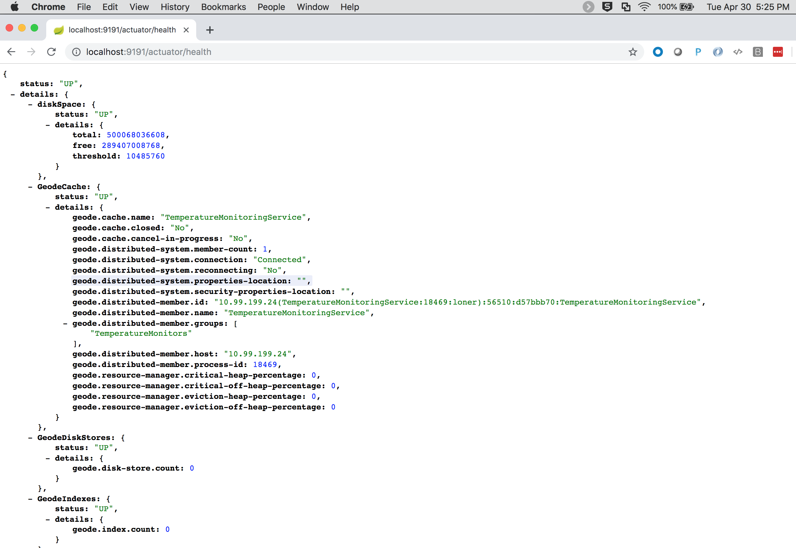
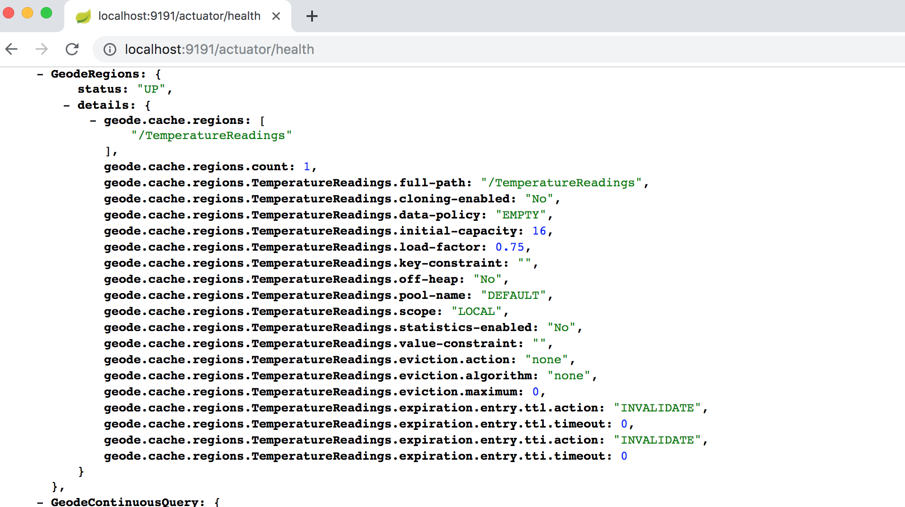
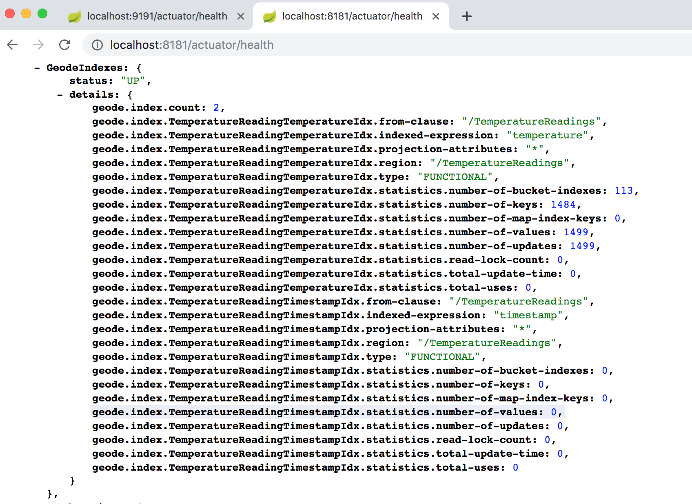

[[geode-samples-boot-actuator]]
= Spring Boot Actuator for Apache Geode & Pivotal GemFire

This guide walks through using {spring-boot-docs-html}/production-ready.html[Spring Boot Actuator] to assess the state
of your running Apache Geode or Pivotal GemFire, Spring Boot application.

The goal for SBDG's Spring Boot Actuator integration is to enable users to effectively monitor and manage their
Spring Boot applications using Apache Geode or Pivotal GemFire in a production environment.

In particular, SBDG's integration with Spring Boot Actuator currently focuses on enabling
{spring-boot-docs-html}/production-ready-endpoints.html#production-ready-health[Health Information]
for your application.  In the future, SBDG will provide dedicated support for http://micrometer.io/[Micrometer] metrics.

This guide assumes you are already familiar with Spring Boot and Apache Geode (or Pivotal GemFire).

[[geode-samples-boot-actuator-example]]
== Example Application

This guide additionally provides a working {github-samples-url}/boot/actuator[example application] to review some of
the Actuator Health Endpoints.

Our application demos a simple Temperature Monitoring Service, similar to a real-world, Internet of Things (IOT)
Use Case (UC).  Essentially, the application collects `TemperatureReadings` from different temperature sensors (devices)
and uses the readings to monitor fluctuations in temperatures.  The sensor devices could be located around the world
in multiple locations of the planet's oceans.

[[geode-samples-boot-actuator-example-temperaturereading]]
=== TemperatureReading

First, we start by modeling a temperature reading, which stores the temperature in Fahrenheit along with a timestamp
for when the reading was measured.

Clearly, a more practical example would store the temperature measurement as a `double` or `BigDecimal` along with
the ability to support different scales (Celsius, Fahrenheit, Kelvin).

However in this case, we simply modeled the `TemperatureReading` as:

.TemperatureReading class
[source,java]
----
include::{samples-dir}boot/actuator/src/main/java/example/app/temp/model/TemperatureReading.java[tags=class]
----

[[geode-samples-boot-actuator-example-temperatureevent]]
=== TemperatureEvent

A key concern of our application is to "monitor" temperature readings.  Therefore, we need some way to capture
temperature change events.

For that, we introduce the simple `TemperatureEvent` base class:

.TemperatureEvent class
[source,java]
----
include::{samples-dir}boot/actuator/src/main/java/example/app/temp/event/TemperatureEvent.java[tags=class]
----

Additionally, we provide 2 subclasses: `BoilingTemperatureEvent` and `FreezingTemperatureEvent` to further classify
the temperature changes.

[[geode-samples-boot-actuator-example-temperaturereadingrepository]]
=== TemperatureReadingRepository

To perform basic data access operations (e.g. CRUD) and simple queries on `TemperatureReadings`, we create
a Spring Data Repository:

.TemperatureEvent class
[source,java]
----
include::{samples-dir}boot/actuator/src/main/java/example/app/temp/repo/TemperatureReadingRepository.java[tags=class]
----

The _Repository_ showcases a few examples of derived query methods.

[[geode-samples-boot-actuator-example-temperaturemonitor]]
=== TemperatureMonitor service class

To receive temperature change events, we need a class to monitor changes.  This capability is built on Apache Geode's
{apache-geode-docs}/developing/continuous_querying/chapter_overview.html[Continuous Query (CQ)] functionality.

With Apache Geode (or Pivotal GemFire) you can register an (OQL) Query with the servers in the cluster that runs
continuously, sending notifications back to the client anytime data changes to match the predicate in our query,
or queries.

For our purposes, we will simply monitor the temperature anytime it rises above boiling (°F) or drops below
freezing (°F):

.TemperatureMonitor class
[source,java]
----
include::{samples-dir}boot/actuator/src/main/java/example/app/temp/service/TemperatureMonitor.java[tags=class]
----

When the temperature changes, triggering our queries, we receive an event and publish an appropriate `TemperatureEvent`
by using the Spring container's `ApplicationEventPublisher`, which has been injected into the monitor.

The 2 OQL queries have been defined to query the "TemperatureReadings" Region and fire anytime the temperature
rises is above 212 °F (boiling) or drops below 32 °F (freezing).

[[geode-samples-boot-actuator-example-temperaturesensor]]
=== TemperatureSensor service class

Of course, we need a simulator to generate temperatures.  For that we have the `TemperatureSensor` class:

.TemperatureSensor class
[source,java]
----
include::{samples-dir}boot/actuator/src/main/java/example/app/temp/service/TemperatureSensor.java[tags=class]
----

To generate a stream of temperatures, we use Spring's {spring-framework-docs}/integration.html#scheduling[Scheduling Service]
along with a `Random` stream of `ints` provided via an `Iterator`, as seen in the `readTemperature()` method.

The `readTemperature()` method is then storing the *new* `TemperatureReading` in the "TemperatureReadings` Region
of the Apache Geode cache, as designated by our `TemperatureReading` model class's, `@Region` annotation declaration:

.@Region declaration
[source,java]
----
@Region("TemperatureReadings")
...
public class TemperatureReading { ... }
----

Additionally, the `readTempeature()` method uses our `TemperatureReadingRepository` to perform the necessary
data access operations.

[[geode-samples-boot-actuator-example-server]]
=== Server

Now, we need a couple of drivers, or main application classes to actually have the application do something.

We start with an Spring Boot, Apache Geode Server application to function as the temperature sensor (device)
using the `TemperatureSensor` class:

.BootGeodeServerApplication main class
[source,java]
----
include::{samples-dir}boot/actuator/src/main/java/example/app/temp/geode/server/BootGeodeServerApplication.java[tags=class]
----

This class is annotated with `@SpringBootApplication`, so it is a proper Spring Boot application. It uses Spring Boot's
`SpringApplicationBuilder` to configure and bootstrap the server application.

This class is also annotated with SDG's `@CacheServerApplication` making it a proper Apache Geode Server with a peer
`Cache` instance along with a `CacheServer` to accept client connections.  This effectively overrides SBDG's default,
provided `ClientCache` instance.

Additionally, the class enables several other features, such as Spring's _Scheduling Service_, Apache Geode Statistics,
and entity-defined Regions making the creation of our server-side, partitioned "TemperatureReadings" Region simple.

By enabling Apache Geode statistics, we allow Spring Boot's Actuator, `HealthIndicators` to collect metrics about
our running Apache Geode Server as well.

Because we have enabled scheduling (with `@EnableScheduling`) and declared the `TemperatureSensor` class as a bean
in the Spring application context, the application will immediately start generating temperature readings, which are
recorded to the "TemperatureReadings" Region.

Finally, our class register a few Apache Geode Region Indexes to make the Actuator `HealthIndicator` information more
interesting, particularly since we are running continuous queries.

This is a Servlet-based application as well since our Actuator, `HealthIndicator` endpoints are exposed via HTTP.

NOTE: There are multiple ways to configure and bootstrap an Apache Geode Server, and the server-side of our application.
Using Spring Boot is one of the easier ways.

[[geode-samples-boot-actuator-example-client]]
=== Client

Next, we need a client to act as the "monitor" in our Temperature Service application.

.BootGeodeClientApplication main class
[source,java]
----
include::{samples-dir}boot/actuator/src/main/java/example/app/temp/geode/client/BootGeodeClientApplication.java[tags=class]
----

Again, this class is also annotated with `@SpringBootApplication` making it a proper Spring Boot application.  It too
uses Spring Boot's `SpringApplicationBuilder` class to configure and bootstrap the client application.

Unlike our server, this class is not annotated with any SDG `@*Cache*Application` annotation since SBDG provides us
a `ClientCache` instance by default. We want this application to be a client in our setup.

Like our server, we enable entity-defined Regions to easily and quickly create the client `PROXY` Region
for "TemperatureReadings", which will send/receive data from the server-side Region by the same name.

And, like our server application, we declare a bean of type `TemperatureMonitor` in the Spring application context
to receive the `TemperatureReading` events. This enables the CQ registration and event handlers
and sets things in motion.

Probably the most interesting part is that we an `@EventListener` to receive the `TemperatureEvents` to log
the `TemperatureReadings` to `System.err`.

[[geode-samples-boot-actuator-example-run]]
== Run the Example

Now it is time to run the example.

First, we start the server:

.Run the server
[source,txt]
----
/Library/Java/JavaVirtualMachines/jdk1.8.0_192.jdk/Contents/Home/bin/java -server -ea -Dspring.profiles.active=server "-javaagent:/Applications/IntelliJ IDEA 18 CE.app/Contents/lib/idea_rt.jar=56485:/Applications/IntelliJ IDEA 18 CE.app/Contents/bin" -Dfile.encoding=UTF-8 -classpath /Library/Java/JavaVirtualMachines/jdk1.8.0_192.jdk/Contents/Home/jre/lib/charsets.jar:/Library/Java/JavaVirtualMachines/jdk1.8.0_192.jdk/Contents/Home/jre/lib/deploy.jar:/Library/Java/JavaVirtualMachines/jdk1.8.0_192.jdk/Contents/Home/jre/lib/ext/cldrdata.jar:/Library/Java/JavaVirtualMachines/jdk1.8.0_192.jdk/Contents/Home/jre/lib/ext/dnsns.jar:/Library/Java/JavaVirtualMachines/jdk1.8.0_192.jdk/Contents/Home/jre/lib/ext/jaccess.jar:/Library/Java/JavaVirtualMachines/jdk1.8.0_192.jdk/Contents/Home/jre/lib/ext/jfxrt.jar:/Library/Java/JavaVirtualMachines/jdk1.8.0_192.jdk/Contents/Home/jre/lib/ext/localedata.jar:/Library/Java/JavaVirtualMachines/jdk1.8.0_192.jdk/Contents/Home/jre/lib/ext/nashorn.jar:/Library/Java/JavaVirtualMachines/jdk1.8.0_192.jdk/Contents/Home/jre/lib/ext/sunec.jar:/Library/Java/JavaVirtualMachines/jdk1.8.0_192.jdk/Contents/Home/jre/lib/ext/sunjce_provider.jar:/Library/Java/JavaVirtualMachines/jdk1.8.0_192.jdk/Contents/Home/jre/lib/ext/sunpkcs11.jar:/Library/Java/JavaVirtualMachines/jdk1.8.0_192.jdk/Contents/Home/jre/lib/ext/tools.jar:/Library/Java/JavaVirtualMachines/jdk1.8.0_192.jdk/Contents/Home/jre/lib/ext/zipfs.jar:/Library/Java/JavaVirtualMachines/jdk1.8.0_192.jdk/Contents/Home/jre/lib/javaws.jar:/Library/Java/JavaVirtualMachines/jdk1.8.0_192.jdk/Contents/Home/jre/lib/jce.jar:/Library/Java/JavaVirtualMachines/jdk1.8.0_192.jdk/Contents/Home/jre/lib/jfr.jar:/Library/Java/JavaVirtualMachines/jdk1.8.0_192.jdk/Contents/Home/jre/lib/jfxswt.jar:/Library/Java/JavaVirtualMachines/jdk1.8.0_192.jdk/Contents/Home/jre/lib/jsse.jar:/Library/Java/JavaVirtualMachines/jdk1.8.0_192.jdk/Contents/Home/jre/lib/management-agent.jar:/Library/Java/JavaVirtualMachines/jdk1.8.0_192.jdk/Contents/Home/jre/lib/plugin.jar:/Library/Java/JavaVirtualMachines/jdk1.8.0_192.jdk/Contents/Home/jre/lib/resources.jar:/Library/Java/JavaVirtualMachines/jdk1.8.0_192.jdk/Contents/Home/jre/lib/rt.jar:/Library/Java/JavaVirtualMachines/jdk1.8.0_192.jdk/Contents/Home/lib/ant-javafx.jar:/Library/Java/JavaVirtualMachines/jdk1.8.0_192.jdk/Contents/Home/lib/dt.jar:/Library/Java/JavaVirtualMachines/jdk1.8.0_192.jdk/Contents/Home/lib/javafx-mx.jar:/Library/Java/JavaVirtualMachines/jdk1.8.0_192.jdk/Contents/Home/lib/jconsole.jar:/Library/Java/JavaVirtualMachines/jdk1.8.0_192.jdk/Contents/Home/lib/packager.jar:/Library/Java/JavaVirtualMachines/jdk1.8.0_192.jdk/Contents/Home/lib/sa-jdi.jar:/Library/Java/JavaVirtualMachines/jdk1.8.0_192.jdk/Contents/Home/lib/tools.jar:/Users/jblum/pivdev/spring-boot-data-geode/spring-geode-samples/boot/actuator/out/production/classes:/Users/jblum/pivdev/spring-boot-data-geode/spring-geode-samples/boot/actuator/out/production/resources:/Users/jblum/pivdev/spring-boot-data-geode/spring-geode-actuator-autoconfigure/out/production/classes:/Users/jblum/pivdev/spring-boot-data-geode/spring-geode-actuator-autoconfigure/out/production/resources:/Users/jblum/pivdev/spring-boot-data-geode/spring-geode-autoconfigure/out/production/classes:/Users/jblum/pivdev/spring-boot-data-geode/spring-geode-autoconfigure/out/production/resources:/Users/jblum/pivdev/spring-boot-data-geode/spring-geode-actuator/out/production/classes:/Users/jblum/pivdev/spring-boot-data-geode/spring-geode/out/production/classes:/Users/jblum/pivdev/spring-boot-data-geode/spring-geode/out/production/resources:/Users/jblum/.gradle/caches/modules-2/files-2.1/org.springframework.boot/spring-boot-starter-web/2.0.9.RELEASE/33ad96c247eefaf77c7ac7aab667e3633c20e165/spring-boot-starter-web-2.0.9.RELEASE.jar:/Users/jblum/.gradle/caches/modules-2/files-2.1/org.springframework.data/spring-data-geode-test/0.0.1.RC1/5054cd749bd14e7b8a6ff47717d2b40068c6acb9/spring-data-geode-test-0.0.1.RC1.jar:/Users/jblum/.gradle/caches/modules-2/files-2.1/org.springframework.boot/spring-boot-starter-json/2.0.9.RELEASE/f60574b14eef00eb71147e814981707219c08227/spring-boot-starter-json-2.0.9.RELEASE.jar:/Users/jblum/.gradle/caches/modules-2/files-2.1/org.springframework.boot/spring-boot-starter-actuator/2.0.9.RELEASE/ec864649db0ff57032ec2a9ed8bd17212d6b152f/spring-boot-starter-actuator-2.0.9.RELEASE.jar:/Users/jblum/.gradle/caches/modules-2/files-2.1/org.springframework.boot/spring-boot-starter/2.0.9.RELEASE/6c48e487ea69248b4970d423ee2f2278a9b9cf51/spring-boot-starter-2.0.9.RELEASE.jar:/Users/jblum/.gradle/caches/modules-2/files-2.1/org.springframework.boot/spring-boot-starter-tomcat/2.0.9.RELEASE/e1b56a3e6f029c8a8dd1ac06f19ab7f69efafad2/spring-boot-starter-tomcat-2.0.9.RELEASE.jar:/Users/jblum/.gradle/caches/modules-2/files-2.1/org.hibernate.validator/hibernate-validator/6.0.16.Final/ad9557c558972093c0567a2a1f224f318c00f650/hibernate-validator-6.0.16.Final.jar:/Users/jblum/.gradle/caches/modules-2/files-2.1/org.springframework/spring-webmvc/5.0.13.RELEASE/fdde041963535ef3c746b9c93e1ef2c90a6873e2/spring-webmvc-5.0.13.RELEASE.jar:/Users/jblum/.gradle/caches/modules-2/files-2.1/org.springframework.data/spring-data-geode/2.0.14.RELEASE/e13a69082be48e9a7454c783a35d5639ef580aa4/spring-data-geode-2.0.14.RELEASE.jar:/Users/jblum/.gradle/caches/modules-2/files-2.1/org.springframework/spring-web/5.0.13.RELEASE/8e66504c87cc26109204b08cf7b6530951265483/spring-web-5.0.13.RELEASE.jar:/Users/jblum/.gradle/caches/modules-2/files-2.1/edu.umd.cs.mtc/multithreadedtc/1.01/43fbc1110d7e43cf79e415ef32036975ad85944c/multithreadedtc-1.01.jar:/Users/jblum/.gradle/caches/modules-2/files-2.1/junit/junit/4.12/2973d150c0dc1fefe998f834810d68f278ea58ec/junit-4.12.jar:/Users/jblum/.gradle/caches/modules-2/files-2.1/org.assertj/assertj-core/3.9.1/c5ce126b15f28d56cd8f960c1a6a058b9c9aea87/assertj-core-3.9.1.jar:/Users/jblum/.gradle/caches/modules-2/files-2.1/org.mockito/mockito-core/2.27.0/835fc3283b481f4758b8ef464cd560c649c08b00/mockito-core-2.27.0.jar:/Users/jblum/.gradle/caches/modules-2/files-2.1/org.springframework/spring-test/5.0.13.RELEASE/6558aba528b690efcd04cef853862e66d7ad1fab/spring-test-5.0.13.RELEASE.jar:/Users/jblum/.gradle/caches/modules-2/files-2.1/javax.cache/cache-api/1.1.0/77bdcff7814076dfa61611b0db88487c515150b6/cache-api-1.1.0.jar:/Users/jblum/.gradle/caches/modules-2/files-2.1/org.springframework.shell/spring-shell/1.2.0.RELEASE/d94047721f292bd5334b5654e8600cef4b845049/spring-shell-1.2.0.RELEASE.jar:/Users/jblum/.gradle/caches/modules-2/files-2.1/org.springframework.boot/spring-boot-actuator-autoconfigure/2.0.9.RELEASE/62c52f0aec37d7109b8239603f32f50f78f00b25/spring-boot-actuator-autoconfigure-2.0.9.RELEASE.jar:/Users/jblum/.gradle/caches/modules-2/files-2.1/org.springframework.boot/spring-boot-autoconfigure/2.0.9.RELEASE/b86eab18a95cc453c3c3519ffc214def3a46364e/spring-boot-autoconfigure-2.0.9.RELEASE.jar:/Users/jblum/.gradle/caches/modules-2/files-2.1/org.springframework.boot/spring-boot-actuator/2.0.9.RELEASE/bdc4548baa5c39a7127a2b9fc3d8efb64dd04010/spring-boot-actuator-2.0.9.RELEASE.jar:/Users/jblum/.gradle/caches/modules-2/files-2.1/org.springframework.boot/spring-boot/2.0.9.RELEASE/8c5fde7ba7c753f5f99ce934d27fc19d8a30de46/spring-boot-2.0.9.RELEASE.jar:/Users/jblum/.gradle/caches/modules-2/files-2.1/org.springframework.boot/spring-boot-starter-logging/2.0.9.RELEASE/eb98d1ab880292492285ffc302db069c86c7bf1e/spring-boot-starter-logging-2.0.9.RELEASE.jar:/Users/jblum/.gradle/caches/modules-2/files-2.1/javax.annotation/javax.annotation-api/1.3.2/934c04d3cfef185a8008e7bf34331b79730a9d43/javax.annotation-api-1.3.2.jar:/Users/jblum/.gradle/caches/modules-2/files-2.1/org.springframework/spring-context-support/5.0.13.RELEASE/3458907eaafda275ea38a6ddad5f7ca58c66dd07/spring-context-support-5.0.13.RELEASE.jar:/Users/jblum/.gradle/caches/modules-2/files-2.1/org.springframework/spring-tx/5.0.13.RELEASE/a8442e8d2c11fd6a64f0c5476fa0416bb20463fa/spring-tx-5.0.13.RELEASE.jar:/Users/jblum/.gradle/caches/modules-2/files-2.1/org.springframework.data/spring-data-commons/2.0.14.RELEASE/2836d20873ef3211311bbb49d46c71ccc8f274ac/spring-data-commons-2.0.14.RELEASE.jar:/Users/jblum/.gradle/caches/modules-2/files-2.1/org.springframework/spring-context/5.0.13.RELEASE/16f61ac3bf75131034d4ace1ac24b199e03c6ba1/spring-context-5.0.13.RELEASE.jar:/Users/jblum/.gradle/caches/modules-2/files-2.1/org.springframework/spring-aop/5.0.13.RELEASE/eb756b27d894d4de9491513a7f641e1ad2effcab/spring-aop-5.0.13.RELEASE.jar:/Users/jblum/.gradle/caches/modules-2/files-2.1/org.springframework/spring-beans/5.0.13.RELEASE/13880e7cd21df626736d6a4f5decd17b42cdeaca/spring-beans-5.0.13.RELEASE.jar:/Users/jblum/.gradle/caches/modules-2/files-2.1/org.springframework/spring-expression/5.0.13.RELEASE/eb4651b7c53be5a74f45717f262106758e58b681/spring-expression-5.0.13.RELEASE.jar:/Users/jblum/.gradle/caches/modules-2/files-2.1/org.springframework/spring-core/5.0.13.RELEASE/5a306ec429a43ce126dae5df85927bc91e395894/spring-core-5.0.13.RELEASE.jar:/Users/jblum/.gradle/caches/modules-2/files-2.1/com.fasterxml.jackson.datatype/jackson-datatype-jdk8/2.9.8/bcd02aa9195390e23747ed40bf76be869ad3a2fb/jackson-datatype-jdk8-2.9.8.jar:/Users/jblum/.gradle/caches/modules-2/files-2.1/com.fasterxml.jackson.datatype/jackson-datatype-jsr310/2.9.8/28ad1bced632ba338e51c825a652f6e11a8e6eac/jackson-datatype-jsr310-2.9.8.jar:/Users/jblum/.gradle/caches/modules-2/files-2.1/com.fasterxml.jackson.module/jackson-module-parameter-names/2.9.8/c4eef0e6e20d60fb27af4bc4770dba7bcc3f6de6/jackson-module-parameter-names-2.9.8.jar:/Users/jblum/.gradle/caches/modules-2/files-2.1/org.apache.geode/geode-lucene/1.2.1/3d22a050bd4eb64bd8c82a74677f45c070f102d5/geode-lucene-1.2.1.jar:/Users/jblum/.gradle/caches/modules-2/files-2.1/org.apache.geode/geode-core/1.2.1/fe853317e33dd2a1c291f29cee3c4be549f75a69/geode-core-1.2.1.jar:/Users/jblum/.gradle/caches/modules-2/files-2.1/com.fasterxml.jackson.core/jackson-databind/2.9.8/11283f21cc480aa86c4df7a0a3243ec508372ed2/jackson-databind-2.9.8.jar:/Users/jblum/.gradle/caches/modules-2/files-2.1/org.apache.tomcat.embed/tomcat-embed-websocket/8.5.39/ef8346273e26fa014c4c1be7cdfc945de312c5e/tomcat-embed-websocket-8.5.39.jar:/Users/jblum/.gradle/caches/modules-2/files-2.1/org.apache.tomcat.embed/tomcat-embed-core/8.5.39/4d9de8c6e2894e290e8563c44c650f3ea71266db/tomcat-embed-core-8.5.39.jar:/Users/jblum/.gradle/caches/modules-2/files-2.1/org.apache.tomcat.embed/tomcat-embed-el/8.5.39/a2179cbbcfeaa9a2321f34f086ad8b5682137bdd/tomcat-embed-el-8.5.39.jar:/Users/jblum/.gradle/caches/modules-2/files-2.1/javax.validation/validation-api/2.0.1.Final/cb855558e6271b1b32e716d24cb85c7f583ce09e/validation-api-2.0.1.Final.jar:/Users/jblum/.gradle/caches/modules-2/files-2.1/org.jboss.logging/jboss-logging/3.3.2.Final/3789d00e859632e6c6206adc0c71625559e6e3b0/jboss-logging-3.3.2.Final.jar:/Users/jblum/.gradle/caches/modules-2/files-2.1/com.fasterxml/classmate/1.3.4/3d5f48f10bbe4eb7bd862f10c0583be2e0053c6/classmate-1.3.4.jar:/Users/jblum/.gradle/caches/modules-2/files-2.1/org.hamcrest/hamcrest-core/1.3/42a25dc3219429f0e5d060061f71acb49bf010a0/hamcrest-core-1.3.jar:/Users/jblum/.gradle/caches/modules-2/files-2.1/net.bytebuddy/byte-buddy/1.9.10/211a2b4d3df1eeef2a6cacf78d74a1f725e7a840/byte-buddy-1.9.10.jar:/Users/jblum/.gradle/caches/modules-2/files-2.1/net.bytebuddy/byte-buddy-agent/1.9.10/9674aba5ee793e54b864952b001166848da0f26b/byte-buddy-agent-1.9.10.jar:/Users/jblum/.gradle/caches/modules-2/files-2.1/org.objenesis/objenesis/2.6/639033469776fd37c08358c6b92a4761feb2af4b/objenesis-2.6.jar:/Users/jblum/.gradle/caches/modules-2/files-2.1/org.apache.geode/geode-cq/1.2.1/69873d6b956ba13b55c894a13e72106fb552e840/geode-cq-1.2.1.jar:/Users/jblum/.gradle/caches/modules-2/files-2.1/org.apache.geode/geode-wan/1.2.1/df0dd8516e1af17790185255ff21a54b56d94344/geode-wan-1.2.1.jar:/Users/jblum/.gradle/caches/modules-2/files-2.1/org.apache.shiro/shiro-spring/1.3.2/281a6b565f6cf3aebd31ddb004632008d7106f2d/shiro-spring-1.3.2.jar:/Users/jblum/.gradle/caches/modules-2/files-2.1/org.aspectj/aspectjweaver/1.8.14/d95689587d8f39c1ae35523eadac06fe760b2697/aspectjweaver-1.8.14.jar:/Users/jblum/.gradle/caches/modules-2/files-2.1/com.fasterxml.jackson.core/jackson-annotations/2.9.0/7c10d545325e3a6e72e06381afe469fd40eb701/jackson-annotations-2.9.0.jar:/Users/jblum/.gradle/caches/modules-2/files-2.1/ch.qos.logback/logback-classic/1.2.3/7c4f3c474fb2c041d8028740440937705ebb473a/logback-classic-1.2.3.jar:/Users/jblum/.gradle/caches/modules-2/files-2.1/org.slf4j/jul-to-slf4j/1.7.26/8031352b2bb0a49e67818bf04c027aa92e645d5c/jul-to-slf4j-1.7.26.jar:/Users/jblum/.gradle/caches/modules-2/files-2.1/org.apache.shiro/shiro-web/1.3.2/725be023e1c65a0fd70c01b8c0c13a2936c23315/shiro-web-1.3.2.jar:/Users/jblum/.gradle/caches/modules-2/files-2.1/org.apache.shiro/shiro-core/1.3.2/b5dede9d890f335998a8ebf479809fe365b927fc/shiro-core-1.3.2.jar:/Users/jblum/.gradle/caches/modules-2/files-2.1/org.slf4j/slf4j-api/1.7.26/77100a62c2e6f04b53977b9f541044d7d722693d/slf4j-api-1.7.26.jar:/Users/jblum/.gradle/caches/modules-2/files-2.1/org.springframework/spring-jcl/5.0.13.RELEASE/db00d2cd65e1b556229104cc95ece433a83c72fe/spring-jcl-5.0.13.RELEASE.jar:/Users/jblum/.gradle/caches/modules-2/files-2.1/com.google.guava/guava/17.0/9c6ef172e8de35fd8d4d8783e4821e57cdef7445/guava-17.0.jar:/Users/jblum/.gradle/caches/modules-2/files-2.1/jline/jline/2.12/ce9062c6a125e0f9ad766032573c041ae8ecc986/jline-2.12.jar:/Users/jblum/.gradle/caches/modules-2/files-2.1/commons-io/commons-io/2.5/2852e6e05fbb95076fc091f6d1780f1f8fe35e0f/commons-io-2.5.jar:/Users/jblum/.gradle/caches/modules-2/files-2.1/com.fasterxml.jackson.core/jackson-core/2.9.8/f5a654e4675769c716e5b387830d19b501ca191/jackson-core-2.9.8.jar:/Users/jblum/.gradle/caches/modules-2/files-2.1/com.github.stephenc.findbugs/findbugs-annotations/1.3.9-1/a6b11447635d80757d64b355bed3c00786d86801/findbugs-annotations-1.3.9-1.jar:/Users/jblum/.gradle/caches/modules-2/files-2.1/org.jgroups/jgroups/3.6.10.Final/fc0ff5a8a9de27ab62939956f705c2909bf86bc2/jgroups-3.6.10.Final.jar:/Users/jblum/.gradle/caches/modules-2/files-2.1/antlr/antlr/2.7.7/83cd2cd674a217ade95a4bb83a8a14f351f48bd0/antlr-2.7.7.jar:/Users/jblum/.gradle/caches/modules-2/files-2.1/commons-lang/commons-lang/2.6/ce1edb914c94ebc388f086c6827e8bdeec71ac2/commons-lang-2.6.jar:/Users/jblum/.gradle/caches/modules-2/files-2.1/it.unimi.dsi/fastutil/7.1.0/9835253257524c1be7ab50c057aa2d418fb72082/fastutil-7.1.0.jar:/Users/jblum/.gradle/caches/modules-2/files-2.1/javax.resource/javax.resource-api/1.7/ae40e0864eb1e92c48bf82a2a3399cbbf523fb79/javax.resource-api-1.7.jar:/Users/jblum/.gradle/caches/modules-2/files-2.1/net.java.dev.jna/jna/4.5.2/35d000afbaa4ed425d91873b40f4df9b8236875b/jna-4.5.2.jar:/Users/jblum/.gradle/caches/modules-2/files-2.1/net.sf.jopt-simple/jopt-simple/5.0.3/cdd846cfc4e0f7eefafc02c0f5dce32b9303aa2a/jopt-simple-5.0.3.jar:/Users/jblum/.gradle/caches/modules-2/files-2.1/org.apache.logging.log4j/log4j-core/2.10.0/c90b597163cd28ab6d9687edd53db601b6ea75a1/log4j-core-2.10.0.jar:/Users/jblum/.gradle/caches/modules-2/files-2.1/org.apache.logging.log4j/log4j-api/2.10.0/fec5797a55b786184a537abd39c3fa1449d752d6/log4j-api-2.10.0.jar:/Users/jblum/.gradle/caches/modules-2/files-2.1/commons-beanutils/commons-beanutils/1.9.3/c845703de334ddc6b4b3cd26835458cb1cba1f3d/commons-beanutils-1.9.3.jar:/Users/jblum/.gradle/caches/modules-2/files-2.1/io.github.lukehutch/fast-classpath-scanner/2.0.11/ae34a7a5e6de8ad1f86e12f6f7ae1869fcfe9987/fast-classpath-scanner-2.0.11.jar:/Users/jblum/.gradle/caches/modules-2/files-2.1/org.apache.geode/geode-common/1.2.1/9db253081d33f424f6e3ce0cde4b306e23e3420b/geode-common-1.2.1.jar:/Users/jblum/.gradle/caches/modules-2/files-2.1/org.apache.geode/geode-json/1.2.1/bdb4c262e4ce6bb3b22e0f511cfb133a65fa0c04/geode-json-1.2.1.jar:/Users/jblum/.gradle/caches/modules-2/files-2.1/org.apache.lucene/lucene-analyzers-common/6.4.1/c6f0f593503080204e9d33189cdc59320f55db37/lucene-analyzers-common-6.4.1.jar:/Users/jblum/.gradle/caches/modules-2/files-2.1/org.apache.lucene/lucene-queryparser/6.4.1/1fc5795a072770a2c47dce11a3c85a80f3437af6/lucene-queryparser-6.4.1.jar:/Users/jblum/.gradle/caches/modules-2/files-2.1/org.apache.lucene/lucene-queries/6.4.1/6de41d984c16185a244b52c4d069b00f5b2b120f/lucene-queries-6.4.1.jar:/Users/jblum/.gradle/caches/modules-2/files-2.1/org.apache.lucene/lucene-core/6.4.1/2a18924b9e0ed86b318902cb475a0b9ca4d7be5b/lucene-core-6.4.1.jar:/Users/jblum/.gradle/caches/modules-2/files-2.1/io.micrometer/micrometer-core/1.0.10/bbcca61673a10429b0afc756de3bbbb8b0c7c966/micrometer-core-1.0.10.jar:/Users/jblum/.gradle/caches/modules-2/files-2.1/ch.qos.logback/logback-core/1.2.3/864344400c3d4d92dfeb0a305dc87d953677c03c/logback-core-1.2.3.jar:/Users/jblum/.gradle/caches/modules-2/files-2.1/javax.transaction/javax.transaction-api/1.2/d81aff979d603edd90dcd8db2abc1f4ce6479e3e/javax.transaction-api-1.2.jar:/Users/jblum/.gradle/caches/modules-2/files-2.1/commons-logging/commons-logging/1.2/4bfc12adfe4842bf07b657f0369c4cb522955686/commons-logging-1.2.jar:/Users/jblum/.gradle/caches/modules-2/files-2.1/commons-collections/commons-collections/3.2.2/8ad72fe39fa8c91eaaf12aadb21e0c3661fe26d5/commons-collections-3.2.2.jar:/Users/jblum/.gradle/caches/modules-2/files-2.1/org.hdrhistogram/HdrHistogram/2.1.10/9e1ac84eed220281841b75e72fb9de5a297fbf04/HdrHistogram-2.1.10.jar:/Users/jblum/.gradle/caches/modules-2/files-2.1/org.latencyutils/LatencyUtils/2.0.3/769c0b82cb2421c8256300e907298a9410a2a3d3/LatencyUtils-2.0.3.jar:/Users/jblum/.gradle/caches/modules-2/files-2.1/org.springframework.boot/spring-boot-starter-jetty/2.0.9.RELEASE/a04f026c43f795f53d1bd31f6dad4f157c0a7577/spring-boot-starter-jetty-2.0.9.RELEASE.jar:/Users/jblum/.gradle/caches/modules-2/files-2.1/org.projectlombok/lombok/1.16.22/e555426550f54284fefb09065f2123a1d9be0b73/lombok-1.16.22.jar:/Users/jblum/.gradle/caches/modules-2/files-2.1/org.eclipse.jetty/jetty-servlets/9.4.15.v20190215/403606e16c41c38ce0ca753cd9fb78c4a692c88e/jetty-servlets-9.4.15.v20190215.jar:/Users/jblum/.gradle/caches/modules-2/files-2.1/org.eclipse.jetty.websocket/javax-websocket-server-impl/9.4.15.v20190215/25d0b8223c038fb85263f32d35c5cba2022ab622/javax-websocket-server-impl-9.4.15.v20190215.jar:/Users/jblum/.gradle/caches/modules-2/files-2.1/org.eclipse.jetty/jetty-annotations/9.4.15.v20190215/157606ae508a24c20cb26151b6d0469d7bb1e72f/jetty-annotations-9.4.15.v20190215.jar:/Users/jblum/.gradle/caches/modules-2/files-2.1/org.eclipse.jetty/jetty-plus/9.4.15.v20190215/ff5d8dad04cb47cf29956c7a602131bb2c2bb6db/jetty-plus-9.4.15.v20190215.jar:/Users/jblum/.gradle/caches/modules-2/files-2.1/org.eclipse.jetty/jetty-webapp/9.4.15.v20190215/6ff93c67227fb443b8e63c03c7d5c11066d983b3/jetty-webapp-9.4.15.v20190215.jar:/Users/jblum/.gradle/caches/modules-2/files-2.1/org.eclipse.jetty.websocket/websocket-server/9.4.15.v20190215/ee410ccfdd692a5e44a04bfa0e2b8c2e8fc524f2/websocket-server-9.4.15.v20190215.jar:/Users/jblum/.gradle/caches/modules-2/files-2.1/org.mortbay.jasper/apache-el/8.5.35.1/e89dd4e0d4f396b07fc5b7dc8d430493bc54d4c/apache-el-8.5.35.1.jar:/Users/jblum/.gradle/caches/modules-2/files-2.1/org.yaml/snakeyaml/1.19/2d998d3d674b172a588e54ab619854d073f555b5/snakeyaml-1.19.jar:/Users/jblum/.gradle/caches/modules-2/files-2.1/org.eclipse.jetty/jetty-continuation/9.4.15.v20190215/f9c708af00b0984a98b53ff3a031d35517e5ebbc/jetty-continuation-9.4.15.v20190215.jar:/Users/jblum/.gradle/caches/modules-2/files-2.1/org.eclipse.jetty.websocket/javax-websocket-client-impl/9.4.15.v20190215/c78916a1c3632a54f33a6def4ce11a349b318a1b/javax-websocket-client-impl-9.4.15.v20190215.jar:/Users/jblum/.gradle/caches/modules-2/files-2.1/org.eclipse.jetty.websocket/websocket-client/9.4.15.v20190215/237038ee1a544a28fe88ee5eef326511b3ba8a60/websocket-client-9.4.15.v20190215.jar:/Users/jblum/.gradle/caches/modules-2/files-2.1/org.eclipse.jetty/jetty-client/9.4.15.v20190215/b3c92b6bc7f98d5bd5210b3285a740b9f206add7/jetty-client-9.4.15.v20190215.jar:/Users/jblum/.gradle/caches/modules-2/files-2.1/org.eclipse.jetty/jetty-servlet/9.4.15.v20190215/6c680a4a05986ea0ae0a686df7b3da7378554127/jetty-servlet-9.4.15.v20190215.jar:/Users/jblum/.gradle/caches/modules-2/files-2.1/org.eclipse.jetty/jetty-security/9.4.15.v20190215/bfb074a843d7961111143a193c846040bd089365/jetty-security-9.4.15.v20190215.jar:/Users/jblum/.gradle/caches/modules-2/files-2.1/org.eclipse.jetty/jetty-server/9.4.15.v20190215/c3c67bd8ec3fe328de9e888e2e619362905a56ab/jetty-server-9.4.15.v20190215.jar:/Users/jblum/.gradle/caches/modules-2/files-2.1/org.eclipse.jetty/jetty-http/9.4.15.v20190215/b6ccda5ec5580914ff2fcbd0b9a7e3327e11ba01/jetty-http-9.4.15.v20190215.jar:/Users/jblum/.gradle/caches/modules-2/files-2.1/org.eclipse.jetty.websocket/websocket-common/9.4.15.v20190215/9c17801e6c5070ba14509deee338ebad9003f91f/websocket-common-9.4.15.v20190215.jar:/Users/jblum/.gradle/caches/modules-2/files-2.1/org.eclipse.jetty/jetty-io/9.4.15.v20190215/e9f3cb0e56ff0bf15c42fd977d220e494e66c61c/jetty-io-9.4.15.v20190215.jar:/Users/jblum/.gradle/caches/modules-2/files-2.1/org.eclipse.jetty/jetty-xml/9.4.15.v20190215/9cb76241d67690bc1d5a5ede99e7eb35c3918d53/jetty-xml-9.4.15.v20190215.jar:/Users/jblum/.gradle/caches/modules-2/files-2.1/org.eclipse.jetty/jetty-util/9.4.15.v20190215/842cb29911d32c18c9e6fa377cabfbc4685f4bb2/jetty-util-9.4.15.v20190215.jar:/Users/jblum/.gradle/caches/modules-2/files-2.1/org.eclipse.jetty.websocket/websocket-servlet/9.4.15.v20190215/544090f9a7083fe7794d4669893f7f7e593d0534/websocket-servlet-9.4.15.v20190215.jar:/Users/jblum/.gradle/caches/modules-2/files-2.1/javax.websocket/javax.websocket-api/1.0/fc843b649d4a1dcb0497669d262befa3918c7ba8/javax.websocket-api-1.0.jar:/Users/jblum/.gradle/caches/modules-2/files-2.1/org.eclipse.jetty.websocket/websocket-api/9.4.15.v20190215/166ba3d41032268c9f3537c00db36b72abb5ccd7/websocket-api-9.4.15.v20190215.jar:/Users/jblum/.gradle/caches/modules-2/files-2.1/javax.servlet/javax.servlet-api/3.1.0/3cd63d075497751784b2fa84be59432f4905bf7c/javax.servlet-api-3.1.0.jar:/Users/jblum/.gradle/caches/modules-2/files-2.1/org.ow2.asm/asm-commons/7.0/478006d07b7c561ae3a92ddc1829bca81ae0cdd1/asm-commons-7.0.jar:/Users/jblum/.gradle/caches/modules-2/files-2.1/org.ow2.asm/asm-analysis/7.0/4b310d20d6f1c6b7197a75f1b5d69f169bc8ac1f/asm-analysis-7.0.jar:/Users/jblum/.gradle/caches/modules-2/files-2.1/org.ow2.asm/asm-tree/7.0/29bc62dcb85573af6e62e5b2d735ef65966c4180/asm-tree-7.0.jar:/Users/jblum/.gradle/caches/modules-2/files-2.1/org.ow2.asm/asm/7.0/d74d4ba0dee443f68fb2dcb7fcdb945a2cd89912/asm-7.0.jar example.app.temp.geode.server.BootGeodeServerApplication

  .   ____          _            __ _ _
 /\\ / ___'_ __ _ _(_)_ __  __ _ \ \ \ \
( ( )\___ | '_ | '_| | '_ \/ _` | \ \ \ \
 \\/  ___)| |_)| | | | | || (_| |  ) ) ) )
  '  |____| .__|_| |_|_| |_\__, | / / / /
 =========|_|==============|___/=/_/_/_/
 :: Spring Boot ::        (v2.0.9.RELEASE)

TEMPERATURE READING [99 °F]
TEMPERATURE READING [-17 °F]
TEMPERATURE READING [67 °F]
TEMPERATURE READING [9 °F]
TEMPERATURE READING [102 °F]
TEMPERATURE READING [10 °F]
...
----

After the server starts and begins to log temperature readings (as shown above), then start the client:

.Run the client
[source,txt]
----
/Library/Java/JavaVirtualMachines/jdk1.8.0_192.jdk/Contents/Home/bin/java -server -ea -Dspring.profiles.active=client "-javaagent:/Applications/IntelliJ IDEA 18 CE.app/Contents/lib/idea_rt.jar=56506:/Applications/IntelliJ IDEA 18 CE.app/Contents/bin" -Dfile.encoding=UTF-8 -classpath /Library/Java/JavaVirtualMachines/jdk1.8.0_192.jdk/Contents/Home/jre/lib/charsets.jar:/Library/Java/JavaVirtualMachines/jdk1.8.0_192.jdk/Contents/Home/jre/lib/deploy.jar:/Library/Java/JavaVirtualMachines/jdk1.8.0_192.jdk/Contents/Home/jre/lib/ext/cldrdata.jar:/Library/Java/JavaVirtualMachines/jdk1.8.0_192.jdk/Contents/Home/jre/lib/ext/dnsns.jar:/Library/Java/JavaVirtualMachines/jdk1.8.0_192.jdk/Contents/Home/jre/lib/ext/jaccess.jar:/Library/Java/JavaVirtualMachines/jdk1.8.0_192.jdk/Contents/Home/jre/lib/ext/jfxrt.jar:/Library/Java/JavaVirtualMachines/jdk1.8.0_192.jdk/Contents/Home/jre/lib/ext/localedata.jar:/Library/Java/JavaVirtualMachines/jdk1.8.0_192.jdk/Contents/Home/jre/lib/ext/nashorn.jar:/Library/Java/JavaVirtualMachines/jdk1.8.0_192.jdk/Contents/Home/jre/lib/ext/sunec.jar:/Library/Java/JavaVirtualMachines/jdk1.8.0_192.jdk/Contents/Home/jre/lib/ext/sunjce_provider.jar:/Library/Java/JavaVirtualMachines/jdk1.8.0_192.jdk/Contents/Home/jre/lib/ext/sunpkcs11.jar:/Library/Java/JavaVirtualMachines/jdk1.8.0_192.jdk/Contents/Home/jre/lib/ext/tools.jar:/Library/Java/JavaVirtualMachines/jdk1.8.0_192.jdk/Contents/Home/jre/lib/ext/zipfs.jar:/Library/Java/JavaVirtualMachines/jdk1.8.0_192.jdk/Contents/Home/jre/lib/javaws.jar:/Library/Java/JavaVirtualMachines/jdk1.8.0_192.jdk/Contents/Home/jre/lib/jce.jar:/Library/Java/JavaVirtualMachines/jdk1.8.0_192.jdk/Contents/Home/jre/lib/jfr.jar:/Library/Java/JavaVirtualMachines/jdk1.8.0_192.jdk/Contents/Home/jre/lib/jfxswt.jar:/Library/Java/JavaVirtualMachines/jdk1.8.0_192.jdk/Contents/Home/jre/lib/jsse.jar:/Library/Java/JavaVirtualMachines/jdk1.8.0_192.jdk/Contents/Home/jre/lib/management-agent.jar:/Library/Java/JavaVirtualMachines/jdk1.8.0_192.jdk/Contents/Home/jre/lib/plugin.jar:/Library/Java/JavaVirtualMachines/jdk1.8.0_192.jdk/Contents/Home/jre/lib/resources.jar:/Library/Java/JavaVirtualMachines/jdk1.8.0_192.jdk/Contents/Home/jre/lib/rt.jar:/Library/Java/JavaVirtualMachines/jdk1.8.0_192.jdk/Contents/Home/lib/ant-javafx.jar:/Library/Java/JavaVirtualMachines/jdk1.8.0_192.jdk/Contents/Home/lib/dt.jar:/Library/Java/JavaVirtualMachines/jdk1.8.0_192.jdk/Contents/Home/lib/javafx-mx.jar:/Library/Java/JavaVirtualMachines/jdk1.8.0_192.jdk/Contents/Home/lib/jconsole.jar:/Library/Java/JavaVirtualMachines/jdk1.8.0_192.jdk/Contents/Home/lib/packager.jar:/Library/Java/JavaVirtualMachines/jdk1.8.0_192.jdk/Contents/Home/lib/sa-jdi.jar:/Library/Java/JavaVirtualMachines/jdk1.8.0_192.jdk/Contents/Home/lib/tools.jar:/Users/jblum/pivdev/spring-boot-data-geode/spring-geode-samples/boot/actuator/out/production/classes:/Users/jblum/pivdev/spring-boot-data-geode/spring-geode-samples/boot/actuator/out/production/resources:/Users/jblum/pivdev/spring-boot-data-geode/spring-geode-actuator-autoconfigure/out/production/classes:/Users/jblum/pivdev/spring-boot-data-geode/spring-geode-actuator-autoconfigure/out/production/resources:/Users/jblum/pivdev/spring-boot-data-geode/spring-geode-autoconfigure/out/production/classes:/Users/jblum/pivdev/spring-boot-data-geode/spring-geode-autoconfigure/out/production/resources:/Users/jblum/pivdev/spring-boot-data-geode/spring-geode-actuator/out/production/classes:/Users/jblum/pivdev/spring-boot-data-geode/spring-geode/out/production/classes:/Users/jblum/pivdev/spring-boot-data-geode/spring-geode/out/production/resources:/Users/jblum/.gradle/caches/modules-2/files-2.1/org.springframework.boot/spring-boot-starter-web/2.0.9.RELEASE/33ad96c247eefaf77c7ac7aab667e3633c20e165/spring-boot-starter-web-2.0.9.RELEASE.jar:/Users/jblum/.gradle/caches/modules-2/files-2.1/org.springframework.data/spring-data-geode-test/0.0.1.RC1/5054cd749bd14e7b8a6ff47717d2b40068c6acb9/spring-data-geode-test-0.0.1.RC1.jar:/Users/jblum/.gradle/caches/modules-2/files-2.1/org.springframework.boot/spring-boot-starter-json/2.0.9.RELEASE/f60574b14eef00eb71147e814981707219c08227/spring-boot-starter-json-2.0.9.RELEASE.jar:/Users/jblum/.gradle/caches/modules-2/files-2.1/org.springframework.boot/spring-boot-starter-actuator/2.0.9.RELEASE/ec864649db0ff57032ec2a9ed8bd17212d6b152f/spring-boot-starter-actuator-2.0.9.RELEASE.jar:/Users/jblum/.gradle/caches/modules-2/files-2.1/org.springframework.boot/spring-boot-starter/2.0.9.RELEASE/6c48e487ea69248b4970d423ee2f2278a9b9cf51/spring-boot-starter-2.0.9.RELEASE.jar:/Users/jblum/.gradle/caches/modules-2/files-2.1/org.springframework.boot/spring-boot-starter-tomcat/2.0.9.RELEASE/e1b56a3e6f029c8a8dd1ac06f19ab7f69efafad2/spring-boot-starter-tomcat-2.0.9.RELEASE.jar:/Users/jblum/.gradle/caches/modules-2/files-2.1/org.hibernate.validator/hibernate-validator/6.0.16.Final/ad9557c558972093c0567a2a1f224f318c00f650/hibernate-validator-6.0.16.Final.jar:/Users/jblum/.gradle/caches/modules-2/files-2.1/org.springframework/spring-webmvc/5.0.13.RELEASE/fdde041963535ef3c746b9c93e1ef2c90a6873e2/spring-webmvc-5.0.13.RELEASE.jar:/Users/jblum/.gradle/caches/modules-2/files-2.1/org.springframework.data/spring-data-geode/2.0.14.RELEASE/e13a69082be48e9a7454c783a35d5639ef580aa4/spring-data-geode-2.0.14.RELEASE.jar:/Users/jblum/.gradle/caches/modules-2/files-2.1/org.springframework/spring-web/5.0.13.RELEASE/8e66504c87cc26109204b08cf7b6530951265483/spring-web-5.0.13.RELEASE.jar:/Users/jblum/.gradle/caches/modules-2/files-2.1/edu.umd.cs.mtc/multithreadedtc/1.01/43fbc1110d7e43cf79e415ef32036975ad85944c/multithreadedtc-1.01.jar:/Users/jblum/.gradle/caches/modules-2/files-2.1/junit/junit/4.12/2973d150c0dc1fefe998f834810d68f278ea58ec/junit-4.12.jar:/Users/jblum/.gradle/caches/modules-2/files-2.1/org.assertj/assertj-core/3.9.1/c5ce126b15f28d56cd8f960c1a6a058b9c9aea87/assertj-core-3.9.1.jar:/Users/jblum/.gradle/caches/modules-2/files-2.1/org.mockito/mockito-core/2.27.0/835fc3283b481f4758b8ef464cd560c649c08b00/mockito-core-2.27.0.jar:/Users/jblum/.gradle/caches/modules-2/files-2.1/org.springframework/spring-test/5.0.13.RELEASE/6558aba528b690efcd04cef853862e66d7ad1fab/spring-test-5.0.13.RELEASE.jar:/Users/jblum/.gradle/caches/modules-2/files-2.1/javax.cache/cache-api/1.1.0/77bdcff7814076dfa61611b0db88487c515150b6/cache-api-1.1.0.jar:/Users/jblum/.gradle/caches/modules-2/files-2.1/org.springframework.shell/spring-shell/1.2.0.RELEASE/d94047721f292bd5334b5654e8600cef4b845049/spring-shell-1.2.0.RELEASE.jar:/Users/jblum/.gradle/caches/modules-2/files-2.1/org.springframework.boot/spring-boot-actuator-autoconfigure/2.0.9.RELEASE/62c52f0aec37d7109b8239603f32f50f78f00b25/spring-boot-actuator-autoconfigure-2.0.9.RELEASE.jar:/Users/jblum/.gradle/caches/modules-2/files-2.1/org.springframework.boot/spring-boot-autoconfigure/2.0.9.RELEASE/b86eab18a95cc453c3c3519ffc214def3a46364e/spring-boot-autoconfigure-2.0.9.RELEASE.jar:/Users/jblum/.gradle/caches/modules-2/files-2.1/org.springframework.boot/spring-boot-actuator/2.0.9.RELEASE/bdc4548baa5c39a7127a2b9fc3d8efb64dd04010/spring-boot-actuator-2.0.9.RELEASE.jar:/Users/jblum/.gradle/caches/modules-2/files-2.1/org.springframework.boot/spring-boot/2.0.9.RELEASE/8c5fde7ba7c753f5f99ce934d27fc19d8a30de46/spring-boot-2.0.9.RELEASE.jar:/Users/jblum/.gradle/caches/modules-2/files-2.1/org.springframework.boot/spring-boot-starter-logging/2.0.9.RELEASE/eb98d1ab880292492285ffc302db069c86c7bf1e/spring-boot-starter-logging-2.0.9.RELEASE.jar:/Users/jblum/.gradle/caches/modules-2/files-2.1/javax.annotation/javax.annotation-api/1.3.2/934c04d3cfef185a8008e7bf34331b79730a9d43/javax.annotation-api-1.3.2.jar:/Users/jblum/.gradle/caches/modules-2/files-2.1/org.springframework/spring-context-support/5.0.13.RELEASE/3458907eaafda275ea38a6ddad5f7ca58c66dd07/spring-context-support-5.0.13.RELEASE.jar:/Users/jblum/.gradle/caches/modules-2/files-2.1/org.springframework/spring-tx/5.0.13.RELEASE/a8442e8d2c11fd6a64f0c5476fa0416bb20463fa/spring-tx-5.0.13.RELEASE.jar:/Users/jblum/.gradle/caches/modules-2/files-2.1/org.springframework.data/spring-data-commons/2.0.14.RELEASE/2836d20873ef3211311bbb49d46c71ccc8f274ac/spring-data-commons-2.0.14.RELEASE.jar:/Users/jblum/.gradle/caches/modules-2/files-2.1/org.springframework/spring-context/5.0.13.RELEASE/16f61ac3bf75131034d4ace1ac24b199e03c6ba1/spring-context-5.0.13.RELEASE.jar:/Users/jblum/.gradle/caches/modules-2/files-2.1/org.springframework/spring-aop/5.0.13.RELEASE/eb756b27d894d4de9491513a7f641e1ad2effcab/spring-aop-5.0.13.RELEASE.jar:/Users/jblum/.gradle/caches/modules-2/files-2.1/org.springframework/spring-beans/5.0.13.RELEASE/13880e7cd21df626736d6a4f5decd17b42cdeaca/spring-beans-5.0.13.RELEASE.jar:/Users/jblum/.gradle/caches/modules-2/files-2.1/org.springframework/spring-expression/5.0.13.RELEASE/eb4651b7c53be5a74f45717f262106758e58b681/spring-expression-5.0.13.RELEASE.jar:/Users/jblum/.gradle/caches/modules-2/files-2.1/org.springframework/spring-core/5.0.13.RELEASE/5a306ec429a43ce126dae5df85927bc91e395894/spring-core-5.0.13.RELEASE.jar:/Users/jblum/.gradle/caches/modules-2/files-2.1/com.fasterxml.jackson.datatype/jackson-datatype-jdk8/2.9.8/bcd02aa9195390e23747ed40bf76be869ad3a2fb/jackson-datatype-jdk8-2.9.8.jar:/Users/jblum/.gradle/caches/modules-2/files-2.1/com.fasterxml.jackson.datatype/jackson-datatype-jsr310/2.9.8/28ad1bced632ba338e51c825a652f6e11a8e6eac/jackson-datatype-jsr310-2.9.8.jar:/Users/jblum/.gradle/caches/modules-2/files-2.1/com.fasterxml.jackson.module/jackson-module-parameter-names/2.9.8/c4eef0e6e20d60fb27af4bc4770dba7bcc3f6de6/jackson-module-parameter-names-2.9.8.jar:/Users/jblum/.gradle/caches/modules-2/files-2.1/org.apache.geode/geode-lucene/1.2.1/3d22a050bd4eb64bd8c82a74677f45c070f102d5/geode-lucene-1.2.1.jar:/Users/jblum/.gradle/caches/modules-2/files-2.1/org.apache.geode/geode-core/1.2.1/fe853317e33dd2a1c291f29cee3c4be549f75a69/geode-core-1.2.1.jar:/Users/jblum/.gradle/caches/modules-2/files-2.1/com.fasterxml.jackson.core/jackson-databind/2.9.8/11283f21cc480aa86c4df7a0a3243ec508372ed2/jackson-databind-2.9.8.jar:/Users/jblum/.gradle/caches/modules-2/files-2.1/org.apache.tomcat.embed/tomcat-embed-websocket/8.5.39/ef8346273e26fa014c4c1be7cdfc945de312c5e/tomcat-embed-websocket-8.5.39.jar:/Users/jblum/.gradle/caches/modules-2/files-2.1/org.apache.tomcat.embed/tomcat-embed-core/8.5.39/4d9de8c6e2894e290e8563c44c650f3ea71266db/tomcat-embed-core-8.5.39.jar:/Users/jblum/.gradle/caches/modules-2/files-2.1/org.apache.tomcat.embed/tomcat-embed-el/8.5.39/a2179cbbcfeaa9a2321f34f086ad8b5682137bdd/tomcat-embed-el-8.5.39.jar:/Users/jblum/.gradle/caches/modules-2/files-2.1/javax.validation/validation-api/2.0.1.Final/cb855558e6271b1b32e716d24cb85c7f583ce09e/validation-api-2.0.1.Final.jar:/Users/jblum/.gradle/caches/modules-2/files-2.1/org.jboss.logging/jboss-logging/3.3.2.Final/3789d00e859632e6c6206adc0c71625559e6e3b0/jboss-logging-3.3.2.Final.jar:/Users/jblum/.gradle/caches/modules-2/files-2.1/com.fasterxml/classmate/1.3.4/3d5f48f10bbe4eb7bd862f10c0583be2e0053c6/classmate-1.3.4.jar:/Users/jblum/.gradle/caches/modules-2/files-2.1/org.hamcrest/hamcrest-core/1.3/42a25dc3219429f0e5d060061f71acb49bf010a0/hamcrest-core-1.3.jar:/Users/jblum/.gradle/caches/modules-2/files-2.1/net.bytebuddy/byte-buddy/1.9.10/211a2b4d3df1eeef2a6cacf78d74a1f725e7a840/byte-buddy-1.9.10.jar:/Users/jblum/.gradle/caches/modules-2/files-2.1/net.bytebuddy/byte-buddy-agent/1.9.10/9674aba5ee793e54b864952b001166848da0f26b/byte-buddy-agent-1.9.10.jar:/Users/jblum/.gradle/caches/modules-2/files-2.1/org.objenesis/objenesis/2.6/639033469776fd37c08358c6b92a4761feb2af4b/objenesis-2.6.jar:/Users/jblum/.gradle/caches/modules-2/files-2.1/org.apache.geode/geode-cq/1.2.1/69873d6b956ba13b55c894a13e72106fb552e840/geode-cq-1.2.1.jar:/Users/jblum/.gradle/caches/modules-2/files-2.1/org.apache.geode/geode-wan/1.2.1/df0dd8516e1af17790185255ff21a54b56d94344/geode-wan-1.2.1.jar:/Users/jblum/.gradle/caches/modules-2/files-2.1/org.apache.shiro/shiro-spring/1.3.2/281a6b565f6cf3aebd31ddb004632008d7106f2d/shiro-spring-1.3.2.jar:/Users/jblum/.gradle/caches/modules-2/files-2.1/org.aspectj/aspectjweaver/1.8.14/d95689587d8f39c1ae35523eadac06fe760b2697/aspectjweaver-1.8.14.jar:/Users/jblum/.gradle/caches/modules-2/files-2.1/com.fasterxml.jackson.core/jackson-annotations/2.9.0/7c10d545325e3a6e72e06381afe469fd40eb701/jackson-annotations-2.9.0.jar:/Users/jblum/.gradle/caches/modules-2/files-2.1/ch.qos.logback/logback-classic/1.2.3/7c4f3c474fb2c041d8028740440937705ebb473a/logback-classic-1.2.3.jar:/Users/jblum/.gradle/caches/modules-2/files-2.1/org.slf4j/jul-to-slf4j/1.7.26/8031352b2bb0a49e67818bf04c027aa92e645d5c/jul-to-slf4j-1.7.26.jar:/Users/jblum/.gradle/caches/modules-2/files-2.1/org.apache.shiro/shiro-web/1.3.2/725be023e1c65a0fd70c01b8c0c13a2936c23315/shiro-web-1.3.2.jar:/Users/jblum/.gradle/caches/modules-2/files-2.1/org.apache.shiro/shiro-core/1.3.2/b5dede9d890f335998a8ebf479809fe365b927fc/shiro-core-1.3.2.jar:/Users/jblum/.gradle/caches/modules-2/files-2.1/org.slf4j/slf4j-api/1.7.26/77100a62c2e6f04b53977b9f541044d7d722693d/slf4j-api-1.7.26.jar:/Users/jblum/.gradle/caches/modules-2/files-2.1/org.springframework/spring-jcl/5.0.13.RELEASE/db00d2cd65e1b556229104cc95ece433a83c72fe/spring-jcl-5.0.13.RELEASE.jar:/Users/jblum/.gradle/caches/modules-2/files-2.1/com.google.guava/guava/17.0/9c6ef172e8de35fd8d4d8783e4821e57cdef7445/guava-17.0.jar:/Users/jblum/.gradle/caches/modules-2/files-2.1/jline/jline/2.12/ce9062c6a125e0f9ad766032573c041ae8ecc986/jline-2.12.jar:/Users/jblum/.gradle/caches/modules-2/files-2.1/commons-io/commons-io/2.5/2852e6e05fbb95076fc091f6d1780f1f8fe35e0f/commons-io-2.5.jar:/Users/jblum/.gradle/caches/modules-2/files-2.1/com.fasterxml.jackson.core/jackson-core/2.9.8/f5a654e4675769c716e5b387830d19b501ca191/jackson-core-2.9.8.jar:/Users/jblum/.gradle/caches/modules-2/files-2.1/com.github.stephenc.findbugs/findbugs-annotations/1.3.9-1/a6b11447635d80757d64b355bed3c00786d86801/findbugs-annotations-1.3.9-1.jar:/Users/jblum/.gradle/caches/modules-2/files-2.1/org.jgroups/jgroups/3.6.10.Final/fc0ff5a8a9de27ab62939956f705c2909bf86bc2/jgroups-3.6.10.Final.jar:/Users/jblum/.gradle/caches/modules-2/files-2.1/antlr/antlr/2.7.7/83cd2cd674a217ade95a4bb83a8a14f351f48bd0/antlr-2.7.7.jar:/Users/jblum/.gradle/caches/modules-2/files-2.1/commons-lang/commons-lang/2.6/ce1edb914c94ebc388f086c6827e8bdeec71ac2/commons-lang-2.6.jar:/Users/jblum/.gradle/caches/modules-2/files-2.1/it.unimi.dsi/fastutil/7.1.0/9835253257524c1be7ab50c057aa2d418fb72082/fastutil-7.1.0.jar:/Users/jblum/.gradle/caches/modules-2/files-2.1/javax.resource/javax.resource-api/1.7/ae40e0864eb1e92c48bf82a2a3399cbbf523fb79/javax.resource-api-1.7.jar:/Users/jblum/.gradle/caches/modules-2/files-2.1/net.java.dev.jna/jna/4.5.2/35d000afbaa4ed425d91873b40f4df9b8236875b/jna-4.5.2.jar:/Users/jblum/.gradle/caches/modules-2/files-2.1/net.sf.jopt-simple/jopt-simple/5.0.3/cdd846cfc4e0f7eefafc02c0f5dce32b9303aa2a/jopt-simple-5.0.3.jar:/Users/jblum/.gradle/caches/modules-2/files-2.1/org.apache.logging.log4j/log4j-core/2.10.0/c90b597163cd28ab6d9687edd53db601b6ea75a1/log4j-core-2.10.0.jar:/Users/jblum/.gradle/caches/modules-2/files-2.1/org.apache.logging.log4j/log4j-api/2.10.0/fec5797a55b786184a537abd39c3fa1449d752d6/log4j-api-2.10.0.jar:/Users/jblum/.gradle/caches/modules-2/files-2.1/commons-beanutils/commons-beanutils/1.9.3/c845703de334ddc6b4b3cd26835458cb1cba1f3d/commons-beanutils-1.9.3.jar:/Users/jblum/.gradle/caches/modules-2/files-2.1/io.github.lukehutch/fast-classpath-scanner/2.0.11/ae34a7a5e6de8ad1f86e12f6f7ae1869fcfe9987/fast-classpath-scanner-2.0.11.jar:/Users/jblum/.gradle/caches/modules-2/files-2.1/org.apache.geode/geode-common/1.2.1/9db253081d33f424f6e3ce0cde4b306e23e3420b/geode-common-1.2.1.jar:/Users/jblum/.gradle/caches/modules-2/files-2.1/org.apache.geode/geode-json/1.2.1/bdb4c262e4ce6bb3b22e0f511cfb133a65fa0c04/geode-json-1.2.1.jar:/Users/jblum/.gradle/caches/modules-2/files-2.1/org.apache.lucene/lucene-analyzers-common/6.4.1/c6f0f593503080204e9d33189cdc59320f55db37/lucene-analyzers-common-6.4.1.jar:/Users/jblum/.gradle/caches/modules-2/files-2.1/org.apache.lucene/lucene-queryparser/6.4.1/1fc5795a072770a2c47dce11a3c85a80f3437af6/lucene-queryparser-6.4.1.jar:/Users/jblum/.gradle/caches/modules-2/files-2.1/org.apache.lucene/lucene-queries/6.4.1/6de41d984c16185a244b52c4d069b00f5b2b120f/lucene-queries-6.4.1.jar:/Users/jblum/.gradle/caches/modules-2/files-2.1/org.apache.lucene/lucene-core/6.4.1/2a18924b9e0ed86b318902cb475a0b9ca4d7be5b/lucene-core-6.4.1.jar:/Users/jblum/.gradle/caches/modules-2/files-2.1/io.micrometer/micrometer-core/1.0.10/bbcca61673a10429b0afc756de3bbbb8b0c7c966/micrometer-core-1.0.10.jar:/Users/jblum/.gradle/caches/modules-2/files-2.1/ch.qos.logback/logback-core/1.2.3/864344400c3d4d92dfeb0a305dc87d953677c03c/logback-core-1.2.3.jar:/Users/jblum/.gradle/caches/modules-2/files-2.1/javax.transaction/javax.transaction-api/1.2/d81aff979d603edd90dcd8db2abc1f4ce6479e3e/javax.transaction-api-1.2.jar:/Users/jblum/.gradle/caches/modules-2/files-2.1/commons-logging/commons-logging/1.2/4bfc12adfe4842bf07b657f0369c4cb522955686/commons-logging-1.2.jar:/Users/jblum/.gradle/caches/modules-2/files-2.1/commons-collections/commons-collections/3.2.2/8ad72fe39fa8c91eaaf12aadb21e0c3661fe26d5/commons-collections-3.2.2.jar:/Users/jblum/.gradle/caches/modules-2/files-2.1/org.hdrhistogram/HdrHistogram/2.1.10/9e1ac84eed220281841b75e72fb9de5a297fbf04/HdrHistogram-2.1.10.jar:/Users/jblum/.gradle/caches/modules-2/files-2.1/org.latencyutils/LatencyUtils/2.0.3/769c0b82cb2421c8256300e907298a9410a2a3d3/LatencyUtils-2.0.3.jar:/Users/jblum/.gradle/caches/modules-2/files-2.1/org.springframework.boot/spring-boot-starter-jetty/2.0.9.RELEASE/a04f026c43f795f53d1bd31f6dad4f157c0a7577/spring-boot-starter-jetty-2.0.9.RELEASE.jar:/Users/jblum/.gradle/caches/modules-2/files-2.1/org.projectlombok/lombok/1.16.22/e555426550f54284fefb09065f2123a1d9be0b73/lombok-1.16.22.jar:/Users/jblum/.gradle/caches/modules-2/files-2.1/org.eclipse.jetty/jetty-servlets/9.4.15.v20190215/403606e16c41c38ce0ca753cd9fb78c4a692c88e/jetty-servlets-9.4.15.v20190215.jar:/Users/jblum/.gradle/caches/modules-2/files-2.1/org.eclipse.jetty.websocket/javax-websocket-server-impl/9.4.15.v20190215/25d0b8223c038fb85263f32d35c5cba2022ab622/javax-websocket-server-impl-9.4.15.v20190215.jar:/Users/jblum/.gradle/caches/modules-2/files-2.1/org.eclipse.jetty/jetty-annotations/9.4.15.v20190215/157606ae508a24c20cb26151b6d0469d7bb1e72f/jetty-annotations-9.4.15.v20190215.jar:/Users/jblum/.gradle/caches/modules-2/files-2.1/org.eclipse.jetty/jetty-plus/9.4.15.v20190215/ff5d8dad04cb47cf29956c7a602131bb2c2bb6db/jetty-plus-9.4.15.v20190215.jar:/Users/jblum/.gradle/caches/modules-2/files-2.1/org.eclipse.jetty/jetty-webapp/9.4.15.v20190215/6ff93c67227fb443b8e63c03c7d5c11066d983b3/jetty-webapp-9.4.15.v20190215.jar:/Users/jblum/.gradle/caches/modules-2/files-2.1/org.eclipse.jetty.websocket/websocket-server/9.4.15.v20190215/ee410ccfdd692a5e44a04bfa0e2b8c2e8fc524f2/websocket-server-9.4.15.v20190215.jar:/Users/jblum/.gradle/caches/modules-2/files-2.1/org.mortbay.jasper/apache-el/8.5.35.1/e89dd4e0d4f396b07fc5b7dc8d430493bc54d4c/apache-el-8.5.35.1.jar:/Users/jblum/.gradle/caches/modules-2/files-2.1/org.yaml/snakeyaml/1.19/2d998d3d674b172a588e54ab619854d073f555b5/snakeyaml-1.19.jar:/Users/jblum/.gradle/caches/modules-2/files-2.1/org.eclipse.jetty/jetty-continuation/9.4.15.v20190215/f9c708af00b0984a98b53ff3a031d35517e5ebbc/jetty-continuation-9.4.15.v20190215.jar:/Users/jblum/.gradle/caches/modules-2/files-2.1/org.eclipse.jetty.websocket/javax-websocket-client-impl/9.4.15.v20190215/c78916a1c3632a54f33a6def4ce11a349b318a1b/javax-websocket-client-impl-9.4.15.v20190215.jar:/Users/jblum/.gradle/caches/modules-2/files-2.1/org.eclipse.jetty.websocket/websocket-client/9.4.15.v20190215/237038ee1a544a28fe88ee5eef326511b3ba8a60/websocket-client-9.4.15.v20190215.jar:/Users/jblum/.gradle/caches/modules-2/files-2.1/org.eclipse.jetty/jetty-client/9.4.15.v20190215/b3c92b6bc7f98d5bd5210b3285a740b9f206add7/jetty-client-9.4.15.v20190215.jar:/Users/jblum/.gradle/caches/modules-2/files-2.1/org.eclipse.jetty/jetty-servlet/9.4.15.v20190215/6c680a4a05986ea0ae0a686df7b3da7378554127/jetty-servlet-9.4.15.v20190215.jar:/Users/jblum/.gradle/caches/modules-2/files-2.1/org.eclipse.jetty/jetty-security/9.4.15.v20190215/bfb074a843d7961111143a193c846040bd089365/jetty-security-9.4.15.v20190215.jar:/Users/jblum/.gradle/caches/modules-2/files-2.1/org.eclipse.jetty/jetty-server/9.4.15.v20190215/c3c67bd8ec3fe328de9e888e2e619362905a56ab/jetty-server-9.4.15.v20190215.jar:/Users/jblum/.gradle/caches/modules-2/files-2.1/org.eclipse.jetty/jetty-http/9.4.15.v20190215/b6ccda5ec5580914ff2fcbd0b9a7e3327e11ba01/jetty-http-9.4.15.v20190215.jar:/Users/jblum/.gradle/caches/modules-2/files-2.1/org.eclipse.jetty.websocket/websocket-common/9.4.15.v20190215/9c17801e6c5070ba14509deee338ebad9003f91f/websocket-common-9.4.15.v20190215.jar:/Users/jblum/.gradle/caches/modules-2/files-2.1/org.eclipse.jetty/jetty-io/9.4.15.v20190215/e9f3cb0e56ff0bf15c42fd977d220e494e66c61c/jetty-io-9.4.15.v20190215.jar:/Users/jblum/.gradle/caches/modules-2/files-2.1/org.eclipse.jetty/jetty-xml/9.4.15.v20190215/9cb76241d67690bc1d5a5ede99e7eb35c3918d53/jetty-xml-9.4.15.v20190215.jar:/Users/jblum/.gradle/caches/modules-2/files-2.1/org.eclipse.jetty/jetty-util/9.4.15.v20190215/842cb29911d32c18c9e6fa377cabfbc4685f4bb2/jetty-util-9.4.15.v20190215.jar:/Users/jblum/.gradle/caches/modules-2/files-2.1/org.eclipse.jetty.websocket/websocket-servlet/9.4.15.v20190215/544090f9a7083fe7794d4669893f7f7e593d0534/websocket-servlet-9.4.15.v20190215.jar:/Users/jblum/.gradle/caches/modules-2/files-2.1/javax.websocket/javax.websocket-api/1.0/fc843b649d4a1dcb0497669d262befa3918c7ba8/javax.websocket-api-1.0.jar:/Users/jblum/.gradle/caches/modules-2/files-2.1/org.eclipse.jetty.websocket/websocket-api/9.4.15.v20190215/166ba3d41032268c9f3537c00db36b72abb5ccd7/websocket-api-9.4.15.v20190215.jar:/Users/jblum/.gradle/caches/modules-2/files-2.1/javax.servlet/javax.servlet-api/3.1.0/3cd63d075497751784b2fa84be59432f4905bf7c/javax.servlet-api-3.1.0.jar:/Users/jblum/.gradle/caches/modules-2/files-2.1/org.ow2.asm/asm-commons/7.0/478006d07b7c561ae3a92ddc1829bca81ae0cdd1/asm-commons-7.0.jar:/Users/jblum/.gradle/caches/modules-2/files-2.1/org.ow2.asm/asm-analysis/7.0/4b310d20d6f1c6b7197a75f1b5d69f169bc8ac1f/asm-analysis-7.0.jar:/Users/jblum/.gradle/caches/modules-2/files-2.1/org.ow2.asm/asm-tree/7.0/29bc62dcb85573af6e62e5b2d735ef65966c4180/asm-tree-7.0.jar:/Users/jblum/.gradle/caches/modules-2/files-2.1/org.ow2.asm/asm/7.0/d74d4ba0dee443f68fb2dcb7fcdb945a2cd89912/asm-7.0.jar example.app.temp.geode.client.BootGeodeClientApplication

  .   ____          _            __ _ _
 /\\ / ___'_ __ _ _(_)_ __  __ _ \ \ \ \
( ( )\___ | '_ | '_| | '_ \/ _` | \ \ \ \
 \\/  ___)| |_)| | | | | || (_| |  ) ) ) )
  '  |____| .__|_| |_|_| |_\__, | / / / /
 =========|_|==============|___/=/_/_/_/
 :: Spring Boot ::        (v2.0.9.RELEASE)

COLD TEMPERATURE READING [-22 °F]
COLD TEMPERATURE READING [25 °F]
HOT TEMPERATURE READING [305 °F]
COLD TEMPERATURE READING [-82 °F]
HOT TEMPERATURE READING [295 °F]
HOT TEMPERATURE READING [326 °F]
HOT TEMPERATURE READING [378 °F]
COLD TEMPERATURE READING [-4 °F]
...
----

You should only see boiling and freezing temperatures logged to the client's console. That is because our client
only "monitors" and logs temperature readings above (boiling) or below (freezing) our thresholds, as defined by
the CQs.  Pretty cool, eh?

Both the server and client will continue to run, generating and logging temperatures, until you stop them.

[[geode-samples-boot-actuator-example-monitor]]
== Monitoring our Example with Spring Boot Actuator, HealthIndicator Endpoints

After the application has been running for some time, we can inspect the Spring Boot Actuator, HealthIndicator Endpoints
provided by SBDG to monitor our application's health and runtime performance along with basic configuration meta-data
used to configure Apache Geode at runtime.

[[geode-samples-boot-actuator-example-monitor-client]]
=== Client Health Information

To navigate to the client applications Actuator Health endpoint, open a Web Browser (e.g. Google Chrome) to:

`http://localhost:9191/actuator/health`

This will output a JSON document similar to:

We can see details on our client "TemperatureReadings" Region:

As well as our CQs:

image::client-actuator-health-cq-endpoint.png[]

When you hit refresh, the metrics will update.

[[geode-samples-boot-actuator-example-monitor-server]]
=== Server Health Information

To navigate to the server applications Actuator Health endpoint, open a Web Browser (e.g. Google Chrome) to:

`http://localhost:8181/actuator/health`

This will output a JSON document similar to:

image::server-actuator-health-endpoint.png[]

We can see details of the server "TemperatureReadings" Region:

image::server-actuator-health-region-endpoint.png[]

As well as our Indexes:

And our CacheServer serving clients:

image::server-actuator-health-cacheserver-endpoint.png[]

When you hit refresh, the metrics will update.

[[geode-samples-boot-actuator-enabling]]
== Enabling Spring Boot Actuator

All of this was made possible by including the following dependency on our application classpath:

.Maven POM
[source,xml]
----
<dependency>
  <groupId>org.springframework.geode</groupId>
  <artifactId>spring-geode-starter-actuator</artifactId>
</dependency
----

Additionally, in Spring Boot `application.properties`, you must enable the following:

.Spring Boot `application.properties`
[source,txt]
----
management.endpoint.health.show-details=always
----

[[geode-samples-boot-actuator-conclusion]]
= Conclusion

