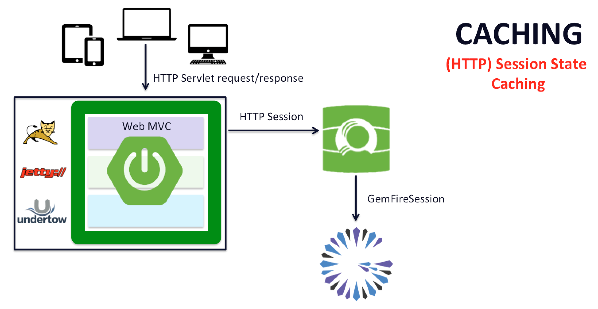
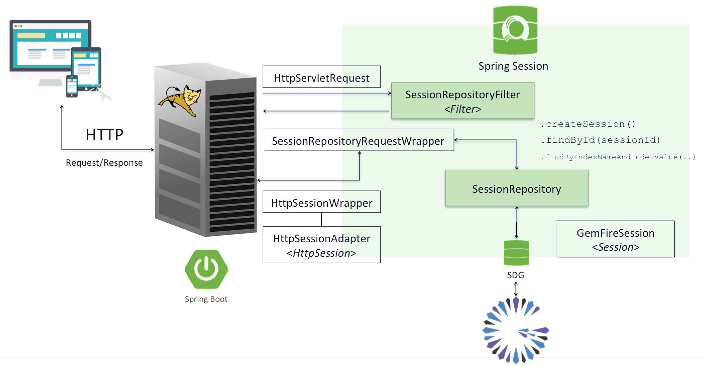
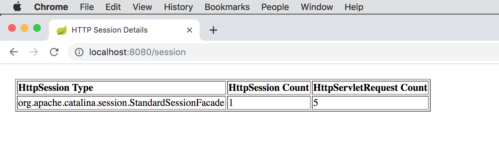

[[geode-samples-caching-http-session]]
= HTTP Session State Caching with Spring
:apache-geode-version: {master-apache-geode-version}
:apache-geode-docs: https://geode.apache.org/docs/guide/{apache-geode-version}
:apache-geode-javadoc: https://geode.apache.org/releases/latest/javadoc
:apache-geode-website: https://geode.apache.org/
:images-dir: ../images
:spring-boot-docs: https://docs.spring.io/spring-boot/docs/current/reference/html
:spring-boot-javadoc: https://docs.spring.io/spring-boot/docs/current/api
:spring-data-geode-docs: https://docs.spring.io/spring-data/geode/docs/current/reference/html
:spring-data-geode-javadoc: https://docs.spring.io/spring-data/geode/docs/current/api
:spring-framework-docs: https://docs.spring.io/spring/docs/current/spring-framework-reference
:spring-framework-javadoc: https://docs.spring.io/spring/docs/current/javadoc-api
:spring-session-docs: https://docs.spring.io/spring-session/docs/current/reference/html5
:spring-session-javadoc: https://docs.spring.io/spring-session/docs/current/api
:spring-session-website: https://spring.io/projects/spring-session
:toc: left
:toclevels: 2
:stylesdir: ../
:highlightjsdir: ../js/highlight
:docinfodir: guides

This guide walks you through building a simple Spring Boot application using {spring-session-website}[Spring Session]
backed by {apache-geode-website}[Apache Geode] to manage HTTP Session state.

It is assumed that the reader is familiar with the Spring _programming model_ as well as the _Java Servlet_ API.
No prior knowledge of Spring Session or Apache Geode is required to utilize HTTP Session State Caching in your
Spring Boot applications.

Let's begin.

link:../index.html#geode-samples[Back]

[[geode-samples-caching-http-session-background]]
== Background

HTTP Session Caching is one of the most used forms of caching in enterprise applications, especially given
the proliferation of Web applications in the enterprise.

HTTP Sessions are primarily used to manage conversational state with users of your Web applications between HTTP
requests given that HTTP is a stateless protocol.  This is due to the fact that HTTP connections are not persistent.
When an HTTP client makes a request, the client opens a connection to the server, sends an HTTP request, waits for
the server to process the request and respond, and then closes the connection.  Each time an HTTP request is sent,
the same procedure is followed.

Of course, there are alternatives to HTTP when making remote Web Service requests.  For instance, if you are using
https://en.wikipedia.org/wiki/WebSocket[WebSockets] in your applications, then you would have persistent connections
and would most likely be using either the https://stomp.github.io/[STOMP] or https://wamp-proto.org/[WAMP] protocols.

TIP: The core Spring Framework has {spring-framework-docs}/web.html#websocket[first-class support] for _WebSockets_
over the STOMP protocol.

TIP: Spring Session additionally {spring-session-docs}/#websocket[supports] Session State Management for _WebSockets_.

As mentioned above, it is useful to use the HTTP Session to manage conversational state with users of your applications
so that they can experience continuity between separate interactions (i.e. HTTP requests).  In order to maintain that
continuity and provide a consistent, uninterrupted experience, the HTTP Session must be preserved in a reliable manner.

One way to do this is to employ a data management solution in your application architecture that 1) makes the HTTP
Session highly available and 2) makes the HTTP Session resilient to failures in the system architecture.

Apache Geode is ideal for managing HTTP Session state given that it can distribute data/state across a scaled-out,
highly-available architecture by replicating data in a redundant and organized (partitioned) manner, thereby making
the data resilient to network and hardware failures.

This is ideal in a cloud environment given that you will most likely be running multiple instances of your application
in order to serve the demand, especially during peak loads.  In these cases, you will undoubtedly face failures and each
application instance will need to be prepared to take over in a moments notice to provide the consistent, uninterrupted
experience to which we alluded to above.  These applications instances will need access to the same HTTP Session state.

An application architecture with HTTP Session State Caching appears as follows:

Essentially, anytime an HTTP Session is requested by your Spring Boot, Web Application, the Servlet Container
(e.g. Apache Tomcat) delegates to Spring Session to provide the implementation of `javax.servlet.http.HttpSession`.
After all, `javax.servlet.http.HttpServlet` is an interface that can have many implementations.

Effectively, Spring Session provides it's own implementation of the `javax.servlet.http.HttpSession` interface through
a Servlet `Filter` that gets registered by Spring Session programmatically when Spring Session is on the application
classpath.

Spring Session's implementation of the `javax.servlet.http.HttpSession` interface can backed by many different providers
that implement the Spring Session framework's `SessionRepository` interface.

Spring Session's architecture can be depicted as follows:

Again, the `SessionRepository` interface is the central component of the framework enabling any backend data store
to be adapted and serve as a provider  for managing the HTTP Sessions.

This is effectively how https://github.com/spring-projects/spring-session-data-geode[Spring Session for Apache Geode
& Pivotal GemFire] works.

[[geode-samples-caching-http-session-example]]
== Example

For our example, we are going to keep the Web application relatively simple.  Essentially, we just want to show you
how easy it is to use Spring Session in your Spring Boot, Web applications, to manage the HTTP Session state.

So, we are going to switch from Servlet Container (e.g. Apache Tomcat) to Spring Session managed HTTP Sessions with a
single-line configuration change.

First, let's introduce the Spring Web MVC `Controller` in our Spring Boot, Web application.

[[geode-samples-caching-http-session-example-controller]]
=== Controller

Our Spring Web MVC `Controller` class is implemented as follows:

.Spring Boot, Web Application Controller
[source,java]
----
include::{samples-dir}/caching/http-session/src/main/java/example/app/caching/session/http/controller/CounterController.java[tags=class]
----

The main Web Service endpoint in our Spring Boot, Web application is the `/session` endpoint, which is accessible from
http//:localhost:8080/session[].

The `/session` endpoint outputs 3 bits of information:

1. The `javax.servlet.http.HttpSession` class type.
2. Current HTTP Session count.
3. Current HTTP Request count.

The `HttpSession` class type lets us know which implementation (e.g. Servlet Container vs. Spring Session) is being used
to manage the HTTP Session state.

The HTTP Request count is simply incremented every time a client HTTP Request is made to the HTTP server (e.g. Servlet
Container) before the HTTP Session expires.  If the HTTP Session expires before another client HTTP Request is made,
then the HTTP Session count is incremented and the HTTP Request count resets to 1.

[[geode-samples-caching-http-session-example-configuration]]
=== Configuration

.Spring Boot, Web Application Configuration
[source,java]
----
include::{samples-dir}/caching/http-session/src/main/resources/application.properties[]
----

The configuration is quite simple.  In this case, we have set the HTTP Session `timeout`, using the
`server.servlet.session.timeout` property, to *15 seconds*.  This property is used to configure the HTTP Session timeout
regardless of whether the HTTP Session is being managed by the Servlet Container or by Spring Session.

Additionally, we have configured the data management policy used by Apache Geode to manage the HTTP Session state
in a `LOCAL` only cache (a.k.a. Region).  This was done by setting the
`spring.session.data.gemfire.cache.client.region.shortcut` property to `LOCAL`.

The other configuration properties in Spring Boot's `application.properties` file were not strictly necessary.

TIP: In most production deployments, you will likely be using a client/server topology, where the HTTP Session
is managed by a cluster of Apache Geode or Pivotal GemFire servers so that the HTTP Session can be shared across
multiple instances of the Spring Boot, Web application. This would be especially true in a cloud environment
when utilizing a Microservices architecture.  However, for example purposes, we tried to keep the sample
as simple as possible.

NOTE: The default data management policy for the client cache (a.k.a. Region) used to manage HTTP Session state is a
`PROXY`, which is the basis for the client/server topology.  Therefore, the default configuration assumes you will be
using the client/server topology in most of your arrangements.

[[geode-samples-caching-http-session-example-classpath]]
=== Classpath

The only essential components of the application classpath is a compile-time dependency on `spring-boot-starter-web`:

.`spring-boot-starter-web` compile-time dependency declaration
[source,xml]
----
<dependency>
  <groupId>org.springframework.boot</groupId>
  <artifactId>spring-boot-starter-web</artifactId>
</dependency>
----

Along with a runtime dependency on `spring-boot-starter-tomcat` (or another Servlet Container, e.g.
`spring-boot-starter-jetty`):

.`spring-boot-starter-tomcat` runtime dependency declaration
[source,xml]
----
<dependency>
  <groupId>org.springframework.boot</groupId>
  <artifactId>spring-boot-starter-tomcat</artifactId>
</dependency>
----

Spring Boot will detect Apache Tomcat on the application classpath and bootstrap an embedded, Apache Tomcat Servlet
Container using a derived `WebApplicationContext`.

[[geode-samples-caching-http-session-example-run]]
== Run the Example

Let's run the example:

image::../images/HttpSessionCachingApplication.png[]

When we navigate to the `/session` Web service endpoint:

We see that the Servlet Container's implementing class for the `javax.servlet.http.HttpSession` interface is
`org.apache.catalina.session.StandardSession`.

If we continue to hit refresh in the Web browser, thereby causing additional client HTTP requests to be made to
the HTTP server, then our HTTP Request count increments.  If we wait for 15 seconds, then the HTTP Session will expire,
and we will see the HTTP Session count increment along with the HTTP Request count reset to 1:

image::../images/HttpSessionCachingApplication-ServletContainerSessionExpiration.png[]

Now, we can repeat this same exercise, but this time, using Spring Session.

[[geode-samples-caching-http-session-example-run-spring-session]]
=== Run the Example with Spring Session

First, we must add Spring Session to the application's classpath.  We do this simply by adding the
`spring-geode-starter-session` runtime dependency to the classpath of our example application:

.`spring-geode-starter-session` runtime dependency declaration
[source,xml]
----
<dependency>
  <groupId>org.springframework.geode</groupId>
  <artifactId>spring-geode-starter-session</artifactId>
  <scope>runtime</scope>
</dependency>
----

The `spring-geode-starter-session` dependency adds Spring Session to the application's classpath at runtime
and positions Apache Geode as the provider used to manage the HTTP Session state.

With Apache Geode, we gain all the benefits of using a highly concurrent, highly distributed data management solution
that provides high availability (HA) and resiliency in a cloud environment.

That's it! This is all we have to do to replace the Servlet's Container's HTTP Session management facilities with a
robust, highly available, highly resilient, clustered solution provided by Spring Session.

When we run the example again, and access the `/session` Web service endpoint, we will see:

image::../images/HttpSessionCachingApplication-SpringSession.png[]

Now we see that the implementing class for the `javax.servlet.http.HttpSession` is
`org.springframework.session.web.http.SessionRepositoryFilter$SessionRepositoryRequestWrapper$HttpSessionWrapper`.

Easy!

Of course, the ability to scale-out and optimize the data management policies for HTTP Session management is very
provider-specific (e.g. Apache Geode) and highly dependent on the use case as well a application requirements,
therefore is beyond the scope of this guide.

[[geode-samples-caching-http-session-summary]]
== Summary

Spring Session is a powerful framework for managing your HTTP Session state.  Not only does it allow you to plugin
different backend data management providers (as of this writing):

* https://github.com/spring-projects/spring-session-data-geode#spring-session-for-apache-geode--pivotal-gemfire[_Apache Geode (or Pivotal GemFire)_]
* {spring-session-website}[_Hazelast_]
* {spring-session-website}[_JDBC_]
* https://spring.io/projects/spring-session-data-mongodb[_MongoDB_]
* {spring-session-website}[_Redis_]

Spring Session also allows you to manage different types of Sessions depending on the context:

* {spring-session-docs}/#httpsession[_HttpSession_]
* {spring-session-docs}/#websocket[_WebSocket_]
* {spring-session-docs}#websession[_WebSession_ (Reactive)]

Therefore, it makes it a simple matter to switch providers, or adopt additional Session management capabilities as your
application requirements change and/or your use cases grow.

HTTP Session state caching is one of the most effective and common ways to utilize caching in your Spring Boot,
Web applications, and ensure the users experience is first-class.

link:../index.html#geode-samples[Back]
