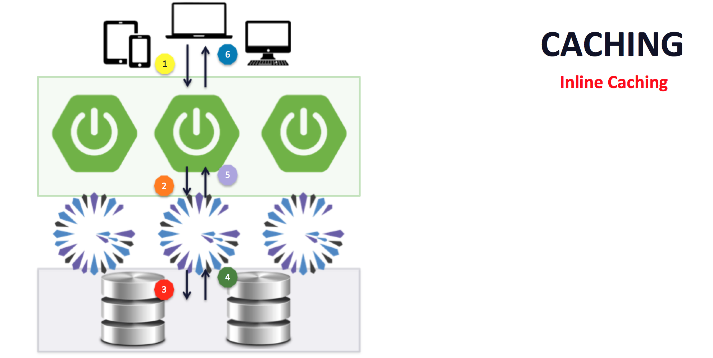
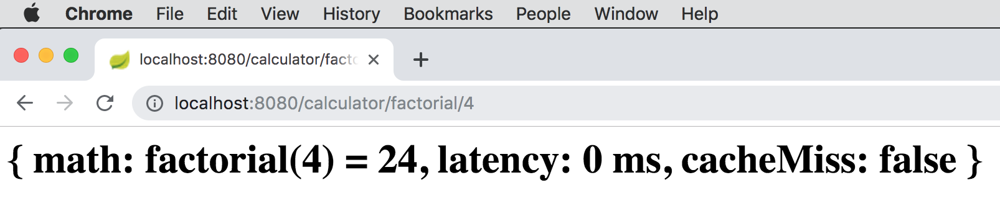
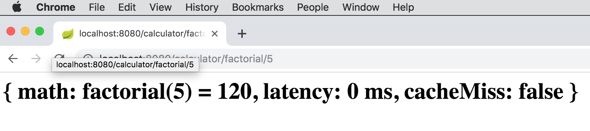

[[geode-samples-caching-inline]]
= Inline Caching with Spring
:apache-geode-version: {master-apache-geode-version}
:apache-geode-docs: https://geode.apache.org/docs/guide/{apache-geode-version}
:apache-geode-javadoc: https://geode.apache.org/releases/latest/javadoc
:images-dir: ../images
:spring-boot-docs: https://docs.spring.io/spring-boot/docs/current/reference/html
:spring-boot-javadoc: https://docs.spring.io/spring-boot/docs/current/api
:spring-data-geode-docs: https://docs.spring.io/spring-data/geode/docs/current/reference/html
:spring-data-geode-javadoc: https://docs.spring.io/spring-data/geode/docs/current/api
:spring-data-website: https://spring.io/projects/spring-data
:spring-framework-docs: https://docs.spring.io/spring/docs/current/spring-framework-reference
:spring-framework-javadoc: https://docs.spring.io/spring/docs/current/javadoc-api
:toc: left
:toclevels: 2

This guide walks you through building a simple Spring Boot application
using {spring-framework-docs}/integration.html#cache[Spring's Cache Abstraction]
backed by Apache Geode as the caching provider for Inline Caching.

It is assumed that the reader is familiar with the Spring _programming model_.  No prior knowledge of Spring's
_Cache Abstraction_ or Apache Geode is required to utilize caching in your Spring Boot applications.

Additionally, this Sample builds on the concepts from the link:caching-look-aside.html[Look-Aside Caching with Spring]
guide.  Therefore, it would be helpful to have read that guide before proceeding through this guide.

Let's begin.

link:../index.html#geode-samples[Back]

[[geode-samples-caching-inline-background]]
== Background

Caching, and in particular, _Look-Aside Caching_, is useful in cases where the output of an operation
yields the same results when given the same input.  If an expensive operation is frequently invoked with
the same input, then it will benefit from caching, especially if the operation is compute intensive, IO bound,
such as by accessing data over a network, and so forth.

Consider a very simple mathematical function, the _factorial_.  A _factorial_ is defined as `factorial(n) = n!`.
For example, if I call `factorial(5)`, then the computation is `5 * 4 * 3 * 2 * 1` and the result will be `120`.
If I call `factorial(5)` over and over, the result will always be the same.  The _factorial_ calculation is
a good candidate for caching.

While a _factorial_ might not be that expensive to compute, it illustrates the characteristics of an operation
that would benefit from caching.

In most _Look-Aside Caching_ use cases, the cache is not expected to be the "_source of truth_".  That is,
the application is backed by some other data source, or _System of Record_ (SOR), such as a database.  The cache
merely reduces resource consumption and contention on the database by keeping frequently accessed data in memory
for quick lookup when the data is not changing constantly.

It is not that the data cannot or does not ever change, only that the data is read far more than it is written,
and when it is written, the cache entry is simply invalidated and reloaded, either lazily when data is next needed
by the application, or the data can be eagerly loaded, if necessary.  Either way, the cache is *not*
the "_source of truth_" and therefore does not strictly need to be consistent with the database.

NOTE: Do not take "_inconsistency_" between the cache and database to mean that the application will read stale data.
It simply means there will be a penalty to reload/refresh the data the next time the data is requested.

But, this guide is not about Look-Aside Caching, it is about _Inline Caching_.  While _Inline Caching_ can take several
forms, the form of _Inline Caching_ we present here will be an extension to the _Look-Aside Cache_ pattern.

This particular form of _Inline Caching_ is useful in cases where:

1. Consistency between the Cache and Database is important, or...
2. Having access to the latest, most up-to-date information from the backend SOR is crucial (e.g. time sensitive).
3. Multiple, discrete & disparate applications are sharing the same data source (contrary to Microservices design).
4. The application is distributed across multiple sites.

There maybe other reasons.

_Spring's Cache Abstraction_ offers a basic form of _Inline Caching_ if you consider the overloaded
{spring-framework-javadoc}/org/springframework/cache/Cache.html#get-java.lang.Object-java.util.concurrent.Callable-[`Cache.get(Object key, Callable<T> valueLoader):T`]
method.  The overloaded `Cache.get(..)` method accepts a `Callable` argument, which serves the purpose of loading a value
from an external data source, as defined by the `Callable`, on a cache miss.  If a value for the given key is not present
in the cache, then the `Callable` will be invoked to load a value for the given key.

This form of _Inline Caching_ is very basic since 1) most application developers are not interfacing with _Spring's
Cache Abstraction_ in their application by using the `org.springframework.cache.Cache` API directly.  Most of the time,
application developers will use the Spring cache annotations (e.g. `@Cacheable`), or alternatively, the JSR-107,
JCache API annotations, as {spring-framework-docs}/integration.html#cache-jsr-107[documented]. 2) Second, while
`Cache.get(..)` satisfies _read-through_ to the backend, external data source, there is no equivalent operation
in the `Cache` API for _write-through_, i.e. when using `Cache.put(key, value)` to put a value into the cache
in addition to writing back to the external data source.

With _Inline Caching_, the _read & write through_ to/from the backend data source are intrinsic characteristics
of _Inline Caching_.  Additionally, on _write-through_, the cache op (i.e. `put(key, value)`) does not succeed
unless the backend data source has been updated.  In essence, the cache and backend data source are kept in-sync
and therefore consistent.

WARNING: There are still moments when the cache could be observed in an inconsistent state relative to the backend
database, such as between a database update and a cache refresh on a cache hit.  This means the value was in the cache
but may not have been the latest value when requested since the database may have been updated by some other means
(e.g. another application updating the database directly, not using _Inline Caching_ with a synchronous _write-through_).
To keep the cache and database consistent, then all data access operations must involve the cache.  That is, you must
strictly adhere to and be diligent in your use of _Inline Caching_.

_Inline Caching_ can be depicted in the following diagram:

In the diagram above, there are 2 flows: 1 for _read-through_ (right-side) and another for _write-through_ (left-side).
Both can occur in a single operation, on a read.

When a client sends a request for data (*#6*) the request invokes the appropriate application (`@Cacheable`) service
method, which is immediately forwarded to the cache to determine if the results for the given input have already been
computed (*#5*). If the result is cached (a _cache hit_), then the result is simply returned to the caller.  However,
if a result had not been previously computed, or the result expired, or was evicted, then before the cacheable service
method is invoked, an additional lookup is performed (*#4*) to determine whether the computed value may have already
been persisted to the backend database.  If the value exists in the database, then it is loaded into the cache
and returned to the caller. Only when the computed value is not present in the cache nor exists in the database is the
cacheable service method invoked. Once the service method finishes and returns the result, the value is cached as part
of the contract of `@Cacheable` and will also be written through to the backend database.

During a client request to compute some value regardless of the cache or database state (*#1*), the service method is
always invoked (as specified in the contract for the `@CachePut` annotation).  Upon completing the computation,
the result is cached (*#2*) and additionally persisted to the database (*#3*), which describes the _write-through_.
If the database INSERT/UPDATE is not successful on write, then the cache will not contain the value.

Now it is time to make all of this a bit more concrete with an example.

[[geode-samples-caching-inline-example]]
== Example

For our example, we will develop a calculator application that performs basic mathematical functions, such as
`factorial`.  Again, not that practical, but a useful and simple demonstration allowing us to focus on
our primary concern, which is to enable and use _Inline Caching_.

[[geode-samples-caching-inline-example-calculator-service]]
=== Caching-enabled CalculatorService

We start by defining the supported mathematical functions in a `CalculatorService` class.

.CalculatorService interface
[source,java]
----
include::{samples-dir}/caching/inline/src/main/java/example/app/caching/inline/service/CalculatorService.java[tags=class]
----

The `CalculatorService` is annotated with Spring's `@Service` stereotype annotation so that it will be picked up by
the Spring Container's classpath component scan process, which has been carefully configured by Spring Boot.
The class also extends the `AbstractCacheableService` base class, inheriting a couple `boolean` methods that signal
whether cache access resulted in a hit or miss.

In addition, the `CalculatorService` contains two mathematical functions: `factorial` and `sqrt` (_square root_).
Each method caches the result of the computation using the input (operand) and operator as the key.  If the method
is called 2 or more times with the same input, the cached result will be returned, providing the cache entry has not
expired or been evicted.  We neither configure eviction nor expiration for this example, however.

Both the `factorial(..)` and `sqrt(..)` methods have been annotated with Spring's `@Cacheable` annotation to demarcate
these methods with caching behavior.  Of course, as explained in SBDG's <<geode-caching-provider,documentation>>,
caching with Spring's Cache Abstraction using Apache Geode (or Pivotal GemFire, even Pivotal Cloud Cache (PCC)
when running in Pivotal CloudFoundry (PCF)) as the caching provider is enabled by default.  Therefore, there is nothing
more you need do to start leverage caching in your Spring Boot applications than to annotate the service methods
with the appropriate Spring or JSR-107, JCache API annotations.  Simple!

It is worth noting that we are starting with the same applied pattern of caching as you would when using the
_Look-Aside Caching_ pattern.  This is key to minimizing the invasive nature of _Inline Caching_.  There is a subtle
difference, though, and that will be apparent in the additional configuration we supply as part of our Spring Boot
application.

Let's look at that next.

[[geode-samples-caching-inline-example-calculator-configuration]]
=== Inline Caching Configuration

The following illustrates the additional configuration required to enable _Inline Caching_:

.CalculatorConfiguration
[source,java]
----
include::{samples-dir}/caching/inline/src/main/java/example/app/caching/inline/config/CalculatorConfiguration.java[tags=class]
----

The pertinent part of the configuration that enables _Inline Caching_ for our Calculator application is contained in
the `inlineCachingForCalculatorApplicationRegionsConfigurer` bean definition.

SBDG provides the `InlineCachingRegionConfigurer` class used in the bean definition to configure and enable the caches
(a.k.a. as Regions in Apache Geode & Pivotal GemFire terminology) with _Inline Caching_ behavior.

The Configurer's job is to configure the appropriate Spring Data (SD) _Repository_ used as a Region's `CacheLoader`
for "_read-through_" behavior as well as configure the same SD _Repository_ for a Region's `CacheWriter` for
"_write-through_" behavior.  This "_read/write-through_" behavior is the "inlining" component of _Inline Caching_,
i.e. the second lookup opportunity we talked about in the <<geode-samples-caching-inline-background,Background>>
section above.

The `CacheLoader/Writer` also ensures consistency between the cache and the backend data store, such as a database.

The _Repository_ plugged in by our application configuration is the `CalculatorRepository`:

.CalculatorRepository
[source,java]
----
include::{samples-dir}/caching/inline/src/main/java/example/app/caching/inline/repo/CalculatorRepository.java[tags=class]
----

NOTE: Spring Data's Repository abstraction is used rather than providing direct access to some `DataSource` for
the backend data store since 1) Spring Data Repository abstraction {spring-data-website}[supports] a wide-array
of backend data stores uniformly and 2) it is easy to compose multiple Spring Data Repositories as one (using
the https://en.wikipedia.org/wiki/Composite_pattern[Composite pattern]) if you want to write to multiple backend
data stores and 3) Spring Data has a very consistent and intuitive API, based on the
https://www.baeldung.com/java-dao-pattern[Data Access Object (DAO) pattern]
for defining basic CRUD and simple query data access operations.  Typically, the `DataSource` must be wrapped
by a higher-level API to make use of the backend data store in Java anyway, like JDBC for databases, or even higher,
such as by using an ORM tool (e.g. JPA with Hibernate).

The second argument in the configuration for the `InlineCachingRegionConfigurer` includes a required `Predicate`
used to target the specific caches (Regions) on which _Inline Caching_ should be enabled and used.  You can target
all regions by simply supplying the following `Predicate`:

.Predicate targeting all caches (Regions)
[source,java]
----
regionBeanName -> true;
----

In our case, we only want to target the Regions that have been used as "caches" as identified in the service methods
annotated with Spring's `@Cacheable` annotation, to be enabled with and use _Inline Caching_.

The `Predicate` allows you to target different Regions using different Spring Data _Repositories_, and by extension
different backend data stores, for different purposes, depending on your application uses cases.

For example, you may have a cache Region X containing data that needs to be stored in MongoDB (use https://spring.io/projects/spring-data-mongodb[Spring Data MongoDB]),
where as another cache Region Y may contain data that needs to be written to Neo4j and represented as a graph (use
https://spring.io/projects/spring-data-neo4j[Spring Data Neo4j's]), and yet another cache Region Z containing data
that needs to be written back to a database (use https://spring.io/projects/spring-data-jdbc[Spring Data JDBC]
or https://spring.io/projects/spring-data-jpa[Spring Data JPA]).

This is what makes the Spring Data _Repository_ pattern so ideal.  It is very flexible and has a highly consistent
API across a disparate grouping of data stores.  And due to that uniformity, it is easy to "adapt" the GemFire/Geode
`CacheLoader`/`CacheWriter` interfaces to use a SD Repository under-the-hood.  Indeed, that is exactly what SBDG
has done for you!

We will circle back to the `resultKeyGenerator` bean definition after we talk about the application domain model.

Also notice the use of the `@EnableCachingDefinedRegions` annotation.

Whenever you use a caching provider like Apache Geode or Redis, you must explicitly define or declare your caches
in some manner.  This is inconvenient since you have basically already declared the caches required by your application
when using Spring's, or alternatively, the JSR-107, JCache API annotations (e.g. `@Cacheable`). Why should you have to
do this again?  Well, using SBDG, you don't.  You simply have to declare the `@EnableCachingDefinedRegions` annotation
and SBDG will take care of defining the necessary Apache Geode Regions backing the caches for you.

Regions for caches are not auto-configured for you because there are many different ways to "define" a Region, with
different configuration, such as eviction and expiration polices, memory requirements, application callbacks, etc.
The Region may already exist and have been created some other way.  Either way, you may not want SBDG to auto-configure
these Regions for you.

TIP: If you have not done so already, you should definitely read about SBDG's support for _Inline Caching_
in the link:../caching.html#geode-caching-provider-inline-caching[].

TIP: To learn more about how Apache Geode's (or Pivotal GemFire's) data loading functionality works, or specifically,
how to {apache-geode-docs}/developing/outside_data_sources/sync_outside_data.html["Keep the Cache in Sync with Outside
Data Sources"] follow the link.  You may also learn more by reading the _Javadoc_ for
{apache-geode-javadoc}//org/apache/geode/cache/CacheLoader.html[`CacheLoader`]
and {apache-geode-javadoc}/org/apache/geode/cache/CacheWriter.html[`CacheWriter`].

TIP: To learn more about `@EnableCachingDefinedRegions`, see the Spring Data for Apache Geode
{spring-data-geode-docs}/#bootstrap-annotation-config-caching[documentation].

[[geode-samples-caching-inline-example-calculator-backend]]
=== Backend DataSource Configuration

While we used Spring Data's Repository abstraction as the way to access data in the backend data store used for
_Inline Caching_, we have not shown how the data source for the backend data store was configured.

Obviously, the data source connecting the application to the backend data store varies from data store to data store.
Clearly, when using a database, you would configure a `javax.sql.DataSource` using the JDBC API.  That `DataSource` is
then plugged into a higher-level data access API like JDBC, or Spring's `JdbcTemplate`, or JPA, to perform data access.
With MongoDB or Redis, again you would configure the data source, or connection factory, appropriate for those stores
and plug that into the data access API of your choice (e.g. Spring Data MongoDB or Spring Data Redis).

Though it is not immediately apparent in our example, we simply 1) used an embedded, in-memory database (i.e. HSQLDB)
and 2) relied on Spring Boot's _auto-configuration_ to bootstrap the embedded database on startup.

TIP: To learn more about {spring-boot-docs}/boot-features-sql.html#boot-features-embedded-database-support[bootstrapping]
an embedded database and the embedded databases that can be _auto-configured_ by Spring Boot, follow the link.

In a nutshell, we only need to declare a dependency on `spring-jdbc` and the embedded database we want to use
as the backend data store for _Inline Caching_, like so:

.Dependencies declaration
[source,xml]
----
<dependency>
    <groupId>org.springframework.boot</groupId>
    <artifactId>spring-boot-starter-data-jpa</artifactId>
</dependency>
<dependency>
    <groupId>org.hsqldb</groupId>
    <artifactId>hsqldb</artifactId>
    <scope>runtime</scope>
</dependency>
----

The `spring-jdbc` dependency is transitively pulled in by `org.springframework.boot:spring-boot-starter-data-jpa`,
which also pulls in Spring Data JPA.  Therefore, we are using JPA, and specifically, the Hibernate JPA provider,
to back our Spring Data Repository (i.e. `CalculatorRepository`) in this example.

With these dependencies declared on the application's classpath, Spring Boot _auto-configures_ a `DataSource` to
an embedded HSQLDB database, bootstraps HSQLDB, finds our application `CalculatorRepository` interface declaration,
and backs it with a Spring Data JPA implementation using Hibernate as the provider.  Very powerful!

Additionally, we configure our embedded HSQLDB database by including a SQL script with DDL statements to initialize
the schema (i.e. create the "CALCULATIONS" table):

.schema.sql
[source,sql]
----
include::{samples-dir}/caching/inline/src/main/resources/schema.sql[]
----

We also include a SQL script containing DML statements to populate the database with some existing data
(i.e. mathematical calculations) in order to simulate cache hits:

.data.sql
[source,sql]
----
include::{samples-dir}/caching/inline/src/main/resources/data.sql[]
----

By simply including `schema.sql` and the complimentary `data.sql` files in the classpath of the application, Spring Boot
will automatically detect these files and apply them to the database during startup.

TIP: To learn more about embedded, in-memory database initialization applied by Spring Boot, see
{spring-boot-docs}/howto-database-initialization.html[here].

[[geode-samples-caching-inline-example-calculator-model]]
=== Application and Data Modeling

The final component of our application up for discussion is the application domain model (as compared to
the data model).  There is not a whole lot of difference; the structure and mapping is relatively 1-to-1.

The results from the mathematical calculations are captured in an instance of the `ResultHolder` class:

.CalculatorRepository
[source,java]
----
include::{samples-dir}/caching/inline/src/main/java/example/app/caching/inline/model/ResultHolder.java[tags=class]
----

This class uses https://projectlombok.org/[Project Lombok] to simplify the implementation.

It is also a JPA persistent entity as designated by the `javax.persistence.Entity` annotation.

We also define a composite, primary key (i.e. `ResultHolder.ResultKey`), which consists of the `operand` to
the mathematical function along with the `Operator`, which has been defined as an enumerated type and is
the mathematical function being computed (e.g. _factorial_).

This is also why, as briefly alluded to back in the section on <<geode-samples-caching-inline-example-calculator-configuration>>,
the `resultKeyGenerator` bean definition was important:

.Result KeyGenerator bean definition
[source,java]
----
include::{samples-dir}/caching/inline/src/main/java/example/app/caching/inline/config/CalculatorConfiguration.java[tags=key-generator]
----

This custom `KeyGenerator` was applied in the caching annotations of the service method like so:

.Result KeyGenerator use
[source,java]
----
@Service
class CalcultorService ... {

  @Cacheable(... keyGenerator="resultKeyGenerator")
  public int factorial(int number) { .. }

  ...
}
----

Basically, the keys between the cache and the database (i.e. the primary key) must match.  This is because the cache key
is used as the identifier in all data access operations performed against the backend database using the
`CalculatorRepository` (e.g. `calculatorRepository.findById(cacheEntry.getKey())`, specifically in the cache loader's
(i.e. the _read-through_) case).

If a custom `KeyGenerator` had not been provided, then the "key" would have been the `@Cacheable` service method
parameter only (i.e. the integer number or operand in the mathematical function), and as I already stated, the primary
key in the database table is a composite key consisting of both the operand and the operator.  This was deliberate
because...

The most fundamental difference between the application domain model and the database model is that while
the application keeps the mathematical calculations in 2 separate, distinct caches (Regions), as seen
in the `@Cacheable annotation on the individual service methods:

.Declared caches
[source,java]
----
@Service
class CalcultorService ... {

  @Cacheable(name = "Factorials" ...)
  public int factorial(int number) { .. }

  @Cacheable(name = "SquareRoots" ...)
  public int sqrt(int number) { .. }

}
----

The database, on the other hand, stores all mathematical calculations in the same table.  That is, both _factorials_
and _square roots_ are stored together in the "CALCULATIONS" table.

This is also why the `operand` cannot be used as the primary key by itself.  If a user of our Calculator application
performed both `factorial(4) = 24` and `sqrt(4) = 2`, how do we know which result the user wants just by looking
at the operand when performing the cache lookup.  You dons't.  You need to know the `operator`, too.

While the individual `CalculatorService` methods for the mathematical functions determine which `operator` is in play,
and even while the results of the calculations are kept separately in distinct caches, and therefore, there can only be
one result per entry (i.e. `operand`) in the individual caches, the database table is not like the cache
or the application.

Again, this design was very deliberate in order to show the flexibility you have in modeling your application,
your cache and your database, independently of each other.  After all, you may be building a new application for
an existing database who's data model cannot be changed.  However, it does not mean your application model needs to
strictly match the database model if that is not the most efficient way to access and process the data.

The point is, you have options, and you can make the best choice for your application's needs.

[[geode-samples-caching-inline-example-run]]
== Run the Example

Now, it is time for us to run the example.

WARNING: The observant reader will have noticed that the `CalculatorService` uses `int` as the data type for the input
and output of the mathematical functions.  You should never use `int` to implement any mathematical calculations for any
enterprise applications, ever.  Instead, you should use either `java.math.BigDecimal` or `java.math.BitInteger`.
One of many reasons for this, especially in _factorial's_ case, is that it is very easy to "_overflow_" the allowed
values of an `int` type, which is 32 bits.  In fact, with `factorial(13)` you exceed the range of allowed integer values
represented by an `int`.  Even `long` is not sufficient in most cases.  Therefore, the `CalculatorService` is very
limited in its utility.  `int` was used primarily to minimize type conversions between store types and keep the example
as simple as possible.

The Calculator application includes a `CalculatorController`, which is a Spring Web MVC `@RestController`,
containing the following web service endpoints:

.Calculator Web Service Endpoints
|===
| REST API call | Description

| `/`                               | Returns the home page. Defaults to `/ping`.
| `/ping`                           | Heartbeat endpoint returning "PONG".
| `/calculator/factorial/\{number}` | Computes the _factorial_ of the `number`.
| `/calculator/sqrt/\{number}`      | Computes the _square root_ of the `number`.

|===

Keep in mind that the following data set has been loaded into the backend database already, which is indirectly treated
as "cached" data:

.data.sql
[source,sql]
----
include::{samples-dir}/caching/inline/src/main/resources/data.sql[]
----

If you call `http://localhost:8080/caculator/factorial/4`, you will see the following output:

image::../images/factorial-of-four-before.png[]

The output shows the result of `factorial(4)` is *24*, that the calculation took *3096 _milliseconds_* and the operation
resulted in a *_cache miss_*.  However, now that we computed `factorial(4)`, the result was put into the "cache"
as well as INSERTED into the backend (embedded, in-memory HSQLDB) database.  So, if we run the operation again,
the `latency` drops to zero (and *_cacheMiss_* is *_false_*):

That is because the result (i.e. *24*) of `factorial(4)` is "cached" in Apache Geode (as well as persisted to
the database; _write-through_) and therefore, the `CaculatorService.factorial(:int)` method is *not* called.
The result, however, is pulled from the cache, not the database.

To see the effects of the `factorial(:int)` method involving the database as part of the inline cache lookup, you can
call `http://localhost:8080/caculator/factorial/5`.  *5* is stored in the database, but is not currently present
in the cache:

image::../images/factorial-of-five-before.png[]

While the latency is much better than invoking the _factorial_ function, it is still not as fast as pulling the result
from the cache.

Now, if you hit refresh in your browser, the application will get the result of `factorial(5)` from the cache since
the result was loaded from the database and put into the cache (_read-through_) during the first request. Therefore,
we see that the latency drops from *12 ms* to *0 ms*.  However, in both cases, the *_cacheMiss_* was *_false_*
because the value was found (in the database) without invoking the `CalculatorService.factorial(:int)` method:

You can play around with the _square root_ operation to see the same effects of _Inline Caching_.

[[geode-samples-caching-inline-example-test]]
== Tests

The Calculator application includes an Integration Test class with tests asserting the behavior demonstrated above
in the example.  The test class is available here:

link:{github-samples-url}/caching/inline/src/test/java/example/app/caching/inline/CalculatorApplicationIntegrationTests.java[]

[[geode-samples-caching-inline-summary]]
== Summary

_Inline Caching_ is a powerful caching pattern when you have an external, backend data store that doubles as the
application's _System of Record_ (SOR) and you need to keep the cache and database relatively in-sync with each other.

_Inline Caching_ enables immediate _read-through_ and _write-through_ behavior that keeps the cache
and database consistent.  While the database can serve as a fallback option for priming the cache, the cache
will serve an important role in reducing the contention and load on the backend database.

As you have seen in this guide, the configuration of _Inline Caching_ is very simple to do with Spring Boot
for Apache Geode (SBDG) when using Spring's Cache Abstraction along with Apache Geode as the caching provider.

link:../index.html#geode-samples[Back]
