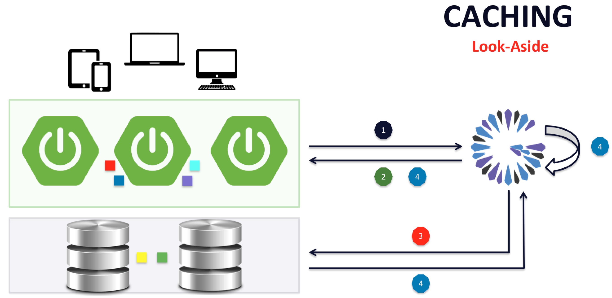

[[geode-samples-caching-lookaside]]
= Look-Aside Caching with Spring
:apache-geode-version: {master-apache-geode-version}
:apache-geode-docs: https://geode.apache.org/docs/guide/{apache-geode-version}
:apache-geode-javadoc: https://geode.apache.org/releases/latest/javadoc
:images-dir: ../images
:spring-boot-docs: https://docs.spring.io/spring-boot/docs/current/reference/html
:spring-boot-javadoc: https://docs.spring.io/spring-boot/docs/current/api
:spring-data-geode-docs: https://docs.spring.io/spring-data/geode/docs/current/reference/html
:spring-data-geode-javadoc: https://docs.spring.io/spring-data/geode/docs/current/api
:spring-framework-docs: https://docs.spring.io/spring/docs/current/spring-framework-reference
:spring-framework-javadoc: https://docs.spring.io/spring/docs/current/javadoc-api
:toc: left
:toclevels: 2

This guide walks you through building a simple Spring Boot application
using {spring-framework-docs}/integration.html#cache[Spring's Cache Abstraction]
backed by Apache Geode as the caching provider for Look-Aside Caching.

It is assumed that the reader is familiar with the Spring _programming model_.  No prior knowledge of Spring's
_Cache Abstraction_ or Apache Geode is required to utilize caching in your Spring Boot applications.

Let's begin.

link:../index.html#geode-samples[Back]

[[geode-samples-caching-lookaside-background]]
== Background

Caching is an effective software design pattern for reducing the resource consumption used by your application
as well as improving efficiency by increasing throughput and reducing latency.

The fundamental premise of caching is, when given the same arguments, if a service call yields the same results
every time, then it is a good candidate for caching.

Indeed, if I am searching for a customer record by account number and the search always yields the same customer
for a given account number, then adding caching to the search operation will improve the overall user experience.
After all, the account number may be a form of customer identity. We can save compute resources by caching
the customer's information, which is especially useful if the customer's information is used in multiple workflows
of the application during the interactions with the customer.

While there are different patterns of caching, the _**Look-Aside Caching**_ pattern is the most frequently used.

_Look-Aside Caching_ is a pattern of caching where the input of a cacheable operation is used as the key for looking up
any cached results from a prior invocation of the operation when given the same input.  In _Look-Aside Caching_, the
cache is consulted first, before the operation is invoked, and if a computation for the given input has already been
computed and cached, then the value from the cache is returned. Otherwise, if no value has been cached for the given
input, or the previous cache result expired, or was evicted, then the operation will be invoked and the result of
the operation is cached using the input as the key and the result as a value.

It should be apparent that the data structure of a cache is a key/value store, or a `Map`.  Indeed it is quite common
for most cache implementations to even implement the `java.util.Map` interface.  However, many cache implementations
are quite a bit more sophisticated, providing distribution (to scale-out), replication (HA) and even persistence
along with other capabilities.

For example, I may have a `CustomerService` class that looks up a `Customer` by `AccountNumber`:

.Cacheable CustomerService class
[source,java]
----
@Service
class CustomerService {

  @Cacheable("CustomersByAccountNumber")
  Customer findBy(AccountNumber accountNumber) {
    ...
  }
}
----

If I have already looked up a `Customer` (e.g. "Jon Doe") with a given `AccountNumber` (e.g. "abc123"), then when
the `findBy(..)` method is called with the same `AccountNumber` (i.e. "abc123") again, we would expect the same result
(i.e. `Customer` "Jon Doe") to be returned.

The _Look-Aside Caching_ pattern can be depicted in the following diagram:

In the diagram above, we see that the caching provider (e.g. Apache Geode) is consulted first, #2, after the client
initiated the request, #1.  If the result of the cacheable operation for the given input has already been computed
and stored in the cache (a _cache hit_), then the result is simply returned, #3, and passed back to the caller, #6.

However, if the cacheable operation has never been invoked with the given input, or the previous computation of
the operation for the given input expired, or was evicted, then the cacheable operation is invoked (_cache miss_).
This cacheable operation may access some external data source to perform its computation, #3 (red). After the operation
completes, it returns the result, but not before the caching infrastructure stores the result along with the input
in the cache, #4 & #5. After the result is cached, the value is returned to the caller, #3 (green). Any subsequent
invocation of the cacheable operation with the same input should yield the same result as stored in the cache,
providing the cache entry (input->result) has not expired or been evicted.

Spring's {spring-framework-docs}/integration.html#cache[Cache Abstraction] is just that, a very elegant implementation
of the _Look-Aside Caching_ pattern.  Details of how Spring's _Cache Abstraction_ works under-the-hood is beyond the
scope of this document.  In a nutshell, it relies on Spring AOP and is not unlike Spring's Transaction Management.

Different caching providers have different capabilities. You should choose the caching provider that gives you
what you require to handle your application needs and use cases correctly.

If used appropriately, caching can greatly improve your application's end-user experience.

TIP: Instead of using {spring-framework-javadoc}/org/springframework/cache/annotation/package-summary.html[Spring's Cache Annotations],
you may instead use JSR-107, JCache API Annotations, which is {spring-framework-docs}/integration.html#cache-jsr-107[supported]
by Spring's _Caching Abstraction_.

NOTE: See Spring Boot's documentation for a complete list of
{spring-boot-docs}/boot-features-caching.html#boot-features-caching-provider[supported caching providers].

[[geode-samples-caching-lookaside-example]]
== Example (with additional background)

To make the effects of Spring's _Cache Abstraction_ using Apache Geode as the cache provider apparent in
your application, we show how to enable and use caching with your application in a very small, simple example.

The example Spring Boot application implements a Counter Service, which simply maintains a collection of named counters.
The application provides a REST-ful Web interface to increment a counter, get the current cached count for a named
counter, and the ability to reset a named counter to 0.

Typically, caching is used to offset the costs associated with expensive operations, such as disk or network I/O.
Indeed, both an operation's throughput and latency is bound by an I/O operation since compute is many orders
of magnitude faster than disk, network, etc.

While developers have been quick to throw more Threads at the problem, trying to do more work in parallel, this opens
the door to a whole new set of problems (concurrency), usually at the expense of using more resources, which does not
always yield the desired results.

Opportunities for caching are often overlooked, yet is very effective at minimizing the over utilization of resources
by leveraging reuse.  In an ever increasing Microservices based world, caching will become even more important
as it serves a very important role in the applications architecture, not the least of which is, resiliency.

Of course, you still must tune your cache.  Most caches keep information in memory, and since memory is finite,
you must utilize strategies to manage memory effectively, such as eviction, expiration, or even Off-Heap
(i.e. native memory) for JVM-based caches.  For example, evicting/expiring entries based on use (_Least Recently Used_,
or LRU) is 1 of many effective strategies.

Each caching provider's capabilities are different in this regard.  The choice should not only be based on
what capabilities you need now, but capabilities (e.g. distributed compute, streaming) you may need in the future.
So, choose wisely.

[[geode-samples-caching-lookaside-example-counterservice-application]]
=== Counter Service Application

Let's have a look at the Counter Service application.

We start with a simple, Spring Boot, Servlet-based, Web application:

.SpringBootApplication
[source,java]
----
include::{samples-dir}/caching/look-aside/src/main/java/example/app/caching/lookaside/BootGeodeLookAsideCachingApplication.java[tags=class]
----

With the `org.springframework.geode:spring-geode-starter` dependency on your application classpath:

.spring-goede-starter dependency
[source,xml]
----
<dependency>
  <groupId>org.springframework.geode</groupId>
  <artifactId>spring-geode-starter</artifactId>
</dependency>
----

And the `BootGeodeLookAsideCachingApplication` class annotated with `@SpringBootApplication`, you have everything you
need to begin using Spring's _Cache Abstraction_ in your application with Apache Geode as the caching provider.

TIP: You can switch from open source Apache Geode to Pivotal GemFire (PCC) very easily simply by changing
the artifactId from `spring-geode-starter` to `spring-gemfire-starter`.  No configuration or code changes
are necessary.

As an application developer, all you need do is focus on where in your application caching would be most beneficial.

Let's do that.

[[geode-samples-caching-lookaside-example-counterservice-cacheableservice]]
=== Caching-enabled CounterService

Next, we define the operations our `CounterService` and add caching:

.CounterService
[source,java]
----
include::{samples-dir}/caching/look-aside/src/main/java/example/app/caching/lookaside/service/CounterService.java[tags=class]
----

The primary function of the `CounterService` is to maintain a collection of named counters, incrementing the count
each time a named counter is accessed, and returning the current (cached) count. There is an additional operation
to reset a named counter to 0.

All `CounterService` operations perform a cache function.

The `@Cacheable` `getCachedCount(:String)` method is our _**look-aside cache**_ operation. That is, the "Counters" cache
is consulted for the named counter before the method is invoked. If a count has already been established for the named
counter, then the cached count is returned and the method will not be invoked. Otherwise the `getCachedCount(:String)`
method is invoked and proceeds to call the `getCount(:String)` method.

The `@CachePut` annotated `getCount(:String)` method is always invoked, but the result is cached. If a cache entry
already exists, then it is updated (or in this case, replaced). This method always has the effect of incrementing
the named counter.

Finally, we have a `@CacheEvict` annotated `resetCache(:String)` method, which will reset the named counter to 0
and evict the cache entry for the named counter.

TIP: Each of the Spring's Cache annotations can be replaced with the corresponding JSR-107 - JCache API annotations
as {spring-framework-docs}/integration.html#cache-jsr-107[documented here], and the application will work just the same.

[[geode-samples-caching-lookaside-example-counterservice-controller]]
=== CounterController

Then, we include a Spring Web MVC Controller to access our Counter Service application from a Web browser:

.CounterController
[source,java]
----
include::{samples-dir}/caching/look-aside/src/main/java/example/app/caching/lookaside/controller/CounterController.java[tags=class]
----

Essentially, we just inject our `CounterService` application class and wrap the service operations in Web service
endpoints, accessible by URL using HTTP:

.Counter Web service endpoints
|===
| URL | Description

| `/ping` | Heartbeat request to test that our application is alive and running.
| `/counter/\{name}` | Increments the "named" counter.
| `/counter/\{name}/cached` | Returns the current, cached count for the "named" counter.
| `/counter/\{name}/reset` | Resets the count for the "named" counter.

|===

The base URL is `http://localhost:8080`.

After running the `BootGeodeLookAsideCachingApplication` class, if you open a Web browser and navigate to
`http://localhost:8080/ping`, you should see the content "**PONG**".

[[geode-samples-caching-lookaside-example-counterservice-configuration]]
=== Counter Service Configuration

While Spring Boot for Apache Geode/Pivotal GemFire (PCC), SBDG, takes care of enabling Spring's caching infrastructure
for you, configuring Apache Geode/Pivotal GemFire (PCC) as a caching provider, you still must define and declare
your individual caches.

No Spring caching provider is fully configured by Spring or Spring Boot for that matter.  Part of the reason for this
is that there are many different ways to configure the caches.

Remember earlier we mentioned tuning a cache with eviction or expiration policies, perhaps using Off-Heap memory,
overflowing entries to disk, making caches persistent, are few of the ways to tune or configure a cache. You might be
using a client/server or even a WAN topology and you might need to configure things like conflation, filters,
compression, security (e.g. SSL), and so on.

However, this is a lot to think about and you may just simply want to get up and running as quickly as possible. While
SBDG is not opinionated about this out-of-the-box, we do provide assistance to make this task easy:

.GeodeConfiguration
[source,java]
----
include::{samples-dir}/caching/look-aside/src/main/java/example/app/caching/lookaside/config/GeodeConfiguration.java[tags=class]
----

The only thing of real significance here is the `@EnableCachingDefinedRegions` annotation. This Spring Data
for Apache Geode/Pivotal GemFire (PCC), SDG, annotation is responsible for introspecting our Spring Boot application
on Spring container startup, identifying all the caching annotations (both Spring Cache annotations as wells JSR-107,
JCache annotations) used in our application components, and creating the appropriate caches.

If you were not using SDG's `@EnablingCachingDefinedRegions` annotation, then you would need to define the Region
using the equivalent _JavaConfig_:

."Counters" Region definition using JavaConfig
[source,java]
----
@Bean("Counters")
public ClientRegionFactoryBean<Object, Object> countersRegion(GemFireCache gemfireCache) {

    ClientRegionFactoryBean<Object, Object> countersRegion = new ClientRegionFactoryBean<>();

    countersRegion.setCache(gemfireCache);
    countersRegion.setClose(false);
    countersRegion.setShortcut(ClientRegionShortcut.LOCAL);

    return countersRegion;
}
----

Or using XML:

."Counters" Region definiton using XML
[source,xml]
----
<gfe:client-region id="Counters" shortcut="LOCAL"/>
----

In Apache Geode terminology, each cache identified in 1 of the caching annotations by name, will have an Apache Geode
Region created for it.

In our case, SBDG provides us a `ClientCache` instance by default, so we will be creating client `LOCAL`-only Regions.
The client "Counters" Region is `LOCAL` since we do not (yet) have a server backend running.

However, it would be very simple to convert this application into using a client/server topology.

[[geode-samples-caching-lookaside-example-counterservice-configuration-clientserver]]
==== Client/Server Configuration

To use the client/server topology, essentially you only need to remove the `shortcut` attribute from the
`@EnableCachingDefinedRegions` annotation (since the default is a client `PROXY` Region), start a Locator/Server
using _Gfsh_ and create the "Counters" Region on the server.

Of course, you technically do not even need to create the "Counters" Region on the server.  You can also leverage
SDG's `@EnableClusterConfiguration(..)` annotation, which will create the necessary server-side, "Counters" Region
for you.

After starting a Locator/Server using _Gfsh_:

[source,txt]
----
$ gfsh
    _________________________     __
   / _____/ ______/ ______/ /____/ /
  / /  __/ /___  /_____  / _____  /
 / /__/ / ____/  _____/ / /    / /
/______/_/      /______/_/    /_/    1.2.1

Monitor and Manage Apache Geode

gfsh>start locator --name=LocatorOne --log-level=config
Starting a Geode Locator in /Users/jblum/pivdev/lab/LocatorOne...
....

gfsh>start server --name=ServerOne --log-level=config
Starting a Geode Server in /Users/jblum/pivdev/lab/ServerOne...
.....

gfsh>list members
   Name    | Id
---------- | ---------------------------------------------------
LocatorOne | 10.99.199.24(LocatorOne:40824:locator)<ec><v0>:1024
ServerOne  | 10.99.199.24(ServerOne:40855)<v1>:1025

gfsh>list regions
No Regions Found
----

You only need to modify your application configuration as follows:

.Using client/server
[source,java]
----
@Configuration
@EnableCachingDefinedRegions
@EnableClusterConfiguration(useHttp = true)
public class GeodeConfiguration { }
----

After (re-)starting the application, we will see that the "Counters" Region on the server has been created:

."Counters" Region
[source,txt]
----
gfsh>list regions
List of regions
---------------
Counters

gfsh>describe region --name=/Counters
..........................................................
Name            : Counters
Data Policy     : partition
Hosting Members : ServerOne

Non-Default Attributes Shared By Hosting Members

 Type  |    Name     | Value
------ | ----------- | ---------
Region | size        | 0
       | data-policy | PARTITION
----

We will refer to the client/server approach further below, when running the example.

Refer to Apache Geode's documentation to learn more about the
{apache-geode-docs}/topologies_and_comm/cs_configuration/chapter_overview.html[client/server topology].

Refer to SDG's documentation to learn more about
{spring-data-geode-docs}/#bootstrap-annotation-config-cluster[Cluster Configuration].

[[geode-samples-caching-lookaside-example-run]]
== Run the Example

Now, it is time to run the example.

If you are just running in local mode (provided configuration), then start the `BootGeodeLookAsideCachingApplication`
from your IDE, or from the command-line, as is:

.Run `BootGeodeLookAsideCachingApplication` class
[source,txt]
----
/Library/Java/JavaVirtualMachines/jdk1.8.0_192.jdk/Contents/Home/bin/java -server -ea ...
    example.app.caching.lookaside.BootGeodeLookAsideCachingApplication

[info 2019/05/06 12:09:57.356 PDT <background-preinit> tid=0xd] HV000001: Hibernate Validator 6.0.16.Final

  .   ____          _            __ _ _
 /\\ / ___'_ __ _ _(_)_ __  __ _ \ \ \ \
( ( )\___ | '_ | '_| | '_ \/ _` | \ \ \ \
 \\/  ___)| |_)| | | | | || (_| |  ) ) ) )
  '  |____| .__|_| |_|_| |_\__, | / / / /
 =========|_|==============|___/=/_/_/_/
 :: Spring Boot ::        (v2.0.9.RELEASE)

[info 2019/05/06 12:09:57.531 PDT <main> tid=0x1] Starting BootGeodeLookAsideCachingApplication on jblum-mbpro-2.local with PID 40871...

[info 2019/05/06 12:09:57.532 PDT <main> tid=0x1] No active profile set, falling back to default profiles: default

[info 2019/05/06 12:09:57.582 PDT <main> tid=0x1] Refreshing org.springframework.boot.web.servlet.context.AnnotationConfigServletWebServerApplicationContext@2eea88a1: startup date [Mon May 06 12:09:57 PDT 2019]; root of context hierarchy

...

[info 2019/05/06 12:09:59.234 PDT <main> tid=0x1] Tomcat initialized with port(s): 8080 (http)

2019-05-06 12:09:59.267  INFO 40871 --- [           main] o.apache.catalina.core.StandardService   : Starting service [Tomcat]
2019-05-06 12:09:59.269  INFO 40871 --- [           main] org.apache.catalina.core.StandardEngine  : Starting Servlet Engine: Apache Tomcat/8.5.39
2019-05-06 12:09:59.280  INFO 40871 --- [ost-startStop-1] o.a.catalina.core.AprLifecycleListener   : The APR based Apache Tomcat Native library which allows optimal performance in production environments was not found on the java.library.path: [/Users/jblum/Library/Java/Extensions:/Library/Java/Extensions:/Network/Library/Java/Extensions:/System/Library/Java/Extensions:/usr/lib/java:.]
2019-05-06 12:09:59.381  INFO 40871 --- [ost-startStop-1] o.a.c.c.C.[Tomcat].[localhost].[/]       : Initializing Spring embedded WebApplicationContext
[info 2019/05/06 12:09:59.381 PDT <localhost-startStop-1> tid=0x10] Root WebApplicationContext: initialization completed in 1800 ms

[info 2019/05/06 12:09:59.440 PDT <localhost-startStop-1> tid=0x10] Servlet dispatcherServlet mapped to [/]

...

2019-05-06 12:10:26.116  INFO 40871 --- [nio-8080-exec-1] o.a.c.c.C.[Tomcat].[localhost].[/]       : Initializing Spring FrameworkServlet 'dispatcherServlet'
----

Then open your Web browser and navigate to `http://localhost:8080/ping`:

image::../images/LookAsideCachingApplication-Ping.png[]

After that, we can create and increment counters, for example:

`http://localhost:8080/counter/A`

**1**

If you constantly hit the refresh button, you will see 2, 3, 4, 5, ... and so on.  While the named counter's (i.e. "A")
new count is being cached, we are not returning the cached value.

If you navigate to:

`http://localhost:8080/counter/A/cached`

The count for the named counter (e.g. "A") will remain fixed on whatever the last count was (e.g. "5").

You can begin a new named counter (e.g. "B") without affecting the exiting named counter (i.e. "A"), by navigating to:

`http://localhost:8080/counter/B`

**1**

And again, after refreshing the page multiple times:

**3**

If you navigate to:

`http://localhost:8080/counter/B/reset`

**0**

This resets the count of counter "B" to 0. However, this does not affect the count of counter "A", which we can
reevaluate by navigating to:

`http://localhost:8080/counter/A/cached`

**5**

This is an extremely simple application, but shows the effects of caching.

[[geode-samples-caching-lookaside-example-run-clientserver]]
=== Running the Example using Client/Server

If you are using the client/server topology, the effects of caching are no different. However, after running the example
application you can evaluate the state of the "Counters" Region using _Gfsh_, like so:

.Describing and Querying the "Counters" Region on the Server
[source,txt]
----
gfsh>describe region --name=/Counters
..........................................................
Name            : Counters
Data Policy     : partition
Hosting Members : ServerOne

Non-Default Attributes Shared By Hosting Members

 Type  |    Name     | Value
------ | ----------- | ---------
Region | size        | 2
       | data-policy | PARTITION

gfsh>query --query="SELECT entries.key, entries.value FROM /Counters.entrySet entries"
Result : true
Limit  : 100
Rows   : 2

key | value
--- | -----
A   | 5
B   | 2
----

[[geode-samples-caching-lookaside-conclusion]]
== Conclusion

As you have learned, Spring makes enabling and using caching in your application really easy.

With SBDG, using either Apache Geode or Pivotal GemFire (PCC) as your caching provider in Spring's _Cache Abstraction_
is as easy as making sure `org.springframework.geode:spring-geode-starter` is on your application's classpath. You just
need to focus on areas of your application that would benefit from caching.

You now have successfully used the _**Look-Aside Caching**_ pattern in your Spring Boot application.

Later we will cover more advanced forms of the _Look-Aside Caching_ pattern (e.g. using Eviction/Expiration policies)
as well as take a look at other caching patterns, like _Inline Caching_ and _Near Caching_.

link:../index.html#geode-samples[Back]
