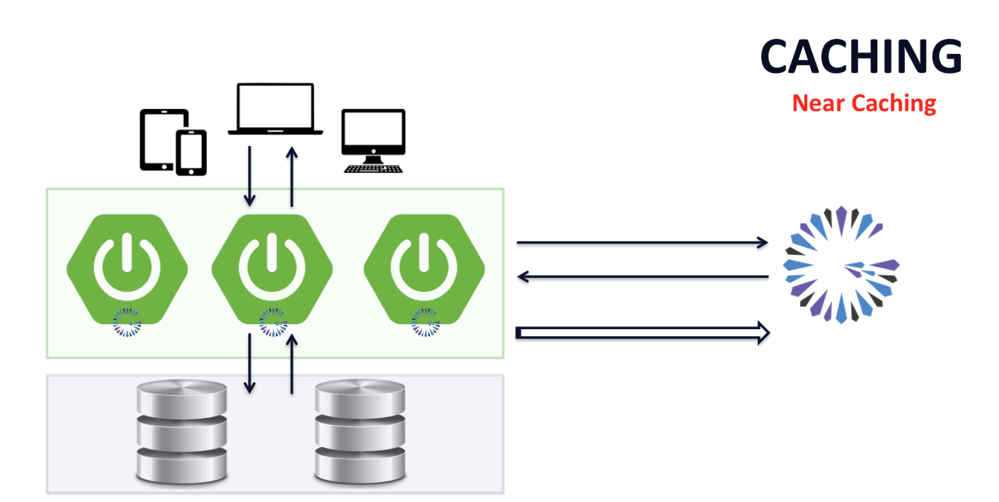
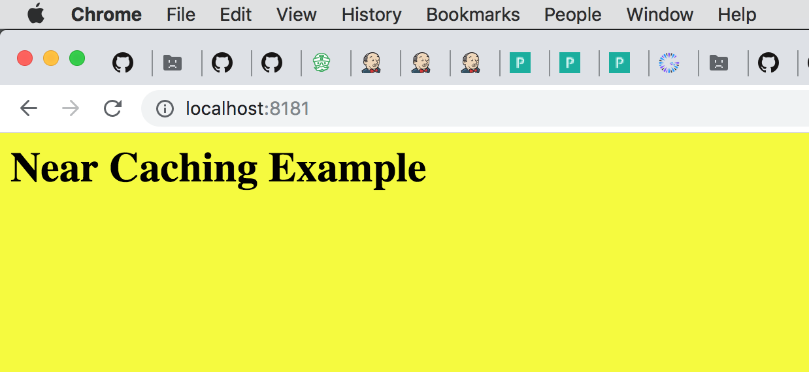
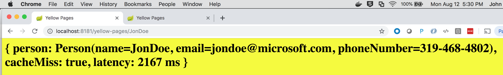
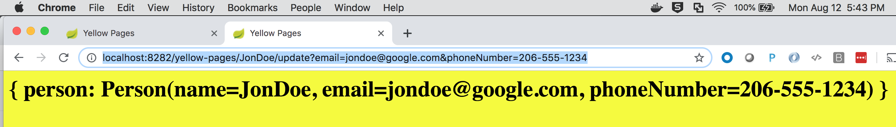
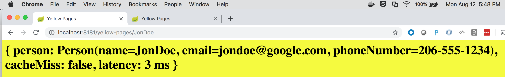

[[geode-samples-caching-near]]
= Near Caching with Spring
:apache-geode-version: {master-apache-geode-version}
:apache-geode-docs: https://geode.apache.org/docs/guide/{apache-geode-version}
:apache-geode-javadoc: https://geode.apache.org/releases/latest/javadoc
:images-dir: ../images
:spring-boot-docs: https://docs.spring.io/spring-boot/docs/current/reference/html
:spring-boot-javadoc: https://docs.spring.io/spring-boot/docs/current/api
:spring-data-geode-docs: https://docs.spring.io/spring-data/geode/docs/current/reference/html
:spring-data-geode-javadoc: https://docs.spring.io/spring-data/geode/docs/current/api
:spring-framework-docs: https://docs.spring.io/spring/docs/current/spring-framework-reference
:spring-framework-javadoc: https://docs.spring.io/spring/docs/current/javadoc-api
:toc: left
:toclevels: 2

This guide walks you through building a simple Spring Boot application
using {spring-framework-docs}/integration.html#cache[Spring's Cache Abstraction]
backed by Apache Geode as the caching provider for Near Caching.

It is assumed that the reader is familiar with the Spring _programming model_.  No prior knowledge of Spring's
_Cache Abstraction_ nor Apache Geode is required to utilize caching in your Spring Boot applications.

Additionally, this Sample builds on the concepts introduced in both link:caching-look-aside.html[Look-Aside Caching]
as well as link:caching-inline.html[Inline Caching] with Spring.  It would be helpful to start by reading the guide on
_Look-Aside Caching_ followed by the guide on _Inline Caching_, first, before continuing with this guide.

Let's begin.

link:../index.html#geode-samples[Back]

[[geodes-samples-caching-near-background]]
== Background

In the first sample on link:caching-look-aside.html[_Look-Aside Caching_], we paved the foundation for using caching in
your Spring Boot applications. _Look-Aside Caching_ makes efficient use of resources (e.g. by reducing contention on
the database, or by reducing the number of network calls between Microservices in a distributed system) simply by
keeping frequently accessed data in-memory for quick retrieval (reads), which can improve throughput and reduce latency.

In the second sample, we expanded on _Look-Aside Caching_ with link:caching-inline.html[_Inline Caching_] and extended
the _Look-Aside Caching_ pattern to "_read/write-through_" to a backend data source (e.g. database).  The backend data
source is likely the  application's _System or Record_ (SOR), or "_source of truth_".  The _write-through_ operation
to the backend data source is synchronous.  If the write fails, the cache will not be modified.  This ensures a
consistent view between the cache and the backend data source, which is an important characteristic of _Inline Caching_.

It is likely that you will be using a client/server topology when applying either the _Look-Aside_
or the _Inline Caching_ pattern to your Spring Boot application(s).  This is especially true when scaling up
multiple instances of the same application in a Microservices architecture.

Multiple, Microservice, application instances will need a consistent view of the data, especially in a load-balanced,
cloud-native environment where separate client requests, that are part of the same session, could be routed to different
application instances.  Therefore, application state needs to be maintained independent of the application instances.

NOTE: _Sticky Sessions_ can be used to keep conversational state associated with a user's Session tied to a single
application instance.  However, use of _Sticky Sessions_ is not resilient to failures, and as such, essentially become
an anti-pattern in a cloud context.  You should avoid using _Stick Sessions_ in a cloud environment whenever possible.

To keep up with demand and not overload backend systems, like a database, you would have to scale-up with more Memory,
more CPU, more Disk, more Network bandwidth, basically, more of everything, which can be a very costly endeavor as you
try to keep up with the every growing demand (which is a good problem to have, but...):

image::../images/Small-Database-To-Big-Database.png[]

Rather than scale-up, you could scale-out by using a sophisticated caching technology that uniformly partitions data
across a cluster of data nodes thereby enabling data access operations to be intelligently routed and evenly distributed
across the cluster.  In addition, data can be replicated for redundancy and high-availability (HA) purposes making the
cluster more resilient to failure.  Such a data management technology is ideal in a cloud environment.  The cluster acts
as a single, logical unit of pooled resources (Memory, CPU, Disk, and Network) but uses a shared-nothing architecture.
That is, no node in the cluster can be a single point of failure.

image::../images/Cluster.png[]

From a Spring Boot application's point-of-view, it is the client in this application architecture, and multiple
application instances can access and share the same data.  Indeed, in a Microservices architecture, another application
instance must be prepared to take over in a moments notice if any application instance goes down in order to avoid any
perceived disruption in the users' service.

However, even in a sophisticated, scale-out, client/server architecture such as the one we described above, it still
involves network access, even if only a "_single-hop_".

So, how might we use caching to further reduce resource consumption (e.g. Network) in our application architecture?

The key lies in keeping data closer to the point of access, i.e. on the client, in our Spring Boot application.
In essence, we put more responsibility on our Spring Boot application by increasing the participation of our application
in this slightly modified architecture, in a "_pro-active_" way.

Enter *_Near Caching_*.

Basically, in addition to our server-side, peer node, cache topology, the client additionally caches data, but only
the data it is "_interested_" in.

Additionally, rather than the client having to pull for data changes, the data can be pushed to the client when the data
changes, based on its "_registered interests_".  Therefore, the client only receives the data it subscribed to,
in the first place.

Furthermore, the data change events can be conflated so our client application only sees the latest updates, not every
single change that may have occurred due to other application instances modifying the same data, possibly concurrently.

These 3 things in conjunction with each other should have a net effect of reducing noise and network saturation.

Effectively, an applied "_Near Caching_" software design pattern looks like the following in our application/system
architecture:

It is now time to see the _Near Caching_ pattern in action.

[[geode-samples-caching-near-example]]
== Example

For our example, we develop a _Yellow Pages_ application with the ability to lookup a person by name and retrieve
the person's contact information, such as an email address and phone number.

[[geode-samples-caching-near-example-server-side]]
=== Server-side Configuration

First, we will configure and bootstrap an Apache Geode, peer `CacheServer` node using Spring Boot:

.SpringBootApplication for an Apache Geode `CacheServer`
[source,java]
----
include::{samples-dir}/caching/near/src/main/java/example/app/caching/near/server/BootGeodeNearCachingCacheServerApplication.java[tags=class]
----

This class consists of a Spring `@Configuration` class to configure the necessary server-side Region
(i.e "_YellowPages_") used to store a person's contact information:

.Server-side Configuration
[source,java]
----
include::{samples-dir}/caching/near/src/main/java/example/app/caching/near/server/BootGeodeNearCachingCacheServerApplication.java[tags=geode-configuration]
----

The pertinent bit of this configuration is the subscription conflation on the "_YellowPages_" Region.  This setting
ensures that only the latest information is sent to the clients.  It is possible that multiple clients maybe accessing
and updating a person's contact information.  Therefore, we want to make sure all the clients have, and are only sent,
the latest information, which therefore reduces traffic across our network.

We include a Spring Boot `ApplicationRunner` with a few assertions to make sure the server is configured properly
on startup:

.Asserting Server-side Configuration
[source,java]
----
include::{samples-dir}/caching/near/src/main/java/example/app/caching/near/server/BootGeodeNearCachingCacheServerApplication.java[tags=application-runner]
----

And finally, we include a Spring `@Profile` to enable an embedded Locator and Manager, allowing us to connect to our
Spring Boot, Apache Geode `CacheServer` application using _Gfsh_ (Geode Shell).  Enabling the embedded Locator
and Manager are not necessary when starting the server or to run our application, but can be useful when debugging.

.Embedded Locator & Manager Configuration
[source,java]
----
include::{samples-dir}/caching/near/src/main/java/example/app/caching/near/server/BootGeodeNearCachingCacheServerApplication.java[tags=locator-manager]
----

TIP: For more information on configurating and bootstrapping a small cluster of Apache Geode servers using Spring Boot,
see link:../appendix.html#geode-cluster-configuration-bootstrapping[Running an Apache Geode or Pivotal GemFire Cluster using Spring Boot].

[[geode-samples-caching-near-example-client-side]]
=== Client-side Configuration

Next, we will create and start 2 instances of our Spring Boot, Apache Geode `ClientCache` application, which will use
the _Look-Aside Caching_ pattern enhanced with_Near Caching_.

We start with the `@SpringBootApplication` main class:

.SpringBootApplication for Geode `ClientCache`
[source,java]
----
include::{samples-dir}/caching/near/src/main/java/example/app/caching/near/client/BootGeodeNearCachingClientCacheApplication.java[tags=class]
----

Essentially, the main class just serves to bootstrap our application configuration and components.  Additionally, we
include some assertions in a Spring Boot `ApplicationRunner` bean to ensure our client configuration is correct.

Our configuration appears as follows:

.Application Geode Configuration
[source,java]
----
include::{samples-dir}/caching/near/src/main/java/example/app/caching/near/client/config/GeodeConfiguration.java[tags=class]
----

First, we note the "_YellowPages_" client Region, which must match the server-side Region by name:

.The "YellowPages" client `CACHING_PROXY` Region
[source,java]
----
include::{samples-dir}/caching/near/src/main/java/example/app/caching/near/client/config/GeodeConfiguration.java[tags=region]
----

Most importantly, the client Region's data policy is set to `ClientRegionShortcut.CACHING_PROXY`:

.Enabling Near Caching
[source,java]
----
clientRegion.setShortcut(ClientRegionShortcut.CACHING_PROXY);
----

This enables a _local cache_ (a.k.a. "*_Near Cache_*") on the client in our Spring Boot application.

NOTE: The default `ClientRegionShortcut` is `PROXY`, which means there is no local cache.  With a client `PROXY` Region,
all cache operations are forwarded to the server.

Equally important is the "_interest registration_" for all KEYS:

.Register Interest
[source,java]
----
include::{samples-dir}/caching/near/src/main/java/example/app/caching/near/client/config/GeodeConfiguration.java[tags=interest-registration]
----

The first parameter is a _Regular Expression_ (i.e. `.*`) matching the KEYS this client is interested in
receiving updates for, which in this case, is all KEYS.

The other parameters to the `RegexInterest` constructor includes the `InterestResultPolicy`, which determines whether
the client should get an initial push of the data (KEYS/VALUES) matching the regex when the client registers interest.

The `durable` boolean parameter sets whether the client subscription queue on the server should be "durable",
i.e. maintained when the client is not present.  If the client goes down, for whatever reason, the server will continue
to maintain the client's subscription queue with events matching the regex up to a specified timeout (configurable on
the server).  If the client comes back online before the configured timeout, the events in the queue will be replayed
back to the client.  If the client does not reconnect before the configured timeout, the queue is discarded.

Durability can be useful for clients that need to receive events for data it missed while the client was offline in the
order the events occurred.  Of course, keep in mind that durable clients use up system resources on the server
(e.g. memory).

TIP: To learn more about durable subscriptions, see the Apache Geode
{apache-geode-docs}/developing/events/implementing_durable_client_server_messaging.html[documentation]

The `receiveValues` boolean parameter determines whether the client will receive both KEYS and VALUES when an event
matching the regex occurs, or whether the client will only receive the KEYS for the VALUES that changed.

Configuring the client to only receive KEYS minimizes the amount of data sent over the network when the client only
wants to (perhaps) "invalidate" the keyed entriess, e.g. by using
{apache-geode-javadoc}/org/apache/geode/cache/Region.html#localInvalidate-java.lang.Object-[`Region.localInvalidate(key:Object)`].

In that way, the memory footprint of the clients can also be maintained and the client will only lazily fetch the value
when needed again.

TIP: The `RegexInterest` constructor corresponds to
{apache-geode-javadoc}/org/apache/geode/cache/Region.html#registerInterestRegex-java.lang.String-org.apache.geode.cache.InterestResultPolicy-boolean-boolean-[Region.registerInterestRegex(:String, :InterestResultPolicy, :boolean, :boolean)]

There is one final bit of configuration on the client-side that we need, and that is to enable subscriptions. We do so
by setting the appropriate Spring Data for Apache Geode (SDG) property
(e.g. `spring.data.gemfire.pool.subscriptions-enabled`) in `application.properties`, like so:

.Common Client `application.properties`
[source,java]
----
include::{samples-dir}/caching/near/src/main/resources/application-client.properties[]
----

Additionally, each client (i.e. "one", "two" and so on, for however many clients we want to start) each have their own
client specific `application.properties`, for example:

.Common Client `application.properties`
[source,java]
----
include::{samples-dir}/caching/near/src/main/resources/application-client-one.properties[]
----

We set the `spring.application.name` property to help identify the client and additionally set the `server.port`
property to a unique value since our Spring Boot application is a Web application.

Now we can discuss the components of the application.

[[geode-samples-caching-near-example-app-model]]
=== Application Model

We start by modeling our `Person` and a person's contact information, an email address and phone number:

.`Person` class
[source,java]
----
include::{samples-dir}/caching/near/src/main/java/example/app/caching/near/client/model/Person.java[tags=class]
----

The class uses https://projectlombok.org/[Project Lombok] to simplify the implementation.  Otherwise, the `Person` class
is pretty self-explanatory and there is nothing else special about the class.

[[geode-samples-caching-near-example-app-service]]
=== Application Service

Next, we have our `YellowPagesService` class that implements our _Yellow Pages_ application logic.  This class also uses
Spring's Caching annotations to demarcate service methods that will apply "_Look-Aside_" with "_Near Caching_"
semantics:

.`YellowPagesService` class
[source,java]
----
include::{samples-dir}/caching/near/src/main/java/example/app/caching/near/client/service/YellowPagesService.java[tags=class]
----

Essentially, we have a `@Cacheable`, `find(:String)` service method that tries to lookup a `Person` by name
from the cache.  If a `Person` by name is found, then the `Person` is simply returned, otherwise, the `find(:String)`
service method is invoked and a `Person` with the given name and generated contact information is created and cached.

Technically, our `find(:String)` service method should "_idempotent_", but for example purposes,
we combine READ with CREATE.

Our service class additionally contains operations to update (i.e. `@CachePut`) a `Person's` contact information
as well as evict (i.e. `@CacheEvict`) the `Person's` contact information from the cache.

[[geode-samples-caching-near-example-app-controller]]
=== Application Controller

To make the operations of our _Yellow Pages_ application accessible, we expose REST-ful Web service endpoints using a
Spring Web MVC `@RestController` class:

.`YellowPagesController` class
[source,java]
----
include::{samples-dir}/caching/near/src/main/java/example/app/caching/near/client/controller/YellowPagesController.java[tags=class]
----

Basically, we have REST-based Web service endpoints matching our `YellowPagesService` class service methods.

NOTE: Unless you install a Web browser plugin, a Web browser will only allow HTTP GET requests. Therefore, for
convenience purposes only, our application provides REST API endpoints (e.g. `/yellow-pages/JonDoe/update?email=jondoe@home.org`)
that allows the user to modify the data.  No properly constructed REST-ful application should do this.

Now we are ready to run our example application and observe the effects of *_Near Caching_*.

[[geode-samples-caching-near-example-run]]
== Run the Example

[[geode-samples-caching-near-example-run-server]]
=== Run the Server

First, we must start our Spring Boot application that configures and bootstraps the Apache Geode `CacheServer`.

TIP: If you want to connect to the server with _Gfsh_, you must have a distribution of Apache Geode installed on your
system and you must enable the "_locator-manager_" profile.  The "_locator-manager_" profile can be enabled using the
`-Dspring.profiles.active=server,locator-manager` Java System property.  Additionally, the `server` profile has been
enabled as well.

When running the `BootGeodeNearCachingCacheServerApplication` class, you should see output similar to the following:

.Server output
[source,txt]
----
  .   ____          _            __ _ _
 /\\ / ___'_ __ _ _(_)_ __  __ _ \ \ \ \
( ( )\___ | '_ | '_| | '_ \/ _` | \ \ \ \
 \\/  ___)| |_)| | | | | || (_| |  ) ) ) )
  '  |____| .__|_| |_|_| |_\__, | / / / /
 =========|_|==============|___/=/_/_/_/
 :: Spring Boot ::  (v2.1.7.BUILD-SNAPSHOT)

[info 2019/08/12 13:02:17.328 PDT <main> tid=0x1] Starting BootGeodeNearCachingCacheServerApplication on jblum-mbpro-2.local with PID 13725...

[info 2019/08/12 13:02:17.329 PDT <main> tid=0x1] The following profiles are active: locator-manager,server

...

// Then you should see a bunch of Apache Geode log output, ending with something like...

...

[info 2019/08/12 13:02:20.975 PDT <main> tid=0x1] CacheServer Configuration:   port=40404 max-connections=800 max-threads=0 notify-by-subscription=true socket-buffer-size=32768 maximum-time-between-pings=60000 maximum-message-count=230000 message-time-to-live=180 eviction-policy=none capacity=1 overflow directory=. groups=[] loadProbe=ConnectionCountProbe loadPollInterval=5000 tcpNoDelay=true

[info 2019/08/12 13:02:20.996 PDT <main> tid=0x1] Started BootGeodeNearCachingCacheServerApplication in 4.216 seconds (JVM running for 5.49)
----

NOTE: The Spring Boot Gradle plugin has been configured to run the `BootGeodeNearCachingClientCacheApplication` class,
not the server.

Now that the server is running, if you installed Apache Geode on your system and set the `$PATH` to include `$GEODE/bin`,
then you can run _Gfsh_ and connect to the server:

.Connect to the Server with Gfsh
[source,txt]
----
$ echo $GEODE
/Users/jblum/pivdev/apache-geode-1.6.0

$ gfsh
    _________________________     __
   / _____/ ______/ ______/ /____/ /
  / /  __/ /___  /_____  / _____  /
 / /__/ / ____/  _____/ / /    / /
/______/_/      /______/_/    /_/    1.6.0

Monitor and Manage Apache Geode

gfsh>connect
Connecting to Locator at [host=localhost, port=10334] ..
Connecting to Manager at [host=10.99.199.24, port=1099] ..
Successfully connected to: [host=10.99.199.24, port=1099]

gfsh>list members
      Name        | Id
----------------- | ----------------------------------------------------------------
YellowPagesServer | 10.99.199.24(YellowPagesServer:13725)<ec><v0>:1024 [Coordinator]

gfsh>describe member --name=YellowPagesServer
Name        : YellowPagesServer
Id          : 10.99.199.24(YellowPagesServer:13725)<ec><v0>:1024
Host        : 10.99.199.24
Regions     : YellowPages
PID         : 13725
Groups      :
Used Heap   : 75M
Max Heap    : 3641M
Working Dir : /Users/jblum/pivdev/spring-boot-data-geode
Log file    : /Users/jblum/pivdev/spring-boot-data-geode
Locators    : localhost[10334]

Cache Server Information
Server Bind              :
Server Port              : 40404
Running                  : true
Client Connections       : 0

gfsh>list regions
List of regions
---------------
YellowPages

gfsh>describe region --name=/YellowPages
..........................................................
Name            : YellowPages
Data Policy     : replicate
Hosting Members : YellowPagesServer

Non-Default Attributes Shared By Hosting Members

 Type  |              Name              | Value
------ | ------------------------------ | ---------
Region | data-policy                    | REPLICATE
       | enable-subscription-conflation | true
       | size                           | 0

gfsh>
----

[[geode-samples-caching-near-example-run-client-app]]
=== Run the Client Application

Now it is time to start 2 instances of the Spring Boot, Apache Geode `ClientCache` application hosting
our _Yellow Pages_ service.

NOTE: Make sure to enable the `client` generic profile in addition to 1 of the client-specific profiles,
e.g. "_client-one_", like so: `-Dspring.profiles.active=client,client-one`.  To run a second application instance,
change the profile from `client-one` to `client-two`.

TIP: Alternatively, rather than using client instance specific `application.properties`, you could set the
`spring.application.name` and `server.port` properties using JVM System properties on the command-line, or in your IDE
run profile as so: `-Dspring.application.name=ClientApplicationTwo -Dserver.port=8282`.  Furthermore, you could set the
`server.port` property to the ephemeral port and let the system determine an available port for the embedded Web Server
(i.e. Jetty).  You must make note of the port number when the application starts up so that you can access the Webapp
from your Web browser.  Look for a line containing: `[info 2019/08/12 13:14:19.755 PDT <main> tid=0x1] Tomcat initialized with port(s): 8181 (http)`.

Once both application instances are running, you can access the Webapp from your Web browser at the following URL:
`http::/localhost:8181/`.

TIP: To switch between the 2 client app instances, it is useful to have 2 Web browser tabs or windows open
accessing each Web Server port (e.g. `8181` and `8282`).

Next, let's create some data using client app instance one.

This operation takes a bit of (simulated) time (`2167 milliseconds (ms)`, or `~2 seconds (s)`) since "_Jon Doe_"
did not previously exist in the cache, which can be noted by the `cacheMiss` value of *true*.  "_JonDoe's_"
email address and phone number were randomly generated.

If you hit the refresh button in your Web browser, the latency significantly drops (~`0-1|2 ms`) because the value
is being pulled from the "_local_" cache (i.e. "_Near Cache_) on the client.

Now, in our second client app instance, if we access the same person, "_JonDoe_", then we see the following:

image::../images/Near-Caching-Example-Webapp-Read-JonDoe.png[]

Notice that `cacheMiss` is *false* and the `latency` is only `1 ms`.  That is because the 2nd client app instance
was already pushed the data from the server based on the client's interest registration.  This is also apparent
in the log output for the client application instances:

.Client Application Instance 2 Log Output On Create
[source,txt]
----
[CREATE] EntryEvent for [JonDoe] with value [Person(name=JonDoe, email=jondoe@microsoft.com, phoneNumber=319-468-4802)]
----

To see the effects of updating a cache entry from a client app instance, let's update "_JonDoe_" from the 2nd client app
instance by changing his email address and phone number:

Before we refresh the Web browser tab or window pointing to our 1st client app instance, if you look at the log output
for the 1st client app instance, you will see:

.Client Application Instance 1 Log Output After Update
[source,txt]
----
[UPDATE] EntryEvent for [JonDoe] with value [Person(name=JonDoe, email=jondoe@google.com, phoneNumber=206-555-1234)]
----

Then, switch back to the 1st client app instance Web browser tab or window and hit the refresh button, or navigate
to the URL, `http://localhost:8181/yellow-pages/JonDoe`, and you should see the updated contact information:

You can repeat this exercise as often as you like.

Now, if you describe the "_YellowPages_" Region in _Gfsh_, you will see that there are cache entries:

.Gfsh `describe region`
[source,txt]
----
gfsh>describe region --name=/YellowPages
..........................................................
Name            : YellowPages
Data Policy     : replicate
Hosting Members : YellowPagesServer

Non-Default Attributes Shared By Hosting Members

 Type  |              Name              | Value
------ | ------------------------------ | ---------
Region | data-policy                    | REPLICATE
       | enable-subscription-conflation | true
       | size                           | 3
----

You can even query the data using OQL:

.OQL Query to query the YellowPages
[source,txt]
----
gfsh>query --query="SELECT person.name, person.email, person.phoneNumber FROM /YellowPages person"
Result : true
Limit  : 100
Rows   : 3

 name   |       email        | phoneNumber
------- | ------------------ | ------------
JaneDoe | janedoe@pivotal.io | 608-826-7621
JonDoe  | jondoe@google.com  | 206-555-1234
PieDoe  | piedoe@comcast.net | 406-413-6170
----

Presto!  You have now just created a Spring Boot application using the _Look-Aside Caching_ pattern enhanced with
_Near Caching_.

[[geode-samples-caching-near-summary]]
== Summary

In this guide, we learned how to create a Spring Boot application using Spring's Cache Abstraction backed by
Apache Geode using the _Look-Aside Caching_ pattern in our application service methods.  We further enhanced
the caching ability of our application with *_Near Caching_*.

With *_Near Caching_*, we have the added ability to further improve on the throughput and latency of our application
as well as make even more efficient use of system resources.  _Near Caching_ gives us:

* A local, client-side cache for quick lookup, transforming our client into an efficient, light-weight data container
for data that is relevant to the client, thereby reducing the load on our servers.
* By _enabling subscriptions_ and _registering interests_, we can have data intelligently pushed to us (rather than
simply pulled when needed) based on the data the client is specifically interested in, or "subscribed" to.
* Then, we saw that we can conflate subscription events on the server-side so clients only receive the latest updates
to the data that will be sent to the client based on the registered interests.
* With 1 more step, it is simple to make the subscription queues maintained on the servers for each client "durable"
so if the client is offline, it does not miss any events, if necessary.
* Furthermore, the client subscriptions queues on the servers can be made both redundant and persistent for
high-availability (HA) and resiliency purposes.

There is a much more that can be achieved with a _Near Cache_, so we leave it as an exercise for the reader
to explore and experiment more.  Hopefully this has peaked your curiosity and shown you a few of the benefits of
applying the _Near Caching_ pattern to your Spring Boot applications.

link:../index.html#geode-samples[Back]
