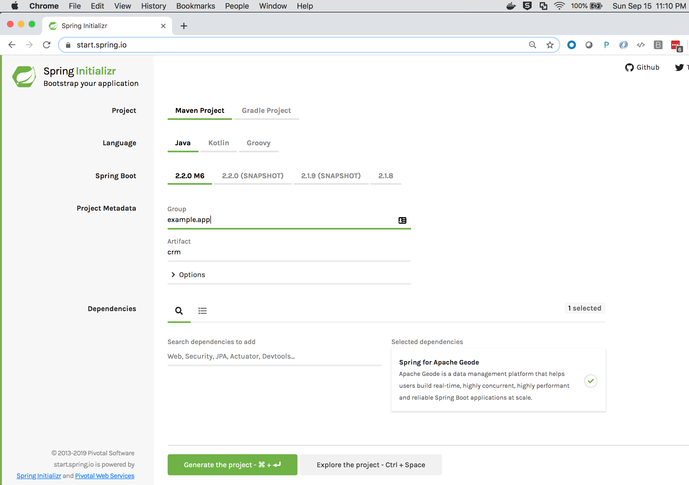
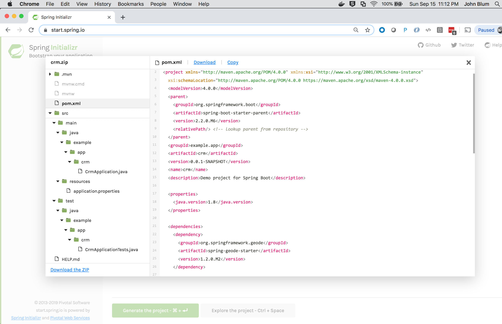
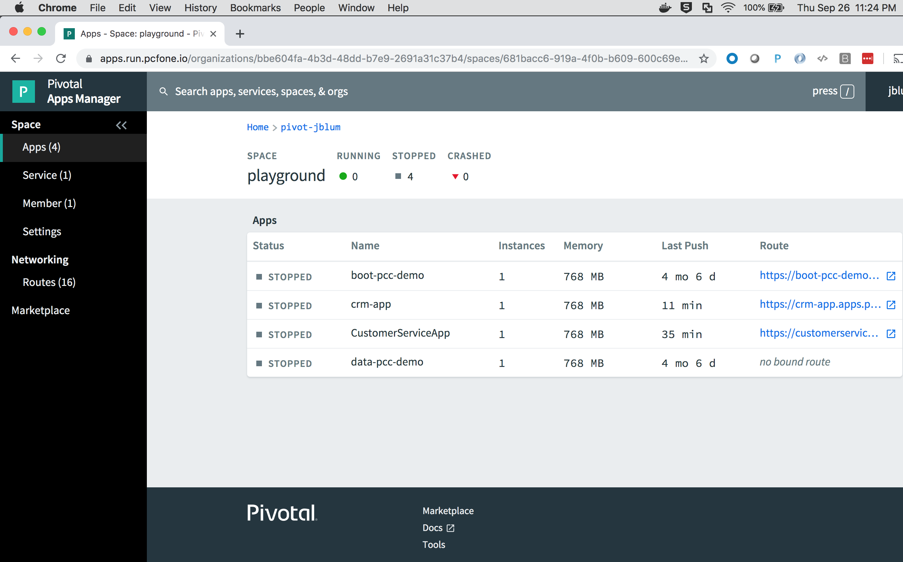
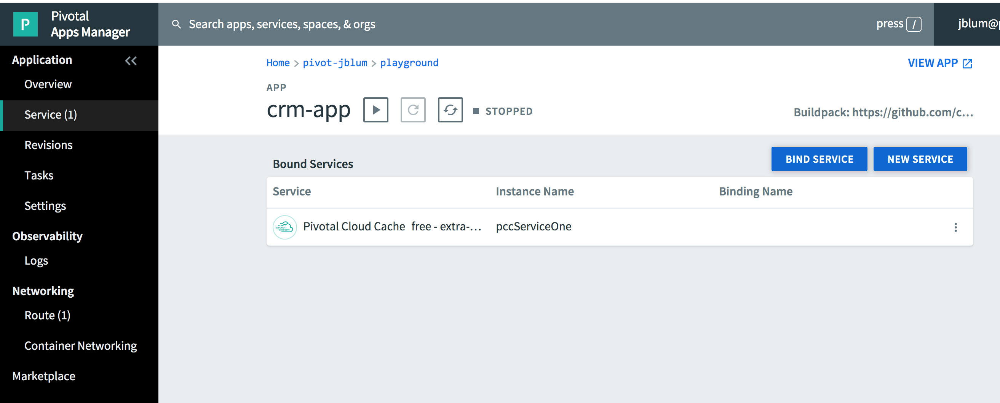
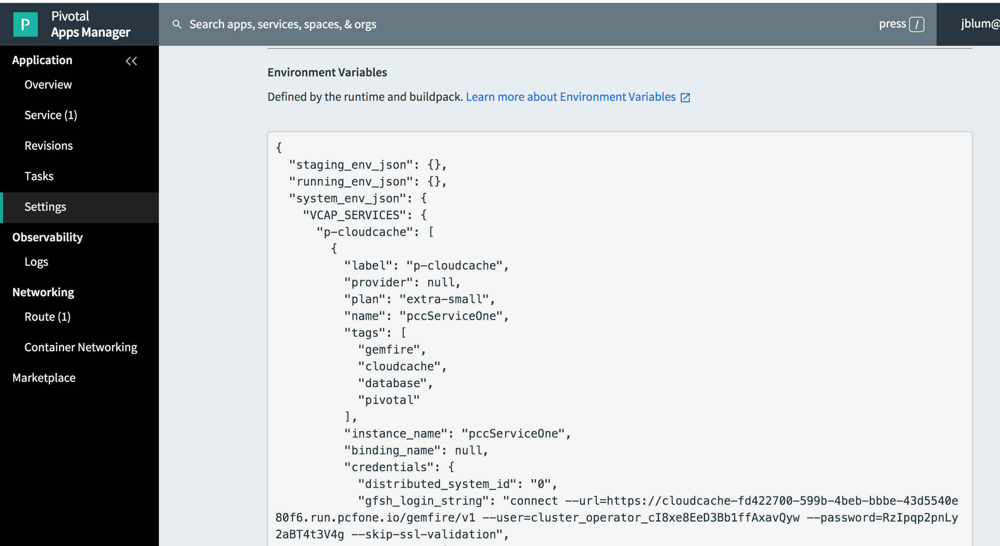
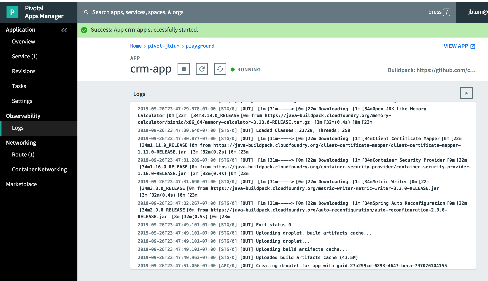
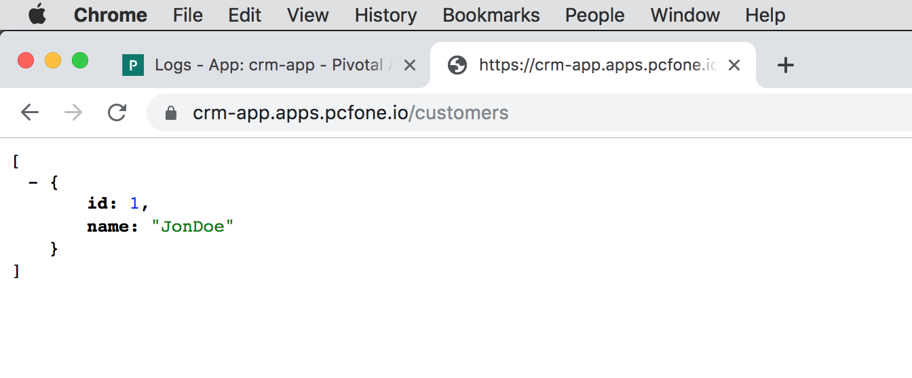

[[geode-samples-getting-started]]
= Getting Started Quickly, Easily and Reliably with Spring Boot for Apache Geode & Pivotal Cloud Cache
John Blum
:apache-geode-version: {master-apache-geode-version}
:apache-geode-docs: https://geode.apache.org/docs/guide/{apache-geode-version}
:apache-geode-javadoc: https://geode.apache.org/releases/latest/javadoc
:apache-geode-website: https://geode.apache.org/
:pivotal-cloudcache-version: 1-8
:pivotal-cloudcache-docs: https://docs.pivotal.io/p-cloud-cache/{pivotal-cloudcache-version}
:pivotal-cloudcache-website: https://pivotal.io/pivotal-cloud-cache
:pivotal-cloudfoundry-website: https://pivotal.io/platform
:pivotal-gemfire-version: 98
:pivotal-gemfire-docs: https://gemfire.docs.pivotal.io/{pivotal-gemfire-version}/geode/reference
:pivotal-gemfire-javadoc: https://gemfire-{pivotal-gemfire-version}-javadocs.docs.pivotal.io/
:pivotal-gemfire-website: https://pivotal.io/pivotal-gemfire
:spring-boot-docs: https://docs.spring.io/spring-boot/docs/current/reference/htmlsingle
:spring-data-commons-docs: https://docs.spring.io/spring-data/commons/docs/current/reference/html
:spring-data-commons-javadoc: https://docs.spring.io/spring-data/commons/docs/current/api
:spring-data-geode-docs: https://docs.spring.io/spring-data/geode/docs/current/reference/html
:spring-data-geode-javadoc: https://docs.spring.io/spring-data/geode/docs/current/api
:toc:
:toclevels: 2

This guide walks you through building and running a simple Spring Boot, Apache Geode `ClientCache` application
using the Spring Boot for Apache Geode (SBDG) framework.  Later in this guide, we switch the application from
{apache-geode-website}[Apache Geode] to {pivotal-cloudcache-website}[Pivotal Cloud Cache] and deploy (i.e `_push_`)
the application up to {pivotal-cloudfoundry-website}[_Pivotal Platform_].

Specifically, you will:

1. Create a new "_Spring for Apache Geode_" project using _Spring Initializer_ at https://start.spring.io[start.spring.io].
Goto the <<geode-samples-getting-started-spring-initializer,Spring Initializer>> topic.
2. Then, we build a simple Spring Boot, Apache Geode `ClientCache` application that can persist data locally
in Apache Geode. Goto the <<spring-geode-samples-getting-started-build-app,Build App>> topic.
3. Next, we switch the application from running locally to using a client/server topology.
Goto the <<spring-geode-samples-getting-started-run-app-clientserver,Client/Server>> topic.
4. And finally, we deploy the application to _Pivotal Platform_ and bind our application to a provisioned
_Pivotal Cloud Cache_ (PCC) service instance.
Goto the <<spring-geode-samples-getting-started-run-app-cloudplatform,Cloud Platform>> topic.

Our goal is to accomplish each step with _little to no code or configuration_ changes.  It should just work!

NOTE: It is also possible to migrate from a Commercial, Managed environment (running in _Pivotal Platform_
using _Pivotal Cloud Cache_ (PCC)) back to an Open Source, Non-Managed environment (i.e. running with an externally
managed Apache Geode cluster).

By the end of this guide, you should feel comfortable and ready to begin building Spring Boot applications using either
Apache Geode standalone or by deploying and running in _Pivotal Platform_ using _Pivotal Cloud Cache_ (PCC).

NOTE: {pivotal-cloudcache-website}[_Pivotal Cloud Cache_] (PCC) has replaced {pivotal-gemfire-website}[_Pivotal GemFire_]
as the new brand name.

Let's begin!

link:../index.html#geode-samples[Back]

[[geode-samples-getting-started-spring-initializer]]
== Beginning with Spring Initializer at start.spring.io

First, open your Web browser to https://start.spring.io[].

Then select:

* Maven Project (alternatively, you can select _Gradle_ if you prefer)
* Java Language (alternatively, you can use Kotlin, or Groovy)
* Spring Boot {spring-boot-version}
* Project Metadata:
** Group: `example.app`
** Artifact: `crm`
* Add Dependency: "_Spring for Apache Geode_" by typing "_Geode_" into the "_Search dependencies to add_" field.
* Optionally Add Dependency: "_Spring Web_" to pull in `org.springframework.boot:spring-boot-starter-web`.

Your selections should look similar to:

Be sure to click the "*+*" button next to the "_Spring for Apache Geode_" dependency to select and add it to
the generated project Maven POM file.

You can explore the contents of the generated project by pressing the `CTRL+SPACE` keys:

Click the "_Generate the project_" button.  This generates a *Java 8* project with *JAR* packaging.

Download the ZIP file and unpack it to your desired working directory.

You can then use your favorite IDE (e.g. https://www.jetbrains.com/idea/[IntelliJ IDEA] or https://spring.io/tools[Spring Tool Suite] (STS))
to open the generated project.

You are ready to begin developing your Spring Boot, Apache Geode `ClientCache` application.

[[geode-samples-getting-started-spring-initializer-explore-run]]
=== Exploring the Source Code and Running the CrmApplication

The generated project contains a `example.app.crm.CrmApplication` Java class that is annotated with the
`@SpringBootApplication` annotation.

.Main `CrmApplication` class
[source,java]
----
package example.app.crm;

import org.springframework.boot.SpringApplication;
import org.springframework.boot.autoconfigure.SpringBootApplication;

@SpringBootApplication
public class CrmApplication {

	public static void main(String[] args) {
		SpringApplication.run(CrmApplication.class, args);
	}
}
----

Additionally, in the project Maven POM file, we see the "_Spring Boot for Apache Geode_" (SBDG) dependency
(`org.springframework.geode:spring-geode-starter:{version}`:

.Spring Boot for Apache Geode dependency
[source,xml]
[subs="verbatim,attributes"]
----
<dependency>
    <groupId>org.springframework.geode</groupId>
    <artifactId>spring-geode-starter</artifactId>
    <version>{version}</version>
</dependency>
----

With the _Spring Boot for Apache Geode_ dependency (i.e. `org.springframework.geode:spring-geode-starter`)
on the application classpath along with the main Java class being a proper Spring Boot application, this application
will startup and run as an Apache Geode `ClientCache` application:

.Application log output
[source,txt]
----
/Library/Java/JavaVirtualMachines/jdk1.8.0_192.jdk/Contents/Home/bin/java "-javaagent:/Applications/IntelliJ IDEA 19 CE.app/Contents/lib/idea_rt.jar=57178:/Applications/IntelliJ IDEA 19 CE.app/Contents/bin" ... example.app.crm.CrmApplication

  .   ____          _            __ _ _
 /\\ / ___'_ __ _ _(_)_ __  __ _ \ \ \ \
( ( )\___ | '_ | '_| | '_ \/ _` | \ \ \ \
 \\/  ___)| |_)| | | | | || (_| |  ) ) ) )
  '  |____| .__|_| |_|_| |_\__, | / / / /
 =========|_|==============|___/=/_/_/_/
 :: Spring Boot ::  (v2.2.0.BUILD-SNAPSHOT)

2019-09-15 23:16:15.539  INFO 7156 --- [           main] example.app.crm.CrmApplication           : Starting CrmApplication on jblum-mbpro-2.local with PID 7156 (/Users/jblum/pivdev/spring-boot-data-geode/spring-geode-samples/intro/getting-started/out/production/classes started by jblum in /Users/jblum/pivdev/spring-boot-data-geode)
2019-09-15 23:16:15.545  INFO 7156 --- [           main] example.app.crm.CrmApplication           : No active profile set, falling back to default profiles: default
2019-09-15 23:16:16.058  INFO 7156 --- [           main] o.s.g.c.a.ClusterAwareConfiguration      : Failed to connect to localhost[40404]
2019-09-15 23:16:16.061  INFO 7156 --- [           main] o.s.g.c.a.ClusterAwareConfiguration      : Failed to connect to localhost[10334]
2019-09-15 23:16:16.220  INFO 7156 --- [           main] .s.d.r.c.RepositoryConfigurationDelegate : Bootstrapping Spring Data repositories in DEFAULT mode.
2019-09-15 23:16:16.234  INFO 7156 --- [           main] .s.d.r.c.RepositoryConfigurationDelegate : Finished Spring Data repository scanning in 7ms. Found 0 repository interfaces.
2019-09-15 23:16:16.413  INFO 7156 --- [           main] o.s.c.a.ConfigurationClassEnhancer       : @Bean method PdxConfiguration.pdxDiskStoreAwareBeanFactoryPostProcessor is non-static and returns an object assignable to Spring's BeanFactoryPostProcessor interface. This will result in a failure to process annotations such as @Autowired, @Resource and @PostConstruct within the method's declaring @Configuration class. Add the 'static' modifier to this method to avoid these container lifecycle issues; see @Bean javadoc for complete details.
2019-09-15 23:16:16.541  INFO 7156 --- [           main] trationDelegate$BeanPostProcessorChecker : Bean 'org.springframework.geode.boot.autoconfigure.RegionTemplateAutoConfiguration' of type [org.springframework.geode.boot.autoconfigure.RegionTemplateAutoConfiguration$$EnhancerBySpringCGLIB$$7fa0e8c9] is not eligible for getting processed by all BeanPostProcessors (for example: not eligible for auto-proxying)
2019-09-15 23:16:17.608  INFO 7156 --- [           main] o.a.g.internal.logging.LoggingSession    :
---------------------------------------------------------------------------

  Licensed to the Apache Software Foundation (ASF) under one or more
  contributor license agreements.  See the NOTICE file distributed with this
  work for additional information regarding copyright ownership.

  The ASF licenses this file to You under the Apache License, Version 2.0
  (the "License"); you may not use this file except in compliance with the
  License.  You may obtain a copy of the License at

  https://www.apache.org/licenses/LICENSE-2.0

  Unless required by applicable law or agreed to in writing, software
  distributed under the License is distributed on an "AS IS" BASIS, WITHOUT
  WARRANTIES OR CONDITIONS OF ANY KIND, either express or implied.  See the
  License for the specific language governing permissions and limitations
  under the License.

---------------------------------------------------------------------------
Build-Date: 2019-04-19 11:49:13 -0700
Build-Id: onichols 0
Build-Java-Version: 1.8.0_192
Build-Platform: Mac OS X 10.14.4 x86_64
Product-Name: Apache Geode
Product-Version: 1.9.0
Source-Date: 2019-04-19 11:11:31 -0700
Source-Repository: release/1.9.0
Source-Revision: c0a73d1cb84986d432003bd12e70175520e63597
Native version: native code unavailable
Running on: /10.99.199.24, 8 cpu(s), x86_64 Mac OS X 10.13.6
Communications version: 100
Process ID: 7156
User: jblum
Current dir: /Users/jblum/pivdev/spring-boot-data-geode
Home dir: /Users/jblum
Command Line Parameters:
  -javaagent:/Applications/IntelliJ IDEA 19 CE.app/Contents/lib/idea_rt.jar=57178:/Applications/IntelliJ IDEA 19 CE.app/Contents/bin
  -Dfile.encoding=UTF-8
Class Path:
  ...
  /Users/jblum/.gradle/caches/modules-2/files-2.1/org.springframework.boot/spring-boot-starter-test/2.2.0.BUILD-SNAPSHOT/6804e9aff102009fc451b1b4bd22931e88aaa2a5/spring-boot-starter-test-2.2.0.BUILD-SNAPSHOT.jar
  /Users/jblum/.gradle/caches/modules-2/files-2.1/org.springframework.data/spring-data-geode-test/0.0.9.BUILD-SNAPSHOT/e803b7ea816fc1f137ea448e9a4177373f79589f/spring-data-geode-test-0.0.9.BUILD-SNAPSHOT.jar
  /Users/jblum/.gradle/caches/modules-2/files-2.1/org.assertj/assertj-core/3.13.2/bb7b963fe752f69f055df0025691eceb83ce0c5d/assertj-core-3.13.2.jar
  /Users/jblum/.gradle/caches/modules-2/files-2.1/org.springframework.boot/spring-boot-starter/2.2.0.BUILD-SNAPSHOT/7b533399d6f88039537bb757f25a2c90d46fcdc7/spring-boot-starter-2.2.0.BUILD-SNAPSHOT.jar
  /Users/jblum/.gradle/caches/modules-2/files-2.1/org.springframework.data/spring-data-geode/2.2.0.RC3/19c11f399bcfb47a97c003a57a9a6134e48ac2ea/spring-data-geode-2.2.0.RC3.jar
  /Users/jblum/.gradle/caches/modules-2/files-2.1/org.apache.geode/geode-cq/1.9.0/cd6f1ac771d9d16a9c30620a1a1e2a0b859255dc/geode-cq-1.9.0.jar
  /Users/jblum/.gradle/caches/modules-2/files-2.1/org.apache.geode/geode-lucene/1.9.0/c723e30baabca866b0a1c223ee64b020cfb72c6/geode-lucene-1.9.0.jar
  /Users/jblum/.gradle/caches/modules-2/files-2.1/org.apache.geode/geode-wan/1.9.0/291148404c8cba2ce9c7d45e362954d7979c11b/geode-wan-1.9.0.jar
  /Users/jblum/.gradle/caches/modules-2/files-2.1/org.apache.geode/geode-core/1.9.0/bbfbdf8bbdabed419e095caeaeb4ecbb272beef3/geode-core-1.9.0.jar
  /Users/jblum/.gradle/caches/modules-2/files-2.1/org.springframework.shell/spring-shell/1.2.0.RELEASE/d94047721f292bd5334b5654e8600cef4b845049/spring-shell-1.2.0.RELEASE.jar
  /Users/jblum/.gradle/caches/modules-2/files-2.1/org.springframework.boot/spring-boot-test-autoconfigure/2.2.0.BUILD-SNAPSHOT/2e5515925b591e23e23faf6e15defdaf542fe5a4/spring-boot-test-autoconfigure-2.2.0.BUILD-SNAPSHOT.jar
  /Users/jblum/.gradle/caches/modules-2/files-2.1/org.springframework.boot/spring-boot-autoconfigure/2.2.0.BUILD-SNAPSHOT/a5c2ddec46c3622237a675dfd3250ae6e0cba292/spring-boot-autoconfigure-2.2.0.BUILD-SNAPSHOT.jar
  /Users/jblum/.gradle/caches/modules-2/files-2.1/org.springframework.boot/spring-boot-test/2.2.0.BUILD-SNAPSHOT/3e659e2d0e3719a5703693a4bd98f5893bcb4802/spring-boot-test-2.2.0.BUILD-SNAPSHOT.jar
  /Users/jblum/.gradle/caches/modules-2/files-2.1/org.springframework.boot/spring-boot/2.2.0.BUILD-SNAPSHOT/9f7956e8a72d918a291abf98db8f6a4e42843a6e/spring-boot-2.2.0.BUILD-SNAPSHOT.jar
  /Users/jblum/.gradle/caches/modules-2/files-2.1/org.springframework.boot/spring-boot-starter-logging/2.2.0.BUILD-SNAPSHOT/8a88fdf34b0c71c6f6bc0013beec967523e2bbdf/spring-boot-starter-logging-2.2.0.BUILD-SNAPSHOT.jar
  /Users/jblum/.gradle/caches/modules-2/files-2.1/jakarta.annotation/jakarta.annotation-api/1.3.5/59eb84ee0d616332ff44aba065f3888cf002cd2d/jakarta.annotation-api-1.3.5.jar
  /Users/jblum/.gradle/caches/modules-2/files-2.1/org.springframework/spring-context-support/5.2.0.BUILD-SNAPSHOT/b4187b3ddb0c8cf790d2f82a57e8167f174aa7d1/spring-context-support-5.2.0.BUILD-SNAPSHOT.jar
  /Users/jblum/.gradle/caches/modules-2/files-2.1/org.springframework/spring-test/5.2.0.BUILD-SNAPSHOT/6c7fac94d6abb2a563e70484e35a5e7d719ca095/spring-test-5.2.0.BUILD-SNAPSHOT.jar
  /Users/jblum/.gradle/caches/modules-2/files-2.1/org.springframework/spring-context/5.2.0.BUILD-SNAPSHOT/1a8a192ffa1a5156a117582bf6d7e54e213ddcb3/spring-context-5.2.0.BUILD-SNAPSHOT.jar
  /Users/jblum/.gradle/caches/modules-2/files-2.1/org.springframework/spring-tx/5.2.0.BUILD-SNAPSHOT/2c0a6323873e6651ca8cc2bdccdd7e0913510407/spring-tx-5.2.0.BUILD-SNAPSHOT.jar
  /Users/jblum/.gradle/caches/modules-2/files-2.1/org.apache.geode/geode-management/1.9.0/1adbf11c4686608c594d57fe31ed72f0cca879a1/geode-management-1.9.0.jar
  /Users/jblum/.gradle/caches/modules-2/files-2.1/org.springframework/spring-web/5.2.0.BUILD-SNAPSHOT/3beccdfdb76080981a180cbc6e28dd331957fc99/spring-web-5.2.0.BUILD-SNAPSHOT.jar
  /Users/jblum/.gradle/caches/modules-2/files-2.1/org.springframework.data/spring-data-commons/2.2.0.RC3/51f7652271e6dc04df8eada9635c321b4ad1a9e6/spring-data-commons-2.2.0.RC3.jar
  /Users/jblum/.gradle/caches/modules-2/files-2.1/org.springframework/spring-aop/5.2.0.BUILD-SNAPSHOT/18e0c3c2638c7677a4990e4a42720c92aecd51db/spring-aop-5.2.0.BUILD-SNAPSHOT.jar
  /Users/jblum/.gradle/caches/modules-2/files-2.1/org.springframework/spring-beans/5.2.0.BUILD-SNAPSHOT/36f8177033beecb00601eb97ee05bb1a1bdfc73a/spring-beans-5.2.0.BUILD-SNAPSHOT.jar
  /Users/jblum/.gradle/caches/modules-2/files-2.1/org.springframework/spring-expression/5.2.0.BUILD-SNAPSHOT/d59a3cb4d9146a1b2f7bcea062b94d88e006fd79/spring-expression-5.2.0.BUILD-SNAPSHOT.jar
  /Users/jblum/.gradle/caches/modules-2/files-2.1/org.springframework/spring-core/5.2.0.BUILD-SNAPSHOT/7229adabd3e6d9751b52bbcf9334068519d1f997/spring-core-5.2.0.BUILD-SNAPSHOT.jar
  /Users/jblum/.gradle/caches/modules-2/files-2.1/org.springframework/spring-jcl/5.2.0.BUILD-SNAPSHOT/92debbcc41fdd777adf71c47c3e63dea440d070d/spring-jcl-5.2.0.BUILD-SNAPSHOT.jar
  /Users/jblum/.gradle/caches/modules-2/files-2.1/com.google.guava/guava/17.0/9c6ef172e8de35fd8d4d8783e4821e57cdef7445/guava-17.0.jar
  /Users/jblum/.gradle/caches/modules-2/files-2.1/jline/jline/2.12/ce9062c6a125e0f9ad766032573c041ae8ecc986/jline-2.12.jar
  /Users/jblum/.gradle/caches/modules-2/files-2.1/commons-io/commons-io/2.6/815893df5f31da2ece4040fe0a12fd44b577afaf/commons-io-2.6.jar
  /Users/jblum/.gradle/caches/modules-2/files-2.1/com.jayway.jsonpath/json-path/2.4.0/765a4401ceb2dc8d40553c2075eb80a8fa35c2ae/json-path-2.4.0.jar
  /Users/jblum/.gradle/caches/modules-2/files-2.1/jakarta.xml.bind/jakarta.xml.bind-api/2.3.2/8d49996a4338670764d7ca4b85a1c4ccf7fe665d/jakarta.xml.bind-api-2.3.2.jar
  /Users/jblum/.gradle/caches/modules-2/files-2.1/org.junit.jupiter/junit-jupiter/5.5.2/f8561a498ec26b24a3a64aebb6b2307fed000a33/junit-jupiter-5.5.2.jar
  /Users/jblum/.gradle/caches/modules-2/files-2.1/org.junit.vintage/junit-vintage-engine/5.5.2/c3422d2aed908952f9db3e7f3a396776e5a8e017/junit-vintage-engine-5.5.2.jar
  /Users/jblum/.gradle/caches/modules-2/files-2.1/org.mockito/mockito-junit-jupiter/3.0.0/61cd4985a844f9147fc8d87a2fd221695925f6a6/mockito-junit-jupiter-3.0.0.jar
  /Users/jblum/.gradle/caches/modules-2/files-2.1/junit/junit/4.12/2973d150c0dc1fefe998f834810d68f278ea58ec/junit-4.12.jar
  /Users/jblum/.gradle/caches/modules-2/files-2.1/org.hamcrest/hamcrest-core/2.1/70dd49dea4507315b1fa3bc1aa59b1442d55957a/hamcrest-core-2.1.jar
  /Users/jblum/.gradle/caches/modules-2/files-2.1/org.hamcrest/hamcrest/2.1/9420ba32c29217b54eebd26ff7f9234d31c3fbb2/hamcrest-2.1.jar
  /Users/jblum/.gradle/caches/modules-2/files-2.1/org.mockito/mockito-core/3.0.0/15fd0225cb1858f6922f44776b1577ac26739279/mockito-core-3.0.0.jar
  /Users/jblum/.gradle/caches/modules-2/files-2.1/org.skyscreamer/jsonassert/1.5.0/6c9d5fe2f59da598d9aefc1cfc6528ff3cf32df3/jsonassert-1.5.0.jar
  /Users/jblum/.gradle/caches/modules-2/files-2.1/org.xmlunit/xmlunit-core/2.6.3/cdb208320aed4a7b94fb236cfbf91aeb6d0ede14/xmlunit-core-2.6.3.jar
  /Users/jblum/.gradle/caches/modules-2/files-2.1/edu.umd.cs.mtc/multithreadedtc/1.01/43fbc1110d7e43cf79e415ef32036975ad85944c/multithreadedtc-1.01.jar
  /Users/jblum/.gradle/caches/modules-2/files-2.1/ch.qos.logback/logback-classic/1.2.3/7c4f3c474fb2c041d8028740440937705ebb473a/logback-classic-1.2.3.jar
  /Users/jblum/.gradle/caches/modules-2/files-2.1/org.apache.logging.log4j/log4j-to-slf4j/2.12.1/dfb42ea8ce1a399bcf7218efe8115a0b7ab3788a/log4j-to-slf4j-2.12.1.jar
  /Users/jblum/.gradle/caches/modules-2/files-2.1/org.slf4j/jul-to-slf4j/1.7.28/c6f06c420ad62d3824b38a06dfdce9fb55ba81ef/jul-to-slf4j-1.7.28.jar
  /Users/jblum/.gradle/caches/modules-2/files-2.1/org.apache.shiro/shiro-spring/1.4.1/5f88bc5bcea4e7248e2a60dc267f32b6982e76d8/shiro-spring-1.4.1.jar
  /Users/jblum/.gradle/caches/modules-2/files-2.1/org.aspectj/aspectjweaver/1.9.4/9205229878f3d62fbd3a32a0fb6be2d6ad8589a9/aspectjweaver-1.9.4.jar
  /Users/jblum/.gradle/caches/modules-2/files-2.1/com.fasterxml.jackson.core/jackson-databind/2.9.9.3/68ddd453458765757fd3ffca9437f9a42d91003e/jackson-databind-2.9.9.3.jar
  /Users/jblum/.gradle/caches/modules-2/files-2.1/com.fasterxml.jackson.core/jackson-annotations/2.9.0/7c10d545325e3a6e72e06381afe469fd40eb701/jackson-annotations-2.9.0.jar
  /Users/jblum/.gradle/caches/modules-2/files-2.1/org.apache.shiro/shiro-web/1.4.1/9c54b73a8989ae0d1be07862b9772e468631d798/shiro-web-1.4.1.jar
  /Users/jblum/.gradle/caches/modules-2/files-2.1/org.apache.shiro/shiro-core/1.4.1/4825f3cd3156d197c17edca51061675e4a72260d/shiro-core-1.4.1.jar
  /Users/jblum/.gradle/caches/modules-2/files-2.1/org.apache.shiro/shiro-cache/1.4.1/a93c6de86c911dddbf05ab54fcab73ae525b4592/shiro-cache-1.4.1.jar
  /Users/jblum/.gradle/caches/modules-2/files-2.1/org.apache.shiro/shiro-crypto-hash/1.4.1/8cf0d831999b586a9ee8a64a28cb674646c409c7/shiro-crypto-hash-1.4.1.jar
  /Users/jblum/.gradle/caches/modules-2/files-2.1/org.apache.shiro/shiro-crypto-cipher/1.4.1/518da6768f9565c592e230291e9e7ea2485b1c35/shiro-crypto-cipher-1.4.1.jar
  /Users/jblum/.gradle/caches/modules-2/files-2.1/org.apache.shiro/shiro-config-ogdl/1.4.1/c097cd47e0fc9d50a3a4507d2f49155c78c01fea/shiro-config-ogdl-1.4.1.jar
  /Users/jblum/.gradle/caches/modules-2/files-2.1/org.apache.shiro/shiro-config-core/1.4.1/ad768337fd1516c2bd379bc9f27d5f7922960c5/shiro-config-core-1.4.1.jar
  /Users/jblum/.gradle/caches/modules-2/files-2.1/org.apache.shiro/shiro-event/1.4.1/a6e9b78b3c0d6381db941bc1446a8b0ae5a6edd/shiro-event-1.4.1.jar
  /Users/jblum/.gradle/caches/modules-2/files-2.1/org.apache.shiro/shiro-crypto-core/1.4.1/3e3110cec2a4bf262c965b3c635757882110f594/shiro-crypto-core-1.4.1.jar
  /Users/jblum/.gradle/caches/modules-2/files-2.1/org.apache.shiro/shiro-lang/1.4.1/bc711ec9fd41d8c1b967aa41385522e9bef2fa8b/shiro-lang-1.4.1.jar
  /Users/jblum/.gradle/caches/modules-2/files-2.1/org.slf4j/slf4j-api/1.7.28/2cd9b264f76e3d087ee21bfc99305928e1bdb443/slf4j-api-1.7.28.jar
  /Users/jblum/.gradle/caches/modules-2/files-2.1/net.minidev/json-smart/2.3/7396407491352ce4fa30de92efb158adb76b5b/json-smart-2.3.jar
  /Users/jblum/.gradle/caches/modules-2/files-2.1/jakarta.activation/jakarta.activation-api/1.2.1/562a587face36ec7eff2db7f2fc95425c6602bc1/jakarta.activation-api-1.2.1.jar
  /Users/jblum/.gradle/caches/modules-2/files-2.1/org.junit.jupiter/junit-jupiter-params/5.5.2/e0659722923bd9fdfa08602e2da22bd5a9d354e8/junit-jupiter-params-5.5.2.jar
  /Users/jblum/.gradle/caches/modules-2/files-2.1/org.junit.jupiter/junit-jupiter-api/5.5.2/6393db7e4c0265152d8fc4ff146633d1a7d36c47/junit-jupiter-api-5.5.2.jar
  /Users/jblum/.gradle/caches/modules-2/files-2.1/org.junit.platform/junit-platform-engine/1.5.2/d5697f6ebe0b4d08c0210b5b98b4e1a40f40dfc6/junit-platform-engine-1.5.2.jar
  /Users/jblum/.gradle/caches/modules-2/files-2.1/org.junit.platform/junit-platform-commons/1.5.2/9703df63b65d415b2a027d43ce908c625b3aedce/junit-platform-commons-1.5.2.jar
  /Users/jblum/.gradle/caches/modules-2/files-2.1/org.apiguardian/apiguardian-api/1.1.0/fc9dff4bb36d627bdc553de77e1f17efd790876c/apiguardian-api-1.1.0.jar
  /Users/jblum/.gradle/caches/modules-2/files-2.1/net.bytebuddy/byte-buddy/1.9.10/211a2b4d3df1eeef2a6cacf78d74a1f725e7a840/byte-buddy-1.9.10.jar
  /Users/jblum/.gradle/caches/modules-2/files-2.1/net.bytebuddy/byte-buddy-agent/1.9.10/9674aba5ee793e54b864952b001166848da0f26b/byte-buddy-agent-1.9.10.jar
  /Users/jblum/.gradle/caches/modules-2/files-2.1/org.objenesis/objenesis/2.6/639033469776fd37c08358c6b92a4761feb2af4b/objenesis-2.6.jar
  /Users/jblum/.gradle/caches/modules-2/files-2.1/com.vaadin.external.google/android-json/0.0.20131108.vaadin1/fa26d351fe62a6a17f5cda1287c1c6110dec413f/android-json-0.0.20131108.vaadin1.jar
  /Users/jblum/.gradle/caches/modules-2/files-2.1/ch.qos.logback/logback-core/1.2.3/864344400c3d4d92dfeb0a305dc87d953677c03c/logback-core-1.2.3.jar
  /Users/jblum/.gradle/caches/modules-2/files-2.1/org.apache.logging.log4j/log4j-api/2.12.1/a55e6d987f50a515c9260b0451b4fa217dc539cb/log4j-api-2.12.1.jar
  /Users/jblum/.gradle/caches/modules-2/files-2.1/com.github.stephenc.findbugs/findbugs-annotations/1.3.9-1/a6b11447635d80757d64b355bed3c00786d86801/findbugs-annotations-1.3.9-1.jar
  /Users/jblum/.gradle/caches/modules-2/files-2.1/org.jgroups/jgroups/3.6.14.Final/ee11e0645462b6937625f56f42bf5e853673168/jgroups-3.6.14.Final.jar
  /Users/jblum/.gradle/caches/modules-2/files-2.1/antlr/antlr/2.7.7/83cd2cd674a217ade95a4bb83a8a14f351f48bd0/antlr-2.7.7.jar
  /Users/jblum/.gradle/caches/modules-2/files-2.1/commons-validator/commons-validator/1.6/e989d1e87cdd60575df0765ed5bac65c905d7908/commons-validator-1.6.jar
  /Users/jblum/.gradle/caches/modules-2/files-2.1/commons-digester/commons-digester/2.1/73a8001e7a54a255eef0f03521ec1805dc738ca0/commons-digester-2.1.jar
  /Users/jblum/.gradle/caches/modules-2/files-2.1/com.sun.activation/javax.activation/1.2.0/bf744c1e2776ed1de3c55c8dac1057ec331ef744/javax.activation-1.2.0.jar
  /Users/jblum/.gradle/caches/modules-2/files-2.1/javax.xml.bind/jaxb-api/2.3.1/8531ad5ac454cc2deb9d4d32c40c4d7451939b5d/jaxb-api-2.3.1.jar
  /Users/jblum/.gradle/caches/modules-2/files-2.1/com.sun.xml.bind/jaxb-impl/2.3.1/a1a12b85ba1435b4189e065f7dafcc3fb9410d38/jaxb-impl-2.3.1.jar
  /Users/jblum/.gradle/caches/modules-2/files-2.1/com.sun.istack/istack-commons-runtime/2.2/475249c175393a25d953433182edb7c1a0c35dec/istack-commons-runtime-2.2.jar
  /Users/jblum/.gradle/caches/modules-2/files-2.1/org.apache.commons/commons-lang3/3.9/122c7cee69b53ed4a7681c03d4ee4c0e2765da5/commons-lang3-3.9.jar
  /Users/jblum/.gradle/caches/modules-2/files-2.1/io.micrometer/micrometer-core/1.2.1/dd0198d4c7c73da7865ef7c014db743e2996b713/micrometer-core-1.2.1.jar
  /Users/jblum/.gradle/caches/modules-2/files-2.1/it.unimi.dsi/fastutil/8.2.2/975aab42e32a96ecb9696971a87c87a049055452/fastutil-8.2.2.jar
  /Users/jblum/.gradle/caches/modules-2/files-2.1/javax.resource/javax.resource-api/1.7.1/f86b4d697ecd992ec6c4c6053736db16d41dc57f/javax.resource-api-1.7.1.jar
  /Users/jblum/.gradle/caches/modules-2/files-2.1/net.java.dev.jna/jna/4.5.2/35d000afbaa4ed425d91873b40f4df9b8236875b/jna-4.5.2.jar
  /Users/jblum/.gradle/caches/modules-2/files-2.1/net.sf.jopt-simple/jopt-simple/5.0.4/4fdac2fbe92dfad86aa6e9301736f6b4342a3f5c/jopt-simple-5.0.4.jar
  /Users/jblum/.gradle/caches/modules-2/files-2.1/org.eclipse.jetty/jetty-server/9.4.20.v20190813/d4ee11134bca83db85919a1710fce022c67df3b7/jetty-server-9.4.20.v20190813.jar
  /Users/jblum/.gradle/caches/modules-2/files-2.1/io.github.classgraph/classgraph/4.0.6/7fe1e7464ffd40c7333b8bbf53c4d73a7cbd7b4c/classgraph-4.0.6.jar
  /Users/jblum/.gradle/caches/modules-2/files-2.1/com.healthmarketscience.rmiio/rmiio/2.1.2/1d35887bc716bff6e51d7530bb5abf14fc211e70/rmiio-2.1.2.jar
  /Users/jblum/.gradle/caches/modules-2/files-2.1/org.apache.geode/geode-common/1.9.0/958b3ee6143305b8028b6e6b4b4b866a6c9fd18f/geode-common-1.9.0.jar
  /Users/jblum/.gradle/caches/modules-2/files-2.1/org.apache.lucene/lucene-analyzers-common/6.6.2/46f562c0a503f832df42b11f733101625b56a5ca/lucene-analyzers-common-6.6.2.jar
  /Users/jblum/.gradle/caches/modules-2/files-2.1/org.apache.lucene/lucene-queryparser/6.6.2/f9fe9a5431859f70b4220fbf495c35cb6474539e/lucene-queryparser-6.6.2.jar
  /Users/jblum/.gradle/caches/modules-2/files-2.1/org.apache.lucene/lucene-core/6.6.2/bcd4b690b926b41d342ae676fe84351b1680e01c/lucene-core-6.6.2.jar
  /Users/jblum/.gradle/caches/modules-2/files-2.1/mx4j/mx4j/3.0.2/47bf147f11b4a026263e1c96a1ea0e029f9e5ab6/mx4j-3.0.2.jar
  /Users/jblum/.gradle/caches/modules-2/files-2.1/com.fasterxml.jackson.core/jackson-core/2.9.9/bfff5af9fb8347d26bbb7959cb9b4fe9a2b0ca5e/jackson-core-2.9.9.jar
  /Users/jblum/.gradle/caches/modules-2/files-2.1/net.minidev/accessors-smart/1.2/c592b500269bfde36096641b01238a8350f8aa31/accessors-smart-1.2.jar
  /Users/jblum/.gradle/caches/modules-2/files-2.1/org.opentest4j/opentest4j/1.2.0/28c11eb91f9b6d8e200631d46e20a7f407f2a046/opentest4j-1.2.0.jar
  /Users/jblum/.gradle/caches/modules-2/files-2.1/commons-beanutils/commons-beanutils/1.9.3/c845703de334ddc6b4b3cd26835458cb1cba1f3d/commons-beanutils-1.9.3.jar
  /Users/jblum/.gradle/caches/modules-2/files-2.1/org.apache.httpcomponents/httpclient/4.5.9/a25c1be5ce99d0ce99aa43eb982868c796dd0775/httpclient-4.5.9.jar
  /Users/jblum/.gradle/caches/modules-2/files-2.1/commons-logging/commons-logging/1.2/4bfc12adfe4842bf07b657f0369c4cb522955686/commons-logging-1.2.jar
  /Users/jblum/.gradle/caches/modules-2/files-2.1/commons-collections/commons-collections/3.2.2/8ad72fe39fa8c91eaaf12aadb21e0c3661fe26d5/commons-collections-3.2.2.jar
  /Users/jblum/.gradle/caches/modules-2/files-2.1/javax.activation/javax.activation-api/1.2.0/85262acf3ca9816f9537ca47d5adeabaead7cb16/javax.activation-api-1.2.0.jar
  /Users/jblum/.gradle/caches/modules-2/files-2.1/org.hdrhistogram/HdrHistogram/2.1.11/1b035a1a4ce5d3441a4a1a331d04839ef487ec49/HdrHistogram-2.1.11.jar
  /Users/jblum/.gradle/caches/modules-2/files-2.1/org.latencyutils/LatencyUtils/2.0.3/769c0b82cb2421c8256300e907298a9410a2a3d3/LatencyUtils-2.0.3.jar
  /Users/jblum/.gradle/caches/modules-2/files-2.1/javax.transaction/javax.transaction-api/1.3/e006adf5cf3cca2181d16bd640ecb80148ec0fce/javax.transaction-api-1.3.jar
  /Users/jblum/.gradle/caches/modules-2/files-2.1/org.eclipse.jetty/jetty-http/9.4.20.v20190813/edda2fd904a881114aba79e2f881c6f4004e8148/jetty-http-9.4.20.v20190813.jar
  /Users/jblum/.gradle/caches/modules-2/files-2.1/org.eclipse.jetty/jetty-io/9.4.20.v20190813/b246c5e350d0aa1b310c07ec362755c34a1cc8cb/jetty-io-9.4.20.v20190813.jar
  /Users/jblum/.gradle/caches/modules-2/files-2.1/org.apache.lucene/lucene-queries/6.6.2/61d5b6157f41721c5ef2c710f20bd47b27bae7e5/lucene-queries-6.6.2.jar
  /Users/jblum/.gradle/caches/modules-2/files-2.1/org.ow2.asm/asm/5.0.4/da08b8cce7bbf903602a25a3a163ae252435795/asm-5.0.4.jar
  /Users/jblum/.gradle/caches/modules-2/files-2.1/org.eclipse.jetty/jetty-util/9.4.20.v20190813/8ee753d673a124ba2880361871ab13f6863b2d40/jetty-util-9.4.20.v20190813.jar
  /Users/jblum/.gradle/caches/modules-2/files-2.1/org.apache.httpcomponents/httpcore/4.4.12/21ebaf6d532bc350ba95bd81938fa5f0e511c132/httpcore-4.4.12.jar
  /Users/jblum/.gradle/caches/modules-2/files-2.1/commons-codec/commons-codec/1.13/3f18e1aa31031d89db6f01ba05d501258ce69d2c/commons-codec-1.13.jar
  /Users/jblum/.gradle/caches/modules-2/files-2.1/org.projectlombok/lombok/1.18.8/448003bc1b234aac04b58e27d7755c12c3ec4236/lombok-1.18.8.jar
  /Users/jblum/.gradle/caches/modules-2/files-2.1/org.yaml/snakeyaml/1.25/8b6e01ef661d8378ae6dd7b511a7f2a33fae1421/snakeyaml-1.25.jar
  /Users/jblum/.gradle/caches/modules-2/files-2.1/org.junit.jupiter/junit-jupiter-engine/5.5.2/f597408bde45371548f9e9791da7981a1134328d/junit-jupiter-engine-5.5.2.jar
  /Users/jblum/.gradle/caches/modules-2/files-2.1/org.apache.lucene/lucene-analyzers-phonetic/6.6.2/e852e469aa36b96916c74ae4d0baf50467e56688/lucene-analyzers-phonetic-6.6.2.jar
  /Applications/IntelliJ IDEA 19 CE.app/Contents/lib/idea_rt.jar
Library Path:
  /Users/jblum/Library/Java/Extensions
  /Library/Java/Extensions
  /Network/Library/Java/Extensions
  /System/Library/Java/Extensions
  /usr/lib/java
  .
System Properties:
    PID = 7156
    awt.toolkit = sun.lwawt.macosx.LWCToolkit
    file.encoding = UTF-8
    file.encoding.pkg = sun.io
    file.separator = /
    ftp.nonProxyHosts = local|*.local|169.254/16|*.169.254/16
    gopherProxySet = false
    http.nonProxyHosts = local|*.local|169.254/16|*.169.254/16
    java.awt.graphicsenv = sun.awt.CGraphicsEnvironment
    java.awt.headless = true
    java.awt.printerjob = sun.lwawt.macosx.CPrinterJob
    java.class.version = 52.0
    java.endorsed.dirs = /Library/Java/JavaVirtualMachines/jdk1.8.0_192.jdk/Contents/Home/jre/lib/endorsed
    java.ext.dirs = /Users/jblum/Library/Java/Extensions:/Library/Java/JavaVirtualMachines/jdk1.8.0_192.jdk/Contents/Home/jre/lib/ext:/Library/Java/Extensions:/Network/Library/Java/Extensions:/System/Library/Java/Extensions:/usr/lib/java
    java.home = /Library/Java/JavaVirtualMachines/jdk1.8.0_192.jdk/Contents/Home/jre
    java.io.tmpdir = /var/folders/ly/d_6wcpgx7qv146hbwnp7zvfr0000gn/T/
    java.runtime.name = Java(TM) SE Runtime Environment
    java.runtime.version = 1.8.0_192-b12
    java.specification.name = Java Platform API Specification
    java.specification.vendor = Oracle Corporation
    java.specification.version = 1.8
    java.vendor = Oracle Corporation
    java.vendor.url = https://java.oracle.com/
    java.vendor.url.bug = https://bugreport.sun.com/bugreport/
    java.version = 1.8.0_192
    java.vm.info = mixed mode
    java.vm.name = Java HotSpot(TM) 64-Bit Server VM
    java.vm.specification.name = Java Virtual Machine Specification
    java.vm.specification.vendor = Oracle Corporation
    java.vm.specification.version = 1.8
    java.vm.vendor = Oracle Corporation
    java.vm.version = 25.192-b12
    line.separator =

    os.version = 10.13.6
    path.separator = :
    socksNonProxyHosts = local|*.local|169.254/16|*.169.254/16
    spring.beaninfo.ignore = true
    spring.data.gemfire.cache.client.region.shortcut = LOCAL
    sun.arch.data.model = 64
    sun.boot.class.path = /Library/Java/JavaVirtualMachines/jdk1.8.0_192.jdk/Contents/Home/jre/lib/resources.jar:/Library/Java/JavaVirtualMachines/jdk1.8.0_192.jdk/Contents/Home/jre/lib/rt.jar:/Library/Java/JavaVirtualMachines/jdk1.8.0_192.jdk/Contents/Home/jre/lib/sunrsasign.jar:/Library/Java/JavaVirtualMachines/jdk1.8.0_192.jdk/Contents/Home/jre/lib/jsse.jar:/Library/Java/JavaVirtualMachines/jdk1.8.0_192.jdk/Contents/Home/jre/lib/jce.jar:/Library/Java/JavaVirtualMachines/jdk1.8.0_192.jdk/Contents/Home/jre/lib/charsets.jar:/Library/Java/JavaVirtualMachines/jdk1.8.0_192.jdk/Contents/Home/jre/lib/jfr.jar:/Library/Java/JavaVirtualMachines/jdk1.8.0_192.jdk/Contents/Home/jre/classes
    sun.boot.library.path = /Library/Java/JavaVirtualMachines/jdk1.8.0_192.jdk/Contents/Home/jre/lib
    sun.cpu.endian = little
    sun.cpu.isalist =
    sun.io.unicode.encoding = UnicodeBig
    sun.java.command = example.app.crm.CrmApplication
    sun.java.launcher = SUN_STANDARD
    sun.jnu.encoding = UTF-8
    sun.management.compiler = HotSpot 64-Bit Tiered Compilers
    sun.nio.ch.bugLevel =
    sun.os.patch.level = unknown
    user.country = US
    user.language = en
    user.timezone = America/Los_Angeles
Log4J 2 Configuration:
    org.apache.geode.internal.logging.NullProviderAgent
---------------------------------------------------------------------------

2019-09-15 23:16:17.617  INFO 7156 --- [           main] o.a.g.internal.logging.LoggingSession    : Startup Configuration: ### GemFire Properties defined with api ###
locators=
log-level=config
mcast-port=0
name=SpringBasedCacheClientApplication
### GemFire Properties using default values ###
ack-severe-alert-threshold=0
ack-wait-threshold=15
archive-disk-space-limit=0
archive-file-size-limit=0
async-distribution-timeout=0
async-max-queue-size=8
async-queue-timeout=60000
bind-address=
cache-xml-file=cache.xml
cluster-configuration-dir=
cluster-ssl-ciphers=any
cluster-ssl-enabled=false
cluster-ssl-keystore=
cluster-ssl-keystore-password=
cluster-ssl-keystore-type=
cluster-ssl-protocols=any
cluster-ssl-require-authentication=true
cluster-ssl-truststore=
cluster-ssl-truststore-password=
conflate-events=server
conserve-sockets=true
delta-propagation=true
deploy-working-dir=/Users/jblum/pivdev/spring-boot-data-geode
disable-auto-reconnect=false
disable-jmx=false
disable-tcp=false
distributed-system-id=-1
distributed-transactions=false
durable-client-id=
durable-client-timeout=300
enable-cluster-configuration=true
enable-network-partition-detection=true
enable-time-statistics=false
enforce-unique-host=false
gateway-ssl-ciphers=any
gateway-ssl-enabled=false
gateway-ssl-keystore=
gateway-ssl-keystore-password=
gateway-ssl-keystore-type=
gateway-ssl-protocols=any
gateway-ssl-require-authentication=true
gateway-ssl-truststore=
gateway-ssl-truststore-password=
groups=
http-service-bind-address=
http-service-port=7070
http-service-ssl-ciphers=any
http-service-ssl-enabled=false
http-service-ssl-keystore=
http-service-ssl-keystore-password=
http-service-ssl-keystore-type=
http-service-ssl-protocols=any
http-service-ssl-require-authentication=false
http-service-ssl-truststore=
http-service-ssl-truststore-password=
jmx-manager=false
jmx-manager-access-file=
jmx-manager-bind-address=
jmx-manager-hostname-for-clients=
jmx-manager-http-port=7070
jmx-manager-password-file=
jmx-manager-port=1099
jmx-manager-ssl-ciphers=any
jmx-manager-ssl-enabled=false
jmx-manager-ssl-keystore=
jmx-manager-ssl-keystore-password=
jmx-manager-ssl-keystore-type=
jmx-manager-ssl-protocols=any
jmx-manager-ssl-require-authentication=true
jmx-manager-ssl-truststore=
jmx-manager-ssl-truststore-password=
jmx-manager-start=false
jmx-manager-update-rate=2000
load-cluster-configuration-from-dir=false
locator-wait-time=0
lock-memory=false
log-disk-space-limit=0
log-file=
log-file-size-limit=0
max-num-reconnect-tries=3
max-wait-time-reconnect=60000
mcast-address=239.192.81.1
mcast-flow-control=1048576, 0.25, 5000
mcast-recv-buffer-size=1048576
mcast-send-buffer-size=65535
mcast-ttl=32
member-timeout=5000
membership-port-range=41000-61000
memcached-bind-address=
memcached-port=0
memcached-protocol=ASCII
off-heap-memory-size=
redis-bind-address=
redis-password=
redis-port=0
redundancy-zone=
remote-locators=
remove-unresponsive-client=false
roles=
security-client-accessor=
security-client-accessor-pp=
security-client-auth-init=
security-client-authenticator=
security-client-dhalgo=
security-log-file=
security-log-level=config
security-manager=
security-peer-auth-init=
security-peer-authenticator=
security-peer-verifymember-timeout=1000
security-post-processor=
security-udp-dhalgo=
serializable-object-filter=!*
server-bind-address=
server-ssl-ciphers=any
server-ssl-enabled=false
server-ssl-keystore=
server-ssl-keystore-password=
server-ssl-keystore-type=
server-ssl-protocols=any
server-ssl-require-authentication=true
server-ssl-truststore=
server-ssl-truststore-password=
socket-buffer-size=32768
socket-lease-time=60000
ssl-ciphers=any
ssl-cluster-alias=
ssl-default-alias=
ssl-enabled-components=
ssl-endpoint-identification-enabled=false
ssl-gateway-alias=
ssl-jmx-alias=
ssl-keystore=
ssl-keystore-password=
ssl-keystore-type=
ssl-locator-alias=
ssl-protocols=any
ssl-require-authentication=true
ssl-server-alias=
ssl-truststore=
ssl-truststore-password=
ssl-truststore-type=
ssl-use-default-context=false
ssl-web-alias=
ssl-web-require-authentication=false
start-dev-rest-api=false
start-locator=
statistic-archive-file=
statistic-sample-rate=1000
statistic-sampling-enabled=true
tcp-port=0
thread-monitor-enabled=true
thread-monitor-interval-ms=60000
thread-monitor-time-limit-ms=30000
udp-fragment-size=60000
udp-recv-buffer-size=1048576
udp-send-buffer-size=65535
use-cluster-configuration=true
user-command-packages=
validate-serializable-objects=false

2019-09-15 23:16:17.623  INFO 7156 --- [           main] o.a.g.internal.InternalDataSerializer    : initializing InternalDataSerializer with 3 services
2019-09-15 23:16:17.671  INFO 7156 --- [           main] org.apache.geode                         : [ThreadsMonitor] New Monitor object and process were created.

2019-09-15 23:16:17.696  INFO 7156 --- [    StatSampler] o.a.g.i.statistics.StatArchiveHandler    : Disabling statistic archival.
2019-09-15 23:16:17.809  INFO 7156 --- [           main] o.a.g.internal.cache.GemFireCacheImpl    : Running in client mode
2019-09-15 23:16:18.051  INFO 7156 --- [           main] o.a.g.internal.cache.GemFireCacheImpl    : Initialized cache service org.apache.geode.cache.lucene.internal.LuceneServiceImpl
2019-09-15 23:16:18.067  INFO 7156 --- [           main] o.s.d.g.client.ClientCacheFactoryBean    : Connected to Distributed System [SpringBasedCacheClientApplication] as Member [10.99.199.24(SpringBasedCacheClientApplication:7156:loner):0:e5f5b638:SpringBasedCacheClientApplication] in Group(s) [[]] with Role(s) [[]] on Host [10.99.199.24] having PID [7156]
2019-09-15 23:16:18.068  INFO 7156 --- [           main] o.s.d.g.client.ClientCacheFactoryBean    : Created new Apache Geode version [1.9.0] Cache [SpringBasedCacheClientApplication]
2019-09-15 23:16:18.179  INFO 7156 --- [           main] example.app.crm.CrmApplication           : Started CrmApplication in 3.95474938 seconds (JVM running for 4.876)
2019-09-15 23:16:18.182  INFO 7156 --- [m shutdown hook] o.a.g.d.i.InternalDistributedSystem      : VM is exiting - shutting down distributed system
2019-09-15 23:16:18.182  INFO 7156 --- [m shutdown hook] o.a.g.internal.cache.GemFireCacheImpl    : GemFireCache[id = 1985175273; isClosing = true; isShutDownAll = false; created = Sun Sep 15 23:16:17 PDT 2019; server = false; copyOnRead = false; lockLease = 120; lockTimeout = 60]: Now closing.

Process finished with exit code 0
----

First, you see the JVM bootstrap Spring Boot, which in turn runs our `CrmApplication` and also auto-configures
and bootstraps an Apache Geode `ClientCache` instance.  Most of the output comes from Apache Geode.

The application falls straight through because it is not doing anything interesting, and technically, because there are
no non-daemon Threads (e.g. Socket Thread listening on HTTP port 8080 in the case of Web applications running
an embedded Servlet Container like Apache Tomcat) that prevents the "main" Java Thread from exiting immediately.

[[spring-geode-samples-getting-started-build-app]]
== Build a Spring Boot, Apache Geode `ClientCache` application

Our Spring Boot application is a simple _Customer Relationship Management_ (CRM) application that allows users
to persist `Customer` data in Apache Geode and lookup `Customers` by name.

[[spring-geode-samples-getting-started-build-app-model]]
=== `Customer` class

First, we define a `Customer` class:

.`Customer` class
[source,java]
----
include::{samples-dir}/intro/getting-started/src/main/java/example/app/crm/model/Customer.java[tags=class]
----

The CRM application defines a `Customer` in terms of an identifier (i.e. `Long id`) and a name (i.e. `String name`).
Both fields are required.

Additionally, we map `Customer` objects to the "_/Customers_" Region using Spring Data for Apache Geode's (SDG)
{spring-data-geode-javadoc}/org/springframework/data/gemfire/mapping/annotation/Region.html[`@Region`] annotation.

The `@Region` annotation tells Spring Data where to persist and access `Customer` objects in Apache Geode.  It is
basically equivalent to JPA's `@javax.persistence.Table` annotation.

Additionally, we annotate the `Long id` field with Spring Data's `@org.springframework.data.annotation.Id` annotation.
This designates the `id` field as the identifier, or in Apache Geode's case, the "key" since a Region is a key/value
store.  In fact, Apache Geode's {apache-geode-javadoc}/org/apache/geode/cache/Region.html[`Region`] interface
implements the `java.uti.Map` interface making it a `Map` data structure.

We use https://projectlombok.org/[Project Lombok] to simply the implementation of the `Customer` class.

NOTE: If you want to use Project Lombok, you will need `org.projectlombok:lombok` on your application classpath
as a compile-time dependency.

WARNING: While Project Lombok is useful and convenient for prototyping and testing purposes, it has become a rather
subjective topic on whether to use Lombok in production code.  We have no opinion here.

[[spring-geode-samples-getting-started-build-app-repository]]
=== `CustomerRepository` interface

Now that we have defined a basic model for managing customer data, we can create a Spring Data `CrudRepository` used by
our application to persist `Customer` objects to Apache Geode.  This same _Repository_ can be used to lookup, or query
`Customers` by name.

.`CustomerRepository` interface
[source,java]
----
include::{samples-dir}/intro/getting-started/src/main/java/example/app/crm/repo/CustomerRepository.java[tags=class]
----

A Spring Data `CrudRepository` is a https://en.wikipedia.org/wiki/Data_access_object[_Data Access Object_] (DAO)
that enables an application to perform basic CRUD (i.e. CREATE, READ, UPDATE, DELETE) as well as simple Query
data access operations on a persistent entity (e.g. `Customer`).

TIP: Review the Spring Data Commons Reference Guide for more details on {spring-data-commons-docs}/#repositories[Working with Spring Data Repositories]
and Spring Data for Apache Geode's (SDG) {spring-data-geode-docs}/#gemfire-repositories[extension and implementation]
of Spring Data Commons Repository Abstraction.

[[spring-geode-samples-getting-started-build-app-controller]]
=== `CustomerController` interface

*OPTIONAL:* And, dependent on `org.springframework.boot:spring-boot-starter-web`, the "_Spring Web_" dependency.

If you selected the "_Spring Web_" dependency from the beginning when you generated the project using the
Spring Initializer, then you can create a Spring Web MVC `@RestController` to access the CRM application
from your Web browser.

.`CustomerController` class
[source,java]
----
include::{samples-dir}/intro/getting-started/src/main/java/example/app/crm/controller/CustomerController.java[tags=class]
----

The `CustomerController` class is a Spring Web MVC `@RestController` containing several REST-ful Web service endpoints
for accessing the CRM application via a Web client (e.g. Web browser).

.Customer Web service endpoints
|===
| URL | Description

| GET `/home` | Returns description of the application.
| GET `/ping` | Heartbeat request to test that the application is alive and running.
| GET `/customers` | Returns a list of all Customers.
| GET `/customers/{name}` | Returns the named Customer.
| POST `/customers` | Accepts JSON and creates a new Customer.

|===

NOTE: If you did not enable the Web components by adding the Spring Web dependency to your application classpath, then
no worries, we will still be inspecting the application's effects on Apache Geode using _Gfsh_ (Apache Geode & Pivotal
GemFire's shell tool).  Of course, you can just add the `org.springframework.boot:spring-boot-starter-web` dependency
to your Maven POM file as well.

[[spring-geode-samples-getting-started-build-app-configuration]]
=== `CustomerConfiguration` class

The final bit of code required by the CRM application is to take care of some boilerplate configuration.

This will no doubt cause you to pause and think, why do I need any configuration at all if we are using Spring Boot?
Doesn't Spring Boot, and specifically SBDG, _Auto-configuration_ take care of all our non-custom "configuration" needs?

For the most part, YES, and we'll be reviewing further below what is actually being handled by SBDG, and Spring Boot
in general.

But, there are certain cases that not even SBDG will take for granted and assume, which becomes part of your
responsibility as the application developer.  One example is Region configuration.

[[spring-geode-samples-getting-started-build-app-configuration-region]]
==== Configure the "/Customers" Region

There are many ways to configure a Region and it varies significantly from application Use Case to application Use Case.

First, there are different data management policies (e.g. `PARTITION` or `REPLICATE`) that might be applicable depending
on the type of data you store in Apache Geode (e.g. Transactional vs. Reference data).  You might need different
Eviction and Expiration policies depending on your user base or workloads.  Some data is suited for Off-Heap memory.
Depending on the data management policy of the Region (e.g. `PARTITION`) you can configure additional per node and total
Region memory usage restrictions, collocate the Region with another Region for use in JOIN Queries, etc.

Still, we want the _getting started_ experience to be as simple and as easy as possible, and to do so in a reliable way,
especially during development.  So, while SBDG may not provide implicit _auto-configuration_ support for every concern,
this does not mean you are left to figure it all out by yourself (e.g. Region configuration).

During development, if you don't care specifically "_how_" your data is stored and you just want to simply and rapidly
iterate, putting and getting data into and out of Apache Geode, then SBDG can help.

The first thing we will do is annotate our application configuration with SDG's `@EnableEntityDefinedRegions` annotation
and set the `basePackageClasses` attribute to our `Customer` class:

.Using `EnableEntityDefinedRegions`.
[source,java]
----
@Configuration
@EnableEntityDefinedRegions(basePackageClasses = Customer.class)
public class CustomerConfiguration { ... }
----

Using the `@EnableEntityDefinedRegions` annotation is basically equivalent to the JPA entity scan and Hibernate's
auto-schema creation (DDL generation) based on your JPA annotated entity classes.

The `basePackageClasses` attribute is a type-safe way to specify the base package or packages for where the entity scan
will begin.  It scans for all classes annotated with the `@Region` mapping annotation in the current package as well as
all sub-packages.  If the class is not annotated with `@Region` then it is not an entity.  The entity scan searches down
from the package declared by the class (or classes) specified in the `basePackageClasses` attribute.  Sub-packages are
scanned, nested entity classes are not.  The class or classes specified in the `basePackageClasses` attribute may be
an entity class, but is not required to be an entity class.  It is also not necessary to list all classes in the package
and sub-packages.  One class per unique top-level package is sufficient.

`@EnableEntityDefinedRegions` creates Regions local to your application.  By default, your SBDG based application is
a `ClientCache` and therefore will create client Regions for your entities.

The alternative to using `@EnableEntityDefinedRegions` (or the like) is to define Regions explicitly using Spring
_JavaConfig_, like so:

.Using Spring JavaConfig
[source,java]
----
@Bean("Customers")
public ClientRegionFactoryBean<Long, Customer> customersRegion(GemFireCache gemfireCache) {

    ClientRegionFactoryBean<Long, Customer> clientRegion = new ClientRegionFactoryBean<>();

    clientRegion.setCache(gemfireCache);
    clientRegion.setShortcut(ClientRegionShortcut.PROXY);

    return clientRegion;
}
----

You can also use Spring XML:

.Using Spring XML
[source,xml]
----
<gfe:client-region id="Customers" shortcut="PROXY">
----

[[spring-geode-samples-getting-started-build-app-configuration-cluster]]
==== Configure the Application to be Cluster-Aware

The final bit of configuration helps determine whether the client application is by itself or whether a cluster of
Apache Geode servers are available to manage the application's data.

During development, you might be iteratively and rapidly developing inside your IDE, debugging and testing new functions
locally and then switch to a client/server environment for further integration testing.

Apache Geode requires 1) all client Regions that send data to/from the cluster be `*PROXY` Regions and 2) that a
server-side Region by the same name exists in the cluster.

Switching the data management policy for all client Regions' from `*PROXY` to `LOCAL` when pulling your application code
back inside your IDE locally, where a cluster might not be available, and then having to remember to switch the data
management policy back to `*PROXY` in addition to creating any new Regions when you add new entity classes before
pushing back up to the client/server environment is a tedious and error-prone task.  So, SBDG has introduced the new
`@EnableClusterAware` annotation for this very purpose.

.Using `@EnableClusterAware`
[source,java]
----
@Configuration
@EnableClusterAware
public class CustomerConfiguration { ... }
----

The nearly equivalent alternative to `@EnableClusterAware` is:

.Manually Configuring Client Region Data Management Policies
[source,java]
----
@Configuration
@EnableEntityDefinedRegions(clientRegionShortcut = ClientRegionShortcut.LOCAL)
public class CustomerConfiguration { ... }
----

If you switch to a client/server topology, then you would need to remember to change the `clientRegionShortcut` to
`ClientRegionShortcut.PROXY` (the default).  Of course, you could use Spring Profiles with a profile customized for
each environment where the application will be run.  Or, you can just simply use the `@EnableClusterAware` annotation.

We say "nearly" equivalent because the `@EnableClusterAware` annotation does much more than control the data management
policy used by your client Regions, particularly when a cluster of servers is available, as we'll see further below.

TIP: The `clientRegionShortcut` attribute is available for all application-defined Region annotations:
[`@EnableEntityDefinedRegions`, `@EnableCachingDefinedRegions`, `@EnableClusterDefinedRegions`].

[[spring-geode-samples-getting-started-build-app-configuration-summary]]
==== Configuration Summary

The final application specific configuration appears as follows:

.`CustomerConfiguration` class
[source,java]
----
include::{samples-dir}/intro/getting-started/src/main/java/example/app/crm/config/CustomerConfiguration.java[tags=class]
----

[[spring-geode-samples-getting-started-run-app-locally]]
== Run the Application Locally

To make it apparent that the CRM application does something, we add the following Spring Boot `ApplicationRunner` bean
to our main `@SpringBootApplication` class:

.Spring Boot `ApplicationRunner` in the main `@SpringBootApplication` class
[source,java]
----
include::{samples-dir}/intro/getting-started/src/main/java/example/app/crm/CrmApplication.java[tags=runner]
----

The runner creates a new `Customer` "_JonDoe_", persists "_JonDoe_" to Apache Geode in the "_/Customers_" client `LOCAL`
Region, runs an OQL query to lookup "_JonDoe_" by name using a wildcard query with the LIKE operator and argument
"_%Doe_", then asserts that the result is correct.

NOTE: The example code uses _AssertJ_ to perform assertions inside the `ApplicationRunner` bean, which means you would
need `org.assertj:assertj-core` on your application classpath as a compile-time dependency.

After running the application again, you should see:

.Application Log Output in Local Run
[source,txt]
----
...
2019-09-16 13:37:24.529  INFO 10098 --- [           main] example.app.crm.CrmApplication           : Started CrmApplication in 5.506010062 seconds (JVM running for 6.114)
Saving Customer [Customer(name=JonDoe)]...
Querying for Customer [SELECT * FROM /Customers WHERE name LIKE '%Doe']...
Customer was [Customer(name=JonDoe)]
----

SBDG, with the help of `@EnableEntityDefinedRegions` and `@EnableClusterAware`, along with Spring Data, has already done
quite a bit of work for us:

1. SBDG _auto-configured_ a `ClientCache` instance required to use Apache Geode in the application.
2. The `@EnableEntityDefinedRegion` annotation created the required "_/Customers_" client Region from our `Customer`
entity class.
3. SBDG _auto-configured_ the Spring Data Repository infrastructure and supplied an implementation for
the `CustomerRepository` interface.
4. The `CustomerRepository.findByName(:String)` derived query method applies OO to a framework generated OQL query
thereby enabling the application to lookup a `Customer` given a name by simply invoking a POJO method.
5. The `@EnableClusterAware` annotation determined the runtime context of the application (e.g. local or client/server).

To show one aspect of SBDG's _auto-configuration_ at play, what would happen if you did not annotate the application
configuration with `@EnableClusterAware`?

Then, you would hit the following Exception:

[source,txt]
----
Error starting ApplicationContext. To display the conditions report re-run your application with 'debug' enabled.
2019-09-16 13:57:46.401 ERROR 10127 --- [           main] o.s.boot.SpringApplication               : Application run failed

java.lang.IllegalStateException: Failed to execute ApplicationRunner
	at org.springframework.boot.SpringApplication.callRunner(SpringApplication.java:778) [spring-boot-2.2.0.BUILD-SNAPSHOT.jar:2.2.0.BUILD-SNAPSHOT]
	at org.springframework.boot.SpringApplication.callRunners(SpringApplication.java:765) [spring-boot-2.2.0.BUILD-SNAPSHOT.jar:2.2.0.BUILD-SNAPSHOT]
	at org.springframework.boot.SpringApplication.run(SpringApplication.java:322) [spring-boot-2.2.0.BUILD-SNAPSHOT.jar:2.2.0.BUILD-SNAPSHOT]
	at org.springframework.boot.SpringApplication.run(SpringApplication.java:1226) [spring-boot-2.2.0.BUILD-SNAPSHOT.jar:2.2.0.BUILD-SNAPSHOT]
	at org.springframework.boot.SpringApplication.run(SpringApplication.java:1215) [spring-boot-2.2.0.BUILD-SNAPSHOT.jar:2.2.0.BUILD-SNAPSHOT]
	at example.app.crm.CrmApplication.main(CrmApplication.java:41) [classes/:na]
Caused by: org.springframework.dao.DataAccessResourceFailureException: nested exception is org.apache.geode.cache.client.NoAvailableServersException
	at org.springframework.data.gemfire.GemfireCacheUtils.convertGemfireAccessException(GemfireCacheUtils.java:235) ~[spring-data-geode-2.2.0.RC3.jar:2.2.0.RC3]
	at org.springframework.data.gemfire.GemfireAccessor.convertGemFireAccessException(GemfireAccessor.java:93) ~[spring-data-geode-2.2.0.RC3.jar:2.2.0.RC3]
	at org.springframework.data.gemfire.GemfireTemplate.find(GemfireTemplate.java:330) ~[spring-data-geode-2.2.0.RC3.jar:2.2.0.RC3]
	at org.springframework.data.gemfire.repository.support.SimpleGemfireRepository.count(SimpleGemfireRepository.java:129) ~[spring-data-geode-2.2.0.RC3.jar:2.2.0.RC3]
	at sun.reflect.NativeMethodAccessorImpl.invoke0(Native Method) ~[na:1.8.0_192]
	at sun.reflect.NativeMethodAccessorImpl.invoke(NativeMethodAccessorImpl.java:62) ~[na:1.8.0_192]
	at sun.reflect.DelegatingMethodAccessorImpl.invoke(DelegatingMethodAccessorImpl.java:43) ~[na:1.8.0_192]
	at java.lang.reflect.Method.invoke(Method.java:498) ~[na:1.8.0_192]
	at org.springframework.data.repository.core.support.RepositoryComposition$RepositoryFragments.invoke(RepositoryComposition.java:371) ~[spring-data-commons-2.2.0.RC3.jar:2.2.0.RC3]
	at org.springframework.data.repository.core.support.RepositoryComposition.invoke(RepositoryComposition.java:204) ~[spring-data-commons-2.2.0.RC3.jar:2.2.0.RC3]
	at org.springframework.data.repository.core.support.RepositoryFactorySupport$ImplementationMethodExecutionInterceptor.invoke(RepositoryFactorySupport.java:657) ~[spring-data-commons-2.2.0.RC3.jar:2.2.0.RC3]
	at org.springframework.aop.framework.ReflectiveMethodInvocation.proceed(ReflectiveMethodInvocation.java:186) ~[spring-aop-5.2.0.BUILD-SNAPSHOT.jar:5.2.0.BUILD-SNAPSHOT]
	at org.springframework.data.repository.core.support.RepositoryFactorySupport$QueryExecutorMethodInterceptor.doInvoke(RepositoryFactorySupport.java:621) ~[spring-data-commons-2.2.0.RC3.jar:2.2.0.RC3]
	at org.springframework.data.repository.core.support.RepositoryFactorySupport$QueryExecutorMethodInterceptor.invoke(RepositoryFactorySupport.java:605) ~[spring-data-commons-2.2.0.RC3.jar:2.2.0.RC3]
	at org.springframework.aop.framework.ReflectiveMethodInvocation.proceed(ReflectiveMethodInvocation.java:186) ~[spring-aop-5.2.0.BUILD-SNAPSHOT.jar:5.2.0.BUILD-SNAPSHOT]
	at org.springframework.aop.interceptor.ExposeInvocationInterceptor.invoke(ExposeInvocationInterceptor.java:93) ~[spring-aop-5.2.0.BUILD-SNAPSHOT.jar:5.2.0.BUILD-SNAPSHOT]
	at org.springframework.aop.framework.ReflectiveMethodInvocation.proceed(ReflectiveMethodInvocation.java:186) ~[spring-aop-5.2.0.BUILD-SNAPSHOT.jar:5.2.0.BUILD-SNAPSHOT]
	at org.springframework.aop.framework.JdkDynamicAopProxy.invoke(JdkDynamicAopProxy.java:212) ~[spring-aop-5.2.0.BUILD-SNAPSHOT.jar:5.2.0.BUILD-SNAPSHOT]
	at com.sun.proxy.$Proxy86.count(Unknown Source) ~[na:na]
	at example.app.crm.CrmApplication.lambda$runner$0(CrmApplication.java:50) [classes/:na]
	at org.springframework.boot.SpringApplication.callRunner(SpringApplication.java:775) [spring-boot-2.2.0.BUILD-SNAPSHOT.jar:2.2.0.BUILD-SNAPSHOT]
	... 5 common frames omitted
Caused by: org.apache.geode.cache.client.NoAvailableServersException: null
	at org.apache.geode.cache.client.internal.pooling.ConnectionManagerImpl.borrowConnection(ConnectionManagerImpl.java:265) ~[geode-core-1.9.0.jar:na]
	at org.apache.geode.cache.client.internal.OpExecutorImpl.execute(OpExecutorImpl.java:150) ~[geode-core-1.9.0.jar:na]
	at org.apache.geode.cache.client.internal.OpExecutorImpl.execute(OpExecutorImpl.java:130) ~[geode-core-1.9.0.jar:na]
	at org.apache.geode.cache.client.internal.PoolImpl.execute(PoolImpl.java:792) ~[geode-core-1.9.0.jar:na]
	at org.apache.geode.cache.client.internal.QueryOp.execute(QueryOp.java:59) ~[geode-core-1.9.0.jar:na]
	at org.apache.geode.cache.client.internal.ServerProxy.query(ServerProxy.java:69) ~[geode-core-1.9.0.jar:na]
	at org.apache.geode.cache.query.internal.DefaultQuery.executeOnServer(DefaultQuery.java:328) ~[geode-core-1.9.0.jar:na]
	at org.apache.geode.cache.query.internal.DefaultQuery.execute(DefaultQuery.java:216) ~[geode-core-1.9.0.jar:na]
	at org.springframework.data.gemfire.GemfireTemplate.find(GemfireTemplate.java:312) ~[spring-data-geode-2.2.0.RC3.jar:2.2.0.RC3]
	... 23 common frames omitted
----

The application will continue to run if you included the Spring Web dependencies in your application classpath,
in which case, you can then inspect the application using a Web client (e.g. Web browser):

image::../images/customer-service-application-jondoe.png[]

[[spring-geode-samples-getting-started-run-app-clientserver]]
== Run the Application in a Client/Server Topology

Now that we have a simple Spring Boot, Apache Geode `ClientCache` application running locally inside our IDE, we want to
expand on this bit and switch to a client/server topology.

Although we are not quite ready to move to a managed cloud platform environment, like _Pivotal Platform_ (formerly
known as _Pivotal CloudFoundry_) using _Pivotal Cloud Cache_ (PCC), we no longer want to maintain the data locally.

Without persistence, we would lose all our data if the client application were shutdown since the data is maintained
in-memory.  Additionally, by maintaining the data locally, other client applications, or even other instances of our
existing application (e.g. in a Microservices landscape) would not be able to use this data, which is useless!

To switch to a client/server topology, we need to first configure and bootstrap an Apache Geode cluster.

The Example Code for this Guide already provides the necessary Geode shell script (_Gfsh_) to start a cluster:

.Gfsh shell script to start an Apache Geode cluster
[source,txt]
----
include::{samples-dir}/intro/getting-started/src/main/resources/geode/bin/start-cluster.gfsh[]
----

The cluster can be conveniently started with the following _Gfsh_ command:

.Run the Gfsh shell script
[source,txt]
----
gfsh> run --file=@SBDG_HOME@/spring-geode-samples/intro/getting-started/src/main/resources/geode/bin/start-cluster.gfsh
----

NOTE: Be sure to change the `@SBDG_HOME@` placeholder variable with the location of your cloned copy of SBDG.

The _Gfsh_ shell script starts an Apache Geode cluster with 1 _Locator_ and 2 _Servers_.

The output from the shell script will look similar to:

.Starting the cluster
[source,txt]
----
gfsh>run --file=/Users/jblum/pivdev/spring-boot-data-geode/spring-geode-samples/intro/getting-started/src/main/resources/geode/bin/start-cluster.gfsh
1. Executing - start locator --name=LocatorOne --log-level=config

Starting a Geode Locator in /Users/jblum/pivdev/lab/LocatorOne...
.......
Locator in /Users/jblum/pivdev/lab/LocatorOne on 10.99.199.24[10334] as LocatorOne is currently online.
Process ID: 10429
Uptime: 5 seconds
Geode Version: 1.9.0
Java Version: 1.8.0_192
Log File: /Users/jblum/pivdev/lab/LocatorOne/LocatorOne.log
JVM Arguments: -Dgemfire.enable-cluster-configuration=true -Dgemfire.load-cluster-configuration-from-dir=false -Dgemfire.log-level=config -Dgemfire.launcher.registerSignalHandlers=true -Djava.awt.headless=true -Dsun.rmi.dgc.server.gcInterval=9223372036854775806
Class-Path: /Users/jblum/pivdev/apache-geode-1.9.0/lib/geode-core-1.9.0.jar:/Users/jblum/pivdev/apache-geode-1.9.0/lib/geode-dependencies.jar

Successfully connected to: JMX Manager [host=10.99.199.24, port=1099]

Cluster configuration service is up and running.

2. Executing - start server --name=ServerOne --log-level=config

Starting a Geode Server in /Users/jblum/pivdev/lab/ServerOne...
....
Server in /Users/jblum/pivdev/lab/ServerOne on 10.99.199.24[40404] as ServerOne is currently online.
Process ID: 10439
Uptime: 3 seconds
Geode Version: 1.9.0
Java Version: 1.8.0_192
Log File: /Users/jblum/pivdev/lab/ServerOne/ServerOne.log
JVM Arguments: -Dgemfire.default.locators=10.99.199.24[10334] -Dgemfire.start-dev-rest-api=false -Dgemfire.use-cluster-configuration=true -Dgemfire.log-level=config -XX:OnOutOfMemoryError=kill -KILL %p -Dgemfire.launcher.registerSignalHandlers=true -Djava.awt.headless=true -Dsun.rmi.dgc.server.gcInterval=9223372036854775806
Class-Path: /Users/jblum/pivdev/apache-geode-1.9.0/lib/geode-core-1.9.0.jar:/Users/jblum/pivdev/apache-geode-1.9.0/lib/geode-dependencies.jar

3. Executing - start server --name=ServerTwo --log-level=config --server-port=50505

Starting a Geode Server in /Users/jblum/pivdev/lab/ServerTwo...
...
Server in /Users/jblum/pivdev/lab/ServerTwo on 10.99.199.24[50505] as ServerTwo is currently online.
Process ID: 10443
Uptime: 2 seconds
Geode Version: 1.9.0
Java Version: 1.8.0_192
Log File: /Users/jblum/pivdev/lab/ServerTwo/ServerTwo.log
JVM Arguments: -Dgemfire.default.locators=10.99.199.24[10334] -Dgemfire.start-dev-rest-api=false -Dgemfire.use-cluster-configuration=true -Dgemfire.log-level=config -XX:OnOutOfMemoryError=kill -KILL %p -Dgemfire.launcher.registerSignalHandlers=true -Djava.awt.headless=true -Dsun.rmi.dgc.server.gcInterval=9223372036854775806
Class-Path: /Users/jblum/pivdev/apache-geode-1.9.0/lib/geode-core-1.9.0.jar:/Users/jblum/pivdev/apache-geode-1.9.0/lib/geode-dependencies.jar

************************* Execution Summary ***********************
Script file: /Users/jblum/pivdev/spring-boot-data-geode/spring-geode-samples/intro/getting-started/src/main/resources/geode/bin/start-cluster.gfsh

Command-1 : start locator --name=LocatorOne --log-level=config
Status    : PASSED

Command-2 : start server --name=ServerOne --log-level=config
Status    : PASSED

Command-3 : start server --name=ServerTwo --log-level=config --server-port=50505
Status    : PASSED
----

After the cluster is started, _Gfsh_ will connect to the _Locator/Manager_ where you can then inspect the cluster:

.List & Decsribe Members
[source,txt]
----
gfsh>list members
   Name    | Id
---------- | ------------------------------------------------------------------
LocatorOne | 10.99.199.24(LocatorOne:10429:locator)<ec><v0>:41000 [Coordinator]
ServerOne  | 10.99.199.24(ServerOne:10439)<v1>:41001
ServerTwo  | 10.99.199.24(ServerTwo:10443)<v2>:41002

gfsh>describe member --name=ServerOne
Name        : ServerOne
Id          : 10.99.199.24(ServerOne:10439)<v1>:41001
Host        : 10.99.199.24
Regions     :
PID         : 10439
Groups      :
Used Heap   : 97M
Max Heap    : 3641M
Working Dir : /Users/jblum/pivdev/lab/ServerOne
Log file    : /Users/jblum/pivdev/lab/ServerOne/ServerOne.log
Locators    : 10.99.199.24[10334]

Cache Server Information
Server Bind              :
Server Port              : 40404
Running                  : true
Client Connections       : 0

gfsh>describe member --name=ServerTwo
Name        : ServerTwo
Id          : 10.99.199.24(ServerTwo:10443)<v2>:41002
Host        : 10.99.199.24
Regions     :
PID         : 10443
Groups      :
Used Heap   : 96M
Max Heap    : 3641M
Working Dir : /Users/jblum/pivdev/lab/ServerTwo
Log file    : /Users/jblum/pivdev/lab/ServerTwo/ServerTwo.log
Locators    : 10.99.199.24[10334]

Cache Server Information
Server Bind              :
Server Port              : 50505
Running                  : true
Client Connections       : 0
----

Note that we do not currently have any server-side Regions (e.g. "_/Customers_") defined.  This is deliberate!

.List Regions (No Regions Found)
[source,txt]
----
gfsh>list regions
No Regions Found
----

Now, without any code or configuration changes, simply run the CRM application again!

.Application Log Output in Client/Server Topology
[source,txt]
----
...
2019-09-16 14:54:28.594  INFO 10489 --- [           main] example.app.crm.CrmApplication           : Started CrmApplication in 6.418627159 seconds (JVM running for 6.978)
Saving Customer [Customer(name=JonDoe)]...
2019-09-16 14:54:29.451  INFO 10489 --- [           main] o.a.geode.pdx.internal.TypeRegistry      : Caching PdxType[dsid=0, typenum=3302226
        name=example.app.crm.model.Customer
        fields=[
        id:Object:identity:0:idx0(relativeOffset)=0:idx1(vlfOffsetIndex)=-1
        name:String:1:1:idx0(relativeOffset)=0:idx1(vlfOffsetIndex)=1]]
Querying for Customer [SELECT * FROM /Customers WHERE name LIKE '%Doe']...
Customer was [Customer(name=JonDoe)]
----

The output is nearly identical except for the PDX Type metadata registration.  We will explain this more below.

Now, list Regions in the cluster again, using _Gfsh_:

."/Customers" Region was created
[source,txt]
----
gfsh>list regions
List of regions
---------------
Customers
----

The "_/Customers_" Region has been magically created!

When we describe the "_/Customers_" Region, we can see that it has 1 entry:

.Describe the "/Customers" Region
[source,txt]
----
gfsh>describe region --name=/Customers
Name            : Customers
Data Policy     : partition
Hosting Members : ServerTwo
                  ServerOne

Non-Default Attributes Shared By Hosting Members

 Type  |    Name     | Value
------ | ----------- | ---------
Region | size        | 1
       | data-policy | PARTITION
----

The "_/Customers_" Region entry is from the Spring Boot `ApplicationRunner` bean, which added `Customer` "_JonDoe_"
at runtime during startup of the application.

You will also notice that the server-side "_/Customers_" Region is created as a `PARTITION` Region, which provides
the best data management policy and organization for transactional data.  The "_/Customers_" Region is being hosted
on our 2 _Servers_, "ServerOne" and "ServerTwo".

WARNING: You must have redundancy (and optionally, persistence) configured in your cluster to prevent (complete)
data loss, which forms the basis for high-availability (HA) in Apache Geode and Pivotal Cloud Cache (PCC).

We can query "_JonDoe_" from _Gfsh_:

.Query for "/Customers"
[source,txt]
----
gfsh>query --query="SELECT customer.id, customer.name FROM /Customers customer"
Result : true
Limit  : 100
Rows   : 1

id | name
-- | ------
1  | JonDoe
----

Thanks to the `@EnableClusterAware` annotation, the application seamlessly switched from local to a client/server
topology without so much as a single line of code, or any configuration changes!

Technically, SBDG identified the configuration of the client application and pushed configuration metadata for the
required server-side, "_/Customers_" Region up to the cluster.  Not only that, but the configuration metadata was sent
in such a way that the cluster will remember the configuration on restarts and when new nodes are added, they will
get the same configuration.

For instance, if we start another server, it too will have the "_/Customers_" Region, which is important when
you are "scaling-out".

.Add yet another server
[source,txt]
----
gfsh>start server --name=ServerThree --log-level=config --server-port=12345
Starting a Geode Server in /Users/jblum/pivdev/lab/ServerThree...
...
Server in /Users/jblum/pivdev/lab/ServerThree on 10.99.199.24[12345] as ServerThree is currently online.
Process ID: 10616
Uptime: 3 seconds
Geode Version: 1.9.0
Java Version: 1.8.0_192
Log File: /Users/jblum/pivdev/lab/ServerThree/ServerThree.log
JVM Arguments: -Dgemfire.default.locators=10.99.199.24[10334] -Dgemfire.start-dev-rest-api=false -Dgemfire.use-cluster-configuration=true -Dgemfire.log-level=config -XX:OnOutOfMemoryError=kill -KILL %p -Dgemfire.launcher.registerSignalHandlers=true -Djava.awt.headless=true -Dsun.rmi.dgc.server.gcInterval=9223372036854775806
Class-Path: /Users/jblum/pivdev/apache-geode-1.9.0/lib/geode-core-1.9.0.jar:/Users/jblum/pivdev/apache-geode-1.9.0/lib/geode-dependencies.jar

gfsh>list members
   Name     | Id
----------- | ------------------------------------------------------------------
LocatorOne  | 10.99.199.24(LocatorOne:10429:locator)<ec><v0>:41000 [Coordinator]
ServerOne   | 10.99.199.24(ServerOne:10439)<v1>:41001
ServerTwo   | 10.99.199.24(ServerTwo:10443)<v2>:41002
ServerThree | 10.99.199.24(ServerThree:10616)<v3>:41003

gfsh>describe member --name=ServerThree
Name        : ServerThree
Id          : 10.99.199.24(ServerThree:10616)<v3>:41003
Host        : 10.99.199.24
Regions     : Customers
PID         : 10616
Groups      :
Used Heap   : 98M
Max Heap    : 3641M
Working Dir : /Users/jblum/pivdev/lab/ServerThree
Log file    : /Users/jblum/pivdev/lab/ServerThree/ServerThree.log
Locators    : 10.99.199.24[10334]

Cache Server Information
Server Bind              :
Server Port              : 12345
Running                  : true
Client Connections       : 0
----

You can see that "ServerThree" is hosting the "_/Customers_" Region.

NOTE: You can still access this application from your Web client (e.g. Web browser) and view the data.

Once again, SBDG is providing you with tremendous power and convenience that you may not be aware of.

While there are very apparent things happening, there are also a few non-apparent things happening as well.
In addition to the aforementioned things in the last section, we are now benefiting from:

1. SBDG appropriately configured and relied on Apache Geode internal features to connect the client to the cluster.
2. Configuration metadata for our application's required client Regions (e.g. "_/Customers_") was sent to the cluster
and created on the servers to leverage the client/server topology.
3. SBDG _auto-configured_ PDX, Apache Geode's highly powerful Serialization framework and alternative to
_Java Serialization_.

Once we migrate to a managed cloud platform environment, we'll see the full effects of SBDG's _auto-configuration_
at play.

.PDX vs. Java Serialization
*****
Anytime you need to send data over the network, persist or overflow data to disk, your objects need to be serializable.

SBDG employs Apache Geode's {apache-geode-docs}/developing/data_serialization/gemfire_pdx_serialization.html[PDX Serialization]
framework so your application entity classes do not need to implement `java.io.Serializable`.  In other cases,
implementing `java.io.Serializable` may not even be possible if your application domain types are composed of types
from 3rd party libraries for which you have no control over.

Perhaps you don't want to use _Java Serialization_ given the inherit overhead of the _Java Serialization_ format.

In any case, using Apache Geode PDX Serialization is ideal if you have large number of objects forming a complex graph
where missing a type that needs to be serialized is easy to do.  PDX allows you to query data in serialized form
and even allows non-Java clients (e.g. native clients written in C#/C++) to access the same data.

Using PDX also prevents you from having to configure the cluster to include the application entity classes on the
servers classpath, which is apparent if you try to deserialize the data on the server.

For instance, if you had written the OQL query ran in _Gfsh_ above as `SELECT *` this would have caused
a deserialization.

For example:

.OQL Query causing a deserialization
[source,txt]
----
gfsh>query --query="SELECT * FROM /Customers"
Result  : false
Message : Could not create an instance of a class example.app.crm.model.Customer
----

A deserialization happens in this case because the '*' projection causes the `toString()` method on the queried object
to be called.  Anytime a method is invoked on the object in the projection, or even predicate, of a query, it will cause
the object to be deserialized.  This is also why PDX Serialization and {apache-geode-docs}/developing/delta_propagation/chapter_overview.html[Delta Propagation]
do not mix naturally.

NOTE: _Delta Propagation_ is implemented by calling methods: `Delta.toDelta(:DataOutput)`
and `Delta.fromDelta(:DataInput)` on the `Delta` implementing application domain class type of the object.

If SBDG's Auto-configuration for PDX was disabled, such as by doing:

.Disable PDX Auto-configuration
[source,java]
----
@SpringBootApplication(exclude = PdxSerializationAutoConfiguration.class)
class CrmApplication { ... }
----

Then you would have encountered a serialization Exception:

.Serialization Exception
[source,txt]
----
java.lang.IllegalStateException: Failed to execute ApplicationRunner
	at org.springframework.boot.SpringApplication.callRunner(SpringApplication.java:778) [spring-boot-2.2.0.BUILD-SNAPSHOT.jar:2.2.0.BUILD-SNAPSHOT]
	at org.springframework.boot.SpringApplication.callRunners(SpringApplication.java:765) [spring-boot-2.2.0.BUILD-SNAPSHOT.jar:2.2.0.BUILD-SNAPSHOT]
	at org.springframework.boot.SpringApplication.run(SpringApplication.java:322) [spring-boot-2.2.0.BUILD-SNAPSHOT.jar:2.2.0.BUILD-SNAPSHOT]
	at org.springframework.boot.SpringApplication.run(SpringApplication.java:1226) [spring-boot-2.2.0.BUILD-SNAPSHOT.jar:2.2.0.BUILD-SNAPSHOT]
	at org.springframework.boot.SpringApplication.run(SpringApplication.java:1215) [spring-boot-2.2.0.BUILD-SNAPSHOT.jar:2.2.0.BUILD-SNAPSHOT]
	at example.app.crm.CrmApplication.main(CrmApplication.java:42) [classes/:na]
Caused by: org.springframework.dao.DataAccessResourceFailureException: failed serializing object; nested exception is org.apache.geode.SerializationException: failed serializing object
	at org.springframework.data.gemfire.GemfireCacheUtils.convertGemfireAccessException(GemfireCacheUtils.java:211) ~[spring-data-geode-2.2.0.RC3.jar:2.2.0.RC3]
	at org.springframework.data.gemfire.GemfireAccessor.convertGemFireAccessException(GemfireAccessor.java:93) ~[spring-data-geode-2.2.0.RC3.jar:2.2.0.RC3]
	at org.springframework.data.gemfire.GemfireTemplate.put(GemfireTemplate.java:197) ~[spring-data-geode-2.2.0.RC3.jar:2.2.0.RC3]
	at org.springframework.data.gemfire.repository.support.SimpleGemfireRepository.save(SimpleGemfireRepository.java:86) ~[spring-data-geode-2.2.0.RC3.jar:2.2.0.RC3]
	at sun.reflect.NativeMethodAccessorImpl.invoke0(Native Method) ~[na:1.8.0_192]
	at sun.reflect.NativeMethodAccessorImpl.invoke(NativeMethodAccessorImpl.java:62) ~[na:1.8.0_192]
	at sun.reflect.DelegatingMethodAccessorImpl.invoke(DelegatingMethodAccessorImpl.java:43) ~[na:1.8.0_192]
	at java.lang.reflect.Method.invoke(Method.java:498) ~[na:1.8.0_192]
	at org.springframework.data.repository.core.support.RepositoryComposition$RepositoryFragments.invoke(RepositoryComposition.java:371) ~[spring-data-commons-2.2.0.RC3.jar:2.2.0.RC3]
	at org.springframework.data.repository.core.support.RepositoryComposition.invoke(RepositoryComposition.java:204) ~[spring-data-commons-2.2.0.RC3.jar:2.2.0.RC3]
	at org.springframework.data.repository.core.support.RepositoryFactorySupport$ImplementationMethodExecutionInterceptor.invoke(RepositoryFactorySupport.java:657) ~[spring-data-commons-2.2.0.RC3.jar:2.2.0.RC3]
	at org.springframework.aop.framework.ReflectiveMethodInvocation.proceed(ReflectiveMethodInvocation.java:186) ~[spring-aop-5.2.0.BUILD-SNAPSHOT.jar:5.2.0.BUILD-SNAPSHOT]
	at org.springframework.data.repository.core.support.RepositoryFactorySupport$QueryExecutorMethodInterceptor.doInvoke(RepositoryFactorySupport.java:621) ~[spring-data-commons-2.2.0.RC3.jar:2.2.0.RC3]
	at org.springframework.data.repository.core.support.RepositoryFactorySupport$QueryExecutorMethodInterceptor.invoke(RepositoryFactorySupport.java:605) ~[spring-data-commons-2.2.0.RC3.jar:2.2.0.RC3]
	at org.springframework.aop.framework.ReflectiveMethodInvocation.proceed(ReflectiveMethodInvocation.java:186) ~[spring-aop-5.2.0.BUILD-SNAPSHOT.jar:5.2.0.BUILD-SNAPSHOT]
	at org.springframework.aop.interceptor.ExposeInvocationInterceptor.invoke(ExposeInvocationInterceptor.java:93) ~[spring-aop-5.2.0.BUILD-SNAPSHOT.jar:5.2.0.BUILD-SNAPSHOT]
	at org.springframework.aop.framework.ReflectiveMethodInvocation.proceed(ReflectiveMethodInvocation.java:186) ~[spring-aop-5.2.0.BUILD-SNAPSHOT.jar:5.2.0.BUILD-SNAPSHOT]
	at org.springframework.aop.framework.JdkDynamicAopProxy.invoke(JdkDynamicAopProxy.java:212) ~[spring-aop-5.2.0.BUILD-SNAPSHOT.jar:5.2.0.BUILD-SNAPSHOT]
	at com.sun.proxy.$Proxy87.save(Unknown Source) ~[na:na]
	at example.app.crm.CrmApplication.lambda$runner$0(CrmApplication.java:57) [classes/:na]
	at org.springframework.boot.SpringApplication.callRunner(SpringApplication.java:775) [spring-boot-2.2.0.BUILD-SNAPSHOT.jar:2.2.0.BUILD-SNAPSHOT]
	... 5 common frames omitted
Caused by: org.apache.geode.SerializationException: failed serializing object
	at org.apache.geode.internal.cache.tier.sockets.Message.serializeAndAddPart(Message.java:402) ~[geode-core-1.9.0.jar:na]
	at org.apache.geode.internal.cache.tier.sockets.Message.addObjPart(Message.java:344) ~[geode-core-1.9.0.jar:na]
	at org.apache.geode.internal.cache.tier.sockets.Message.addObjPart(Message.java:323) ~[geode-core-1.9.0.jar:na]
	at org.apache.geode.cache.client.internal.PutOp$PutOpImpl.<init>(PutOp.java:285) ~[geode-core-1.9.0.jar:na]
	at org.apache.geode.cache.client.internal.PutOp.execute(PutOp.java:64) ~[geode-core-1.9.0.jar:na]
	at org.apache.geode.cache.client.internal.ServerRegionProxy.put(ServerRegionProxy.java:155) ~[geode-core-1.9.0.jar:na]
	at org.apache.geode.internal.cache.LocalRegion.serverPut(LocalRegion.java:3061) ~[geode-core-1.9.0.jar:na]
	at org.apache.geode.internal.cache.LocalRegion.cacheWriteBeforePut(LocalRegion.java:3176) ~[geode-core-1.9.0.jar:na]
	at org.apache.geode.internal.cache.ProxyRegionMap.basicPut(ProxyRegionMap.java:238) ~[geode-core-1.9.0.jar:na]
	at org.apache.geode.internal.cache.LocalRegion.virtualPut(LocalRegion.java:5691) ~[geode-core-1.9.0.jar:na]
	at org.apache.geode.internal.cache.LocalRegionDataView.putEntry(LocalRegionDataView.java:162) ~[geode-core-1.9.0.jar:na]
	at org.apache.geode.internal.cache.LocalRegion.basicPut(LocalRegion.java:5119) ~[geode-core-1.9.0.jar:na]
	at org.apache.geode.internal.cache.LocalRegion.validatedPut(LocalRegion.java:1661) ~[geode-core-1.9.0.jar:na]
	at org.apache.geode.internal.cache.LocalRegion.put(LocalRegion.java:1648) ~[geode-core-1.9.0.jar:na]
	at org.apache.geode.internal.cache.AbstractRegion.put(AbstractRegion.java:421) ~[geode-core-1.9.0.jar:na]
	at org.springframework.data.gemfire.GemfireTemplate.put(GemfireTemplate.java:194) ~[spring-data-geode-2.2.0.RC3.jar:2.2.0.RC3]
	... 23 common frames omitted
Caused by: java.io.NotSerializableException: example.app.crm.model.Customer
	at java.io.ObjectOutputStream.writeObject0(ObjectOutputStream.java:1184) ~[na:1.8.0_192]
	at java.io.ObjectOutputStream.writeObject(ObjectOutputStream.java:348) ~[na:1.8.0_192]
	at org.apache.geode.internal.InternalDataSerializer.writeSerializableObject(InternalDataSerializer.java:2385) ~[geode-core-1.9.0.jar:na]
	at org.apache.geode.internal.InternalDataSerializer.basicWriteObject(InternalDataSerializer.java:2259) ~[geode-core-1.9.0.jar:na]
	at org.apache.geode.DataSerializer.writeObject(DataSerializer.java:2953) ~[geode-core-1.9.0.jar:na]
	at org.apache.geode.internal.util.BlobHelper.serializeTo(BlobHelper.java:66) ~[geode-core-1.9.0.jar:na]
	at org.apache.geode.internal.cache.tier.sockets.Message.serializeAndAddPart(Message.java:400) ~[geode-core-1.9.0.jar:na]
	... 38 common frames omitted
----
*****

.Enabling Cluster Configuration
*****
Using SBDG cluster configuration from a client is convenient during development.  However, the Spring team recommends
users use explicit configuration when deploying their apps to production and setting up the environment.

Using `@EnableClusterAware`, or the `@EnableClusterConfiguration` annotation directly, saves you from having to create
a Region on the server-side using _Gfsh_ every time you add a new persistent entity class:

.Create server-side Region manually
[source,txt]
----
gfsh> create region --name=Example --type=PARTITION ...
----

While this can be scripted and the script can be checked into source control (a definitive plus) the same as
the application code, you sill need to create matching Regions on the client, for which there is no assistance
provided by Apache Geode or Pivotal Cloud Cache.

This is why `@EnableClusterAware` will help you be much more productive during development.  After you are ready to
promote the application to the next environment, it is a simple matter to {apache-geode-docs}/tools_modules/gfsh/command-pages/export.html#topic_mdv_jgz_ck[export]
the server-side cluster configuration using _Gfsh_ and then {apache-geode-docs}/tools_modules/gfsh/command-pages/import.html#topic_vnv_grz_ck[import]
that same configuration into another environment.

The exported configuration can be checked into the source control and versioned along with the application
as the code evolves.

Again, this is highly recommended in practice.
*****

[[spring-geode-samples-getting-started-run-app-cloudplatform]]
== Run the Application in a Cloud Platform Environment

Now that we have built and ran our application locally as well as in a client/server topology, we are ready to push
the application to a managed cloud platform environment, like _Pivotal Platform_ using _Pivotal Cloud Cache_ (PCC).

This is the final step in our journey to the cloud and SBDG makes this a non-event!

While SBDG handles most application development concerns, _Pivotal Cloud Cache_ (PCC), in conjunction with
_Pivotal Platform_, handles most operational concerns.

.Using Pivotal Platform
*****
To deploy this application to _Pivotal Platform_ and use _Pivotal Cloud Cache_ (PCC), you will need access to
a _Pivotal Platform_ environment (e.g. PWS) with the PCC tile installed.

Please see https://run.pivotal.io/[Pivotal Web Services] (PWS) website for more details on how to get started.

TIP: Alternatively, you can run this example in a locally hosted _Pivotal Platform_ environment called
https://docs.pivotal.io/pcf-dev/index.html[PCF Dev].
See link:../cloudfoundry.html#cloudfoundry-geode[Hybrid Cloud Environments] for more details.
*****

Once you have acquired a _Pivotal Platform_ environment and installed the required tools (e.g. CF CLI), then you can
package the application and deploy (i.e. "_push_") it to _Pivotal Platform_.

Before we package the application, we must switch the "_Spring (Boot) for Apache Geode_" dependency in our application
Maven POM file from:

.Spring Boot for Apache Geode dependency
[source,xml]
[subs="verbatim,attributes"]
----
<dependency>
    <groupId>org.springframework.geode</groupId>
    <artifactId>spring-geode-starter</artifactId>
    <version>{project.version}</version>
</dependency>
----

To:

.Spring Boot for Pivotal Cloud Cache dependency
[source,xml]
[subs="verbatim,attributes"]
----
<dependency>
    <groupId>org.springframework.geode</groupId>
    <artifactId>spring-cloudcache-starter</artifactId>
    <version>{project.version}</version>
</dependency>
----

.Acquiring Pivotal Cloud Cache Bits
*****
In order to acquire the Pivotal Cloud Cache (PCC) bits used by your Spring Boot application, you must sign up
and register on https://network.pivotal.io/[PivNet].

This should include instructions on how to configure your application Maven POM file with the necessary `<repository>`
declaration for acquiring the _Pivotal Cloud Cache_ bits pulled in by the `org.springframework.geode:spring-cloudcache-starter`
SBDG application dependency along with the necessary settings in `~/.m2/settings.xml` to authenticate and access
the Pivotal Commercial Repository.

This is absolutely necessary since Pivotal Cloud Cache (PCC) bits are not available in _Maven Central_.

You can also find more details on this process in the Pivotal GemFire
https://gemfire.docs.pivotal.io/{pivotal-gemfire-version}/gemfire/getting_started/installation/obtain_gemfire_maven.html[documentation].
*****

.Rrequired Spring Boot Actuator Bits
*****
As of Apache Geode 1.9 and Pivotal GemFire 9.8, upon which Pivotal Cloud Cache (PCC) 1.8 is {pivotal-cloudcache-docs}/product-snapshot.html[based],
both GemFire and Geode require and declare Micrometer on the classpath as a compile-time depedency.

Technically, the Micrometer bits are pulled in by `org.apache.geode:geode-core:1.9.0` and the Micrometer version
is determined by the version of Spring Boot you are using:

.Micrometer compile-time dependency
[source,txt]
----
[INFO] |  |  |  +- org.apache.geode:geode-core:jar:1.9.0:compile
...
[INFO] |  |  |  |  +- io.micrometer:micrometer-core:jar:1.2.1:compile
----

As of this writing, due to an https://github.com/cloudfoundry/java-buildpack-metric-writer/issues/6[Issue]
in the _Java buildpack_ for CloudFoundry, you are also required to put Spring Boot Actuator on the classpath
for your Spring Boot application using Apache Geode or PCC:

.Declaring Spring Boot Actuator on the application classpath
[source.xml]
[subs="verbatim,attributes"]
----
<dependency>
  <groupId>org.springframework.geode</groupId>
  <artifactId>spring-cloudcache-starter-actuator</artifactId>
  <version>{version}</version>
</dependency>
----

This is because the _Java buildpack_ detects Micrometer on the application classpath, which Apach Geode or PCC depends
on and pulls in, therefore the _Java buildpack_ will enable Spring Boot's Actuator functionality, which if not declared
on your application classpath as well, will lead to the following Exception in a CloudFoudry environment when starting
your app:

.Exception in CloudFoundry
[source,txt]
----
OUT java.lang.IllegalArgumentException: Could not find class [org.springframework.boot.actuate.autoconfigure.metrics.MetricsAutoConfiguration]
OUT     at org.springframework.util.ClassUtils.resolveClassName(ClassUtils.java:327) ~[spring-core-5.2.0.RC2.jar:5.2.0.RC2]
OUT     at org.springframework.core.annotation.TypeMappedAnnotation.adapt(TypeMappedAnnotation.java:479) ~[spring-core-5.2.0.RC2.jar:5.2.0.RC2]
OUT     at org.springframework.core.annotation.TypeMappedAnnotation.getValue(TypeMappedAnnotation.java:403) ~[spring-core-5.2.0.RC2.jar:5.2.0.RC2]
...
----

On the other hand, if you try to exclude Micrometer from the Apache Geode or PCC dependency, for example:

.Excluding the Micrometer dependency from `spring-cloudcache-starter`
[source,txt]
[subs="verbatim,attributes"]
----
<dependency>
    <groupId>org.springframework.geode</groupId>
    <artifactId>spring-cloudcache-starter</artifactId>
    <version>{version}</version>
    <exclusions>
        <exclusion>
            <groupId>io.micrometer</groupId>
            <artifactId>micrometer-core</artifactId>
        </exclusion>
    </exclusions>
</dependency>
----

Then, you will get past the _Java buildpack_ Exception, but you will encounter another Exception when Spring Boot
tries to bootstrap Apache Geode on startup:

.Exception in Apache Geode
[source,txt]
----
[OUT] Caused by: java.lang.NoClassDefFoundError: io/micrometer/core/instrument/MeterRegistry
[OUT]     at org.apache.geode.cache.client.ClientCacheFactory.basicCreate(ClientCacheFactory.java:261) ~[geode-core-9.8.3.jar:na]
----

Therefore, you must include Spring Boot Actuator on your Spring Boot application classpath when deploying
to Pivotal Platform and using Pivotal Cloud Cache (PCC).  Again, the easiest way to do that is include the
`org.springframework.geode:spring-cloudcache-starter-actuator` dependency on your application classpath.
*****

Additionally, and specifically when deploying to _Pivotal Platform_, we will create a `manifest.yml` file
containing details about the services our application requires at runtime to function properly up in the cloud:

.Manifest.yml
[source,yml]
----
include::{samples-dir}/intro/getting-started/manifest.yml[]
----

The `manifest.yml` file is a type of deployment descriptor for our application to inform the cloud platform about
the runtime environment required to run our application.

In order to properly package the application for deployment to a managed cloud platform environment, such as
_Pivotal Platform_, you use the {spring-boot-docs}/#build-tool-plugins-maven-plugin[Spring Boot Maven Plugin],
which was added to the generated project by _Spring Initializer_:

.Spring Boot Maven Plugin
[source,xml]
----
<build>
  <plugins>
    <plugin>
      <groupId>org.springframework.boot</groupId>
      <artifactId>spring-boot-maven-plugin</artifactId>
    </plugin>
  </plugins>
</build>
----

Then, you only need to run the `mvn` command from the command-line to package the CRM application:

.Maven Package Command
[source,txt]
----
$ mvn clean package
----

This will produce artifacts similar to:

.Build artifacts
[source,txt]
----
$ ls -la target/
total 135232
drwxr-xr-x  11 jblum  staff       352 Sep 16 18:21 .
drwxr-xr-x@ 10 jblum  staff       320 Sep 16 18:21 ..
drwxr-xr-x   4 jblum  staff       128 Sep 16 18:21 classes
-rw-r--r--   1 jblum  staff  69230815 Sep 16 18:21 crm-0.0.1-SNAPSHOT.jar
-rw-r--r--   1 jblum  staff      2715 Sep 16 18:21 crm-0.0.1-SNAPSHOT.jar.original
drwxr-xr-x   3 jblum  staff        96 Sep 16 18:21 generated-sources
drwxr-xr-x   3 jblum  staff        96 Sep 16 18:21 generated-test-sources
drwxr-xr-x   3 jblum  staff        96 Sep 16 18:21 maven-archiver
drwxr-xr-x   3 jblum  staff        96 Sep 16 18:21 maven-status
drwxr-xr-x   4 jblum  staff       128 Sep 16 18:21 surefire-reports
drwxr-xr-x   3 jblum  staff        96 Sep 16 18:21 test-classes
----

The `crm-0.0.1-SNAPSHOT.jar` file contains the entire application: classes, configuration files and all the dependencies
needed to run this application in the cloud.

Now, we are ready to deploy, or "push" our CRM application up to the cloud.

The first thing you will need to do is login to your _Pivotal Platform_ environment from the command-line
using the CF CLI tool (i.e. `cf`):

NOTE: The following CF CLI commands show what we did in our _Pivotal Platform_ environment.  You will follow a similar
procedure for your _Pivotal Platform_ environment.  Sensitive information has be stared (*****) out.

.Login to the Pivotal Platform environment
[source,txt]
----
$ cf login -a <your API endpoint here> --sso
API endpoint: *****

Temporary Authentication Code ( Get one at https://login.run.****/passcode )>
Authenticating...
OK

Select an org (or press enter to skip):
1. pivot-jblum

Org>

API endpoint:   https://api.run.***** (API version: 2.139.0)
User:           *****
No org or space targeted, use 'cf target -o ORG -s SPACE'
----

The "_Temporary Authentication Code_" (i.e. "passcode") is obtained by following the provided HTTPS URL
in your Web browser.

After you successfully authenticate you can set your target Org and Space to which your Spring Boot applications
will be deployed:

.Set the target Organization and Space
[source,txt]
----
$ cf target -o pivot-jblum -s playground
api endpoint:   https://api.run.*****
api version:    2.139.0
user:           *****
org:            pivot-jblum
space:          playground
----

Now you can push your CRM, Spring Boot application up to your cloud environment:

.Push your app
[source,txt]
[subs="verbatim,attributes"]
----
$ cf push crm-app -u none --no-start -p build/libs/spring-geode-samples-getting-started-1.2.0.BUILD-SNAPSHOT.jar
Pushing from manifest to org pivot-jblum / space playground as *****...
Using manifest file /Users/jblum/spring-boot-data-geode/spring-geode-samples/intro/getting-started/manifest.yml
Getting app info...
Creating app with these attributes...
+ name:                crm-app
  path:                /Users/jblum/spring-boot-data-geode/spring-geode-samples/intro/getting-started/build/libs/spring-geode-samples-getting-started-{version}.jar
  buildpacks:
+   https://github.com/cloudfoundry/java-buildpack.git
+ health check type:   none
+ instances:           1
+ memory:              768M
  services:
+   pccServiceOne
  routes:
+   crm-app.apps.*****

Creating app crm-app...
Mapping routes...
Binding services...
Comparing local files to remote cache...
Packaging files to upload...
Uploading files...
 14.23 MiB / 14.23 MiB [===============================================================================================
==========================================================================================================] 100.00% 22s

Waiting for API to complete processing files...

name:              crm-app
requested state:   stopped
routes:            crm-app.apps.*****
last uploaded:
stack:
buildpacks:

type:           web
instances:      0/1
memory usage:   768M
     state   since                  cpu    memory   disk     details
#0   down    2019-09-27T06:12:32Z   0.0%   0 of 0   0 of 0
----

The CRM, Spring Boot application is now deployed to the cloud.

We can list the deployed apps and their current state:

.List current deployed apps
[source,txt]
----
$ cf apps
Getting apps in org pivot-jblum / space playground as *****...
OK

name                 requested state   instances   memory   disk   urls
boot-pcc-demo        stopped           0/1         768M     1G     boot-pcc-demo-fantastic-kudu.apps.*****
crm-app              stopped           0/1         768M     1G     crm-app.apps.*****
CustomerServiceApp   stopped           0/1         768M     1G     customerserviceapp.apps.*****
data-pcc-demo        stopped           0/1         768M     1G
----

We see the "_crm-app_" in the table of apps, which is currently stopped.

We can either start and stop the app, restage the app, bind services, and so on, all from the command-line using `cf`,
or we can perform these actions from within _Pivotal AppsManager_, which is what we will do:

Again, we see the "_crm-app_".  You can click on the app name and drill in to get more details:

image::../images/pvtl-appsmanager-org-space-apps-crm-app-overview.png[]

If you click on "_Service (1)_" in the left navigation bar, you will see that the "_crm-app_" is bound to
the "_pccServiceOne_" Pivotal Cloud Cache service instance:

If you click on "_Settings_" in the left navigation bar and "REVEAL ENV VARS" you will find the "_Gfsh login string_"
that you can use to connect to the Pivotal Cloud Cache cluster using _Gfsh_ from your local development environment:

Let's do that now.  Copy the "_Gfsh login string_" and enter it in _Gfsh_:

.Connect to the PCC cluster using Gfsh
[source,txt]
----
$ echo $GEMFIRE
/Users/jblum/pivdev/pivotal-gemfire-9.8.4

$ gfsh
    _________________________     __
   / _____/ ______/ ______/ /____/ /
  / /  __/ /___  /_____  / _____  /
 / /__/ / ____/  _____/ / /    / /
/______/_/      /______/_/    /_/    9.8.4

Monitor and Manage Pivotal GemFire

gfsh>connect --url=https://cloudcache-fd422700-599b-4beb-bbbe-43d5540e80f6.run.*****/gemfire/v1 --user=cluster_operator_cI8xe8EeD3Bb1ffAxavQyw --password=RzIpqp2pnLy2aBT4t3V4g --skip-ssl-validation
key-store:
key-store-password:
key-store-type(default: JKS):
trust-store:
trust-store-password:
trust-store-type(default: JKS):
ssl-ciphers(default: any):
ssl-protocols(default: any):
ssl-enabled-components(default: all):
Successfully connected to: GemFire Manager HTTP service @ https://cloudcache-fd422700-599b-4beb-bbbe-43d5540e80f6.run.*****/gemfire/v1

Cluster-0 gfsh>list members
                      Name                       | Id
------------------------------------------------ | -------------------------------------------------------------------------------------
locator-1cabab56-b2d2-4ed9-8931-a1ea64cd8ce2     | 192.168.12.32(locator-1cabab56-b2d2-4ed9-8931-a1ea64cd8ce2:6:locator)<ec><v163>:56152
locator-0dd76536-7bb0-43d7-ae98-f2d0389b66ae     | 192.168.14.38(locator-0dd76536-7bb0-43d7-ae98-f2d0389b66ae:6:locator)<ec><v173>:56152
locator-38e07e17-18cb-45ab-bdf1-69201c1c8db9     | 192.168.14.39(locator-38e07e17-18cb-45ab-bdf1-69201c1c8db9:6:locator)<ec><v181>:56152
cacheserver-b7a9665a-e672-42c9-b8f6-e2ada2cbf003 | 192.168.14.40(cacheserver-b7a9665a-e672-42c9-b8f6-e2ada2cbf003:7)<v183>:56152
cacheserver-5a9305cf-7bd9-47c4-b624-3ef37c8ab92e | 192.168.14.79(cacheserver-5a9305cf-7bd9-47c4-b624-3ef37c8ab92e:6)<v185>:56152
cacheserver-7c8e247d-c6ae-42a6-88b0-ce5d61062463 | 192.168.14.80(cacheserver-7c8e247d-c6ae-42a6-88b0-ce5d61062463:7)<v187>:56152
cacheserver-a2234d3d-bc38-4acf-bf37-487bdc3e7842 | 192.168.14.81(cacheserver-a2234d3d-bc38-4acf-bf37-487bdc3e7842:7)<v189>:56152

Cluster-0 gfsh>list regions
No Regions Found
----

Now, we can start the CRM, Spring Boot application using _Pivotal AppsManager_ from the "_crm-app Overview_" page.

The "_crm-app_" will be staged and then started:

Click the "_play_" button in the upper right corner above the log output frame to tail the log file of the CRM,
Spring Boot application.  Eventually, you should see the application log the interaction with "_JonDoe_".

image::../images/pvtl-appsmanager-org-space-apps-crm-app-logs-output.png[]

As you can see in the image above, the application successfully logged the interactions with "_JonDoe_".  This only
appears in red "[ERR]" since the interactions with logged with `System.err.printf` statements.

If you now click on "VIEW APP" link in the upper right-hand corner, it will open a new tab to the CRM Web app's
home page:

image::../images/getting-started-crm-app-homepage.png[]

Then, you get all customers in JSON by using HTTP `GET http://host:port/customers` REST API Web service endpoint:

Now, back in _Gfsh_, you can see that the 1) "_/Customers_" Region was added to the cluster of PCC servers
and that 2) "_JonDoe_" was persisted to the cluster and you are able to query for "_JonDoe_".

.Listing and Describing the "/Customers" server Region and Querying for "JonDoe"
[source,txt]
----
Cluster-0 gfsh>list regions
List of regions
---------------
Customers

Cluster-0 gfsh>describe region --name=/Customers
Name            : Customers
Data Policy     : partition
Hosting Members : cacheserver-a2234d3d-bc38-4acf-bf37-487bdc3e7842
                  cacheserver-5a9305cf-7bd9-47c4-b624-3ef37c8ab92e
                  cacheserver-7c8e247d-c6ae-42a6-88b0-ce5d61062463
                  cacheserver-b7a9665a-e672-42c9-b8f6-e2ada2cbf003

Non-Default Attributes Shared By Hosting Members

 Type  |    Name     | Value
------ | ----------- | ---------
Region | size        | 1
       | data-policy | PARTITION

Cluster-0 gfsh>query --query="SELECT customer.id, customer.name FROM /Customers customer"
Result : true
Limit  : 100
Rows   : 1

id | name
-- | ------
1  | JonDoe
----

You successfully deployed the CRM, Spring Boot Apache Geode/Pivotal Cloud Cache `ClientCache` application to the cloud!

In this final incarnation of our CRM, Spring Boot application, SBDG yet again handled many different concerns for us
so we did not need to.  This is in addition to all the things mentioned above when running the application locally
as well as running the application using a client/server topology.  Now, we also benefit from:

1. SBDG figures out the connection criteria needed to connect your client to the servers in the Pivotal Cloud Cache
(PCC) cluster, which is technically extracted from the VCAP environment.  SBDG will connect the Spring Boot app to
the PCC Locators.
2. SBDG automatically authenticates your Spring Boot app with the PCC cluster providing your app was correctly bound to
the PCC service instance so the app can access the servers in the cluster.
3. If Transport Layer Security (TLS) were required and SSL enabled, you could simply set the
`spring.data.gemfire.security.ssl.use-default-context` property in Spring Boot's `application.properties`
and SBDG would connect your client to the Locator(s) and Servers in the PCC cluster using SSL.
4. SBDG still sends configuration metadata to the PCC cluster to ensure the correct Region and Index configuration
on the server-side to match your client app.

This is very powerful, and it greatly simplifies development, especially are you traversing environments.

[[spring-geode-samples-getting-started-summary]]
== Summary

In this guide, we saw first-hand the power of Spring Boot for Apache Geode (SBDG) when building Apache Geode powered
Spring Boot applications.

Apache Geode can truly make your Spring Boot applications highly resilient to failures, highly available, performant
(i.e. high throughput and low latency), without sacrificing consistency, which is paramount to any data intensive
application.

SBDG handles a lot of low-level application concerns so you do not have to.  Your focus, as an application developer,
can remain on building the application to meet your customers' needs, collect feedback, iterate rapidly, and realize
the value proposition sooner.

Indeed, our intended goal is to make developing Apache Geode applications with Spring, and Spring Boot in particular,
a highly productive and enjoyable experience.

We hope you enjoy!

link:../index.html#geode-samples[Back]
